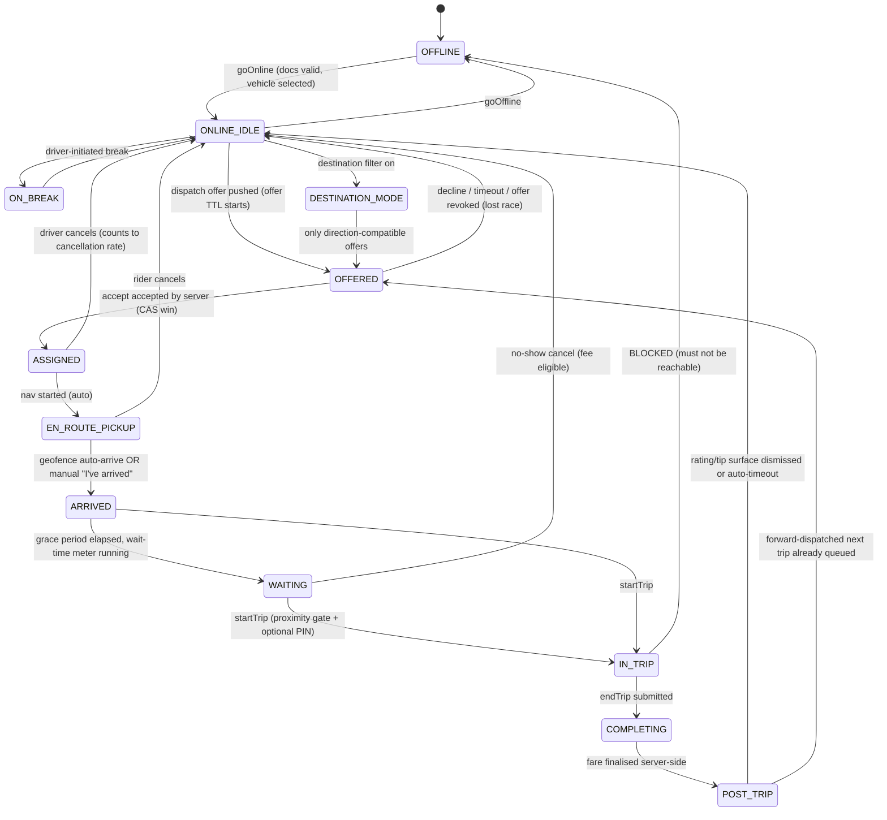
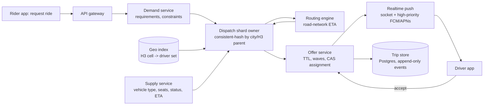
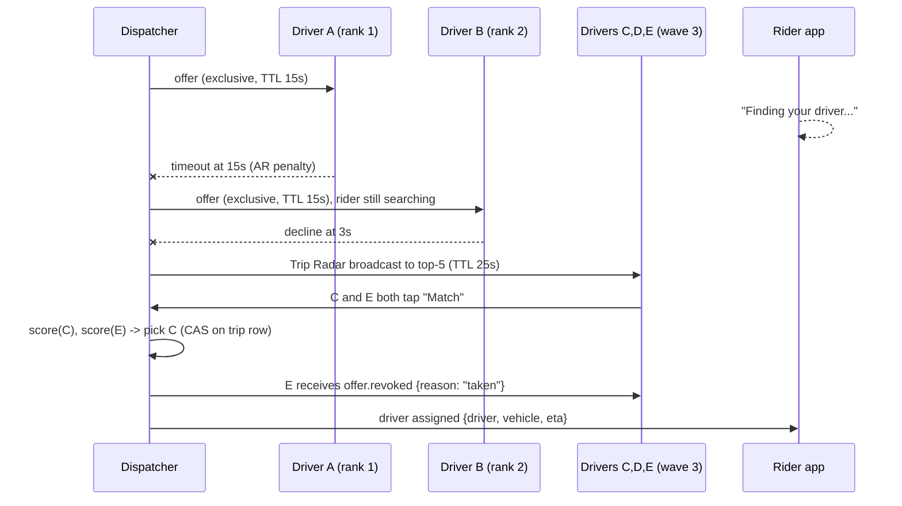
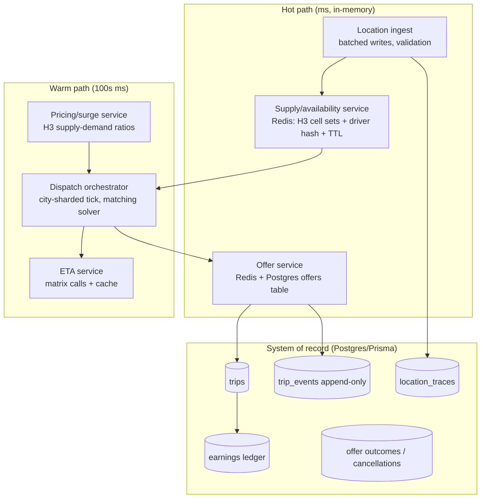

# Uber Driver & Bolt Driver — Engineering-Grade Architecture Reference

> Purpose: a re-wiring reference for a production ride-hailing **driver** app (React Native/Expo client + Node/Express + Prisma/Postgres backend, Ghana market).
> Scope: driver-side client, backend contract, dispatch/matching engine, realtime behaviour, and the driver↔rider coupling.
> Compiled 2026-08-02.

## 0. How to read this document

| Marker | Meaning |
|---|---|
| **[DOC]** | Documented in a primary source (Uber/Lyft engineering blog, Uber/Bolt Help Center, paper, patent). Cited inline. |
| **INFERRED** | Not publicly documented. Best-inferred design, with the reasoning stated. Treat as a design proposal, not a fact about Uber. |
| **[OBS]** | Observed/reported behaviour from driver communities and secondary press. Directionally right, numbers may drift by market. |

Source-quality warning: Uber's *dispatch internals* are the least-documented part of the stack. The 2015 Matt Ranney talk ([Scaling Uber's Real-time Market Platform](https://www.infoq.com/presentations/uber-market-platform), write-up: [High Scalability](https://highscalability.com/how-uber-scales-their-real-time-market-platform/)) is still the single most detailed primary account of DISCO and remains the backbone of section 2. Everything after ~2018 is reconstructed from H3, Gairos, routing-engine, RAMEN and Help-Center posts, plus Lyft/DiDi papers which *are* published in detail and describe the same problem shape.

---

# 1. The driver state machine

## 1.1 Two machines, one coupling

There are **two** state machines, and conflating them is the single most common architectural mistake in clones:

- **Driver session state** — lifecycle of a *person + vehicle + app session*. Owned by a supply/availability service. Fast, TTL-driven, ephemeral, Redis-shaped.
- **Trip/job state** — lifecycle of a *booking*. Owned by a trip service. Durable, append-only, Postgres-shaped, transactional.

A driver can hold **zero, one, or (with stacked dispatch) two** trip states while in exactly **one** session state. The link is an *assignment* record, not a foreign key on the driver row.



### 1.2 State table (canonical)

| State | Server-side truth | Receives normal offers? | Location cadence | Exit triggers |
|---|---|---|---|---|
| `OFFLINE` | no supply record | no | none / significant-change only | goOnline |
| `ONLINE_IDLE` | supply record present, `status=available`, TTL alive | **yes** | 4–10 s | offer, goOffline, break, TTL expiry |
| `ON_BREAK` | supply record, `status=paused` | no | reduced (30–60 s) | resume, TTL expiry |
| `DESTINATION_MODE` | supply record + `destination_filter` predicate | filtered subset only | 4–10 s | reach destination / toggle off / decline budget exhausted |
| `OFFERED` | offer row `PENDING`, expiry timestamp | no (locked) | 4 s | accept / decline / TTL |
| `ASSIGNED` → `EN_ROUTE_PICKUP` | assignment row, trip `DRIVER_EN_ROUTE` | **no**, except stacked dispatch | 2–5 s | arrive |
| `ARRIVED` / `WAITING` | trip `ARRIVED`, `arrived_at` server timestamp | no, except stacked | 4–10 s (stationary) | start / no-show cancel |
| `IN_TRIP` | trip `IN_PROGRESS` | no, except forward dispatch near dropoff | 2–4 s (1–2 s at highway speed) | end trip |
| `COMPLETING` | trip `COMPLETING`, fare not yet final | no | 4 s | fare finalised |
| `POST_TRIP` | trip `COMPLETED` | yes (immediately eligible) | 4–10 s | dismiss |

Cadence figures are **[OBS]** — commonly-reported ranges (~30–60 s idle, ~4–8 s en-route, ~2–4 s in-trip, 1–2 s at highway speed); the invariant that matters is *cadence is a function of state and speed*, not a constant.

## 1.3 Availability registration and expiry

Uber's stated goal for the geospatial index was **1 million writes/second** with many multiples of that for reads ([High Scalability](https://highscalability.com/how-uber-scales-their-real-time-market-platform/)). That number alone dictates the design: the availability store is an in-memory/Redis structure, not a relational table.

**The contract (INFERRED, but the only design that survives the load):**

```
POST /driver/location            # every N seconds while online
{
  "driverId": "drv_01H...",
  "sessionId": "sess_01H...",         // regenerated on every goOnline
  "seq": 41822,                        // monotonic per session, for dedupe/ordering
  "points": [                          // batched: 1..k points
    {"lat":5.6037,"lng":-0.1870,"ts":1754130000123,"acc":8.2,"spd":11.4,"brg":142.0,"src":"gps"},
    {"lat":5.6039,"lng":-0.1872,"ts":1754130004120,"acc":7.9,"spd":11.9,"brg":143.5,"src":"gps"}
  ],
  "battery": 0.62,
  "appState": "background",
  "mock": false,                       // device-reported mock-location flag
  "tripId": null
}
→ 200 { "serverTs": 1754130004480, "ttlSeconds": 30, "assignmentDigest": "a91f..." }
```

Server-side effect (INFERRED, standard shape):

```
GEOADD  supply:geo:{cityId}  lng lat  drv_01H...
HSET    supply:drv:{driverId}  status available  lastSeen <serverTs>  h3r8 <cell>  vehicleClass X  rating 4.87
EXPIRE  supply:drv:{driverId}  30            # TTL is the heartbeat
ZADD    supply:heartbeat:{cityId}  <serverTs>  drv_...   # sweeper index
```

**Expiry semantics — the three-layer rule:**

1. **Hard TTL (10–30 s)** on the per-driver hash. If the phone dies, the key expires and the driver silently leaves the candidate set. This is the primary mechanism; never rely on an explicit "goOffline" call arriving.
2. **Sweeper (every 5–15 s)** scans `supply:heartbeat` by score and demotes anyone past TTL to `stale`, emitting a `driver.went_stale` event so the session row in Postgres and any UI ("You were taken offline") stays consistent.
3. **Assignment-aware grace.** A driver with an *active trip* must **not** be hard-expired from the trip; only from the *available* set. Trip state lives in Postgres and survives the phone dying entirely. This distinction is what lets a rider still see "driver is on the way (last seen 40 s ago)" instead of the trip evaporating.

**Phone dies mid-`ONLINE_IDLE`:** key expires → not matched → no user-visible harm.
**Phone dies mid-`EN_ROUTE_PICKUP`:** supply key expires but assignment persists → rider sees stale marker + "connection lost" → server starts a *reassignment timer* (INFERRED, typically 60–120 s) → auto-cancel + free re-dispatch without penalising the rider.

## 1.4 The busy-driver invariant

> **Invariant D1:** a driver holding an active assignment is not a member of the candidate set for a new normal offer.

Enforcement must be **at the source**, in the availability query — not in a post-filter in the dispatch loop, and not in the client (this project already learned this: `driver-availability.js` as the single eligibility source, commit `41212fc`). Two independent enforcement points:

- `status` field on the supply hash flips to `on_trip` the instant an accept is committed, inside the same transaction/lock as the assignment write.
- The dispatcher's candidate query filters `status == available AND lastSeen > now - ttl AND NOT EXISTS(active_assignment)`.

**The deliberate exception — stacked / forward dispatch.** Uber calls it *forward dispatch*, *back-to-back*, or *stacked* trips: "when a driver is nearing the end of their ride, Uber's algorithm calculates the best next ride option in the area and sends that information to the driver" ([Info About Back-to-Back Trips](https://www.uber.com/us/en/drive/basics/back-to-back-trips/); [Uber Newsroom — Forward Dispatch](https://www.uber.com/en-LK/newsroom/forwarddispatch)). The rider on the *new* trip is explicitly told "Your driver is completing a trip nearby" — this is a **product-level disclosure requirement**, not an implementation detail. If you build stacking without that rider-side message, ETAs look like lies.

Gate conditions for stacked eligibility (INFERRED from the described behaviour):

```
eligible_for_stack =
     driver.state == IN_TRIP
  && eta_to_current_dropoff <= T_stack           # e.g. <= 3-5 min
  && !driver.has_queued_assignment               # max queue depth 1
  && new_pickup within R of current dropoff
  && driver.preferences.allow_back_to_back
  && current_trip.type != POOL_WITH_OPEN_SEATS   # pool has its own matcher
```

Queue depth **1** is the right MVP cap: two queued trips makes cancellation cascades and ETA promises unmanageable.

## 1.5 Other session modes

| Mode | Documented behaviour | Source |
|---|---|---|
| **Destination mode / destination filter** | Driver sets a destination; system only offers trips heading that way. "Flexible route" widens the search, "Faster route" narrows it to trips directly on-route. Uses per-day/limited budget of uses; declines/cancels while in the mode are capped (e.g. 2 Exclusive requests). | [Destination Mode](https://www.uber.com/us/en/blog/destination-mode/) |
| **Area preferences** | Driver receives only trips whose pickup **and** dropoff fall inside selected areas; time-boxed (e.g. 2 h/day). | [Area Preferences](https://help.uber.com/en/driving-and-delivering/article/area-preferences?nodeId=0740baf5-c421-4ae2-9d29-5ba62a3e147a) |
| **Trip type filter** | Toggle rides vs deliveries vs both; implemented as a server-driven preference `trip_type_pref`. | [Driver Preferences with RIBs](https://www.uber.com/us/en/blog/carbon-driver-app-preferences-ribs/) |
| **Long trip flag** | Requests estimated ≥ 45 min are badged "Long Trip" on the offer card. | [Destination Mode](https://www.uber.com/us/en/blog/destination-mode/) |
| **Reserve / scheduled** | Scheduled trips are pre-assigned ahead of time; driver is expected at the pickup at the scheduled time; wait/cancel rules differ from on-demand. Bolt: for scheduled rides the driver waits until 5 minutes past the scheduled start, then may cancel with fee. | [Uber Reserve FAQ](https://help.uber.com/en/driving-and-delivering/article/reserve-faq?nodeId=edd655fe-d600-44bf-97cf-e917fbd6cc72); [Bolt scheduled rides](https://bolt.eu/en/support/articles/7769413257746/) |
| **Pool / shared** | Multiple riders, per-rider pickup/dropoff sub-states inside one trip. The driver machine gains a *stop list*: each stop has `PENDING → ARRIVED → DONE`. | INFERRED shape; product exists as UberX Share |

**Design rule for scheduled rides (learned the hard way in this codebase):** a scheduled trip must not enter the *available-driver* dispatch path at booking time and must not consume the driver's availability until a `T-minus` window. Keep a separate `RESERVED` assignment state that does **not** set `status=on_trip` until the activation window opens.

---

# 2. The dispatch / matching engine

This is the deepest section. Read it as: *how a request finds candidates → how candidates are ranked → how an offer is delivered and resolved → how the assignment is made exactly once.*

## 2.1 DISCO: the shape of Uber's dispatch service

From the primary account ([High Scalability write-up of Matt Ranney's talk](https://highscalability.com/how-uber-scales-their-real-time-market-platform/), [InfoQ](https://www.infoq.com/presentations/uber-market-platform)):

- **DISCO** = *DISpatch optimization*. It replaced an earlier dispatch system that "assumed at a deep level it was moving only people."
- It is split into a **supply service** (tracks vehicles: capacity, seats, whether a child seat is present, whether a wheelchair fits — i.e. supply is *typed*, not a lat/lng) and a **demand service** (tracks requirements of a request: seats, product class, constraints).
- A **geospatial index** answers "where is all the supply, and where is it *expected to be*." Prediction, not just current position, is a first-class input.
- The dispatch tier is **thousands of nodes**, sharded by geography, built on Node.js with **[Ringpop](https://www.uber.com/us/en/blog/ringpop-open-source-nodejs-library/)** for application-layer sharding.
- The original index used **Google S2** cells (~3 km cells with unique IDs) for supply lookup; H3 later became the marketplace grid.

**Ringpop mechanics** ([Ringpop architecture docs](https://ringpop.readthedocs.io/en/latest/architecture_design.html), [ringpop-go](https://github.com/uber/ringpop-go)):
- consistent hash ring, **FarmHash**, red-black tree, uniform replica points per node;
- **SWIM** gossip for membership (weakly consistent, infection-style);
- a request arriving at node A for key *k* is **forwarded over TChannel** to the node that owns *k*.

The practical takeaway for us: **shard the dispatch loop by geography and make the shard owner the single writer for that geography.** That is what removes most race conditions before you ever reach for a distributed lock.



## 2.2 Geospatial indexing: H3

**Why hexagons.** From [H3: Uber's Hexagonal Hierarchical Spatial Index](https://www.uber.com/blog/h3/):

- "Hexagons have only **one distance** between a hexagon centerpoint and its neighbors', compared to **two** distances for squares or **three** for triangles." This is the whole argument. With squares, an edge-neighbour is 1 unit away and a corner-neighbour is √2 — so any "expand the search ring" logic is biased by direction. With hexagons, a k-ring is an unbiased ~circle.
- "Hexagons minimize the **quantization error** introduced when users move through a city" — critical because supply is *moving*, and you want a driver crossing a boundary to change cells smoothly.
- Neighbouring hexagons "approximate circles using the grid system. The **kRing** function provides grid cells within grid distance k of an origin index."
- Grid construction: **122 base cells** on an icosahedron, **12 pentagons** placed over water (Fuller orientation), **16 resolutions**, each finer resolution has cells **1/7 the area** of the coarser one. A cell index is a **64-bit integer**, and truncating the index gives you the ancestor cell — so parent lookup is a bit operation.
- Uber uses H3 as "the grid system for analysis and optimization throughout our marketplaces," explicitly including **surge pricing** ("we calculate surge pricing by measuring supply and demand in hexagons in each city") and dispatch.
- Compaction matters at scale: California at res 6 is 10,633 hexagons uncompacted vs **901** compacted across mixed resolutions.

**Resolution selection (practical, INFERRED for a Ghana-sized deployment):**

| Purpose | H3 res | Rough cell edge | Rationale |
|---|---|---|---|
| Supply bucket for candidate lookup | **8** (~0.46 km edge, ~0.74 km²) | ~460 m | one cell ≈ a couple of city blocks; a k=2 ring ≈ 1.5–2 km radius which is the realistic pickup radius in Accra traffic |
| Surge / demand heatmap | **7** | ~1.2 km | smoother, less noisy for pricing |
| City / service-area membership | **5–6** | 3–8 km | cheap polyfill of the operating polygon |
| Driver heatmap shown in app | **7** | ~1.2 km | visual |

**Candidate lookup, concretely:**

```
cell   = h3.latLngToCell(pickup.lat, pickup.lng, 8)
ring0  = [cell]
ring1  = h3.gridDisk(cell, 1)      # 7 cells
ring2  = h3.gridDisk(cell, 2)      # 19 cells
candidates = supplyIndex.membersOf(ring1)
if candidates.length < MIN_CANDIDATES: candidates = supplyIndex.membersOf(ring2)
if still short and elapsed < T_relax: expand to k=3, then relax vehicle-class constraints
```

**Why not just `GEORADIUS`/PostGIS on the hot path:** a radius query is O(scan) over a sorted set and must be re-run per request; a cell-keyed set is a hash lookup per cell and can be maintained incrementally as drivers move (remove from old cell, add to new cell, only when the cell id changes — which is ~once per 460 m, not every ping). Redis `GEO*` is fine at our scale for v1; H3-cell sets are the upgrade path and are what makes the demand/supply/surge aggregations free.

## 2.3 ETA, not distance

> Straight-line distance is the wrong metric and produces visibly bad matches: a driver 400 m away across a river, a one-way street, or a motorway with no exit is *further* than one 1.2 km away on the same road.

Uber's own history ([ETA Phone Home: How Uber Engineers an Efficient Route](https://www.uber.com/blog/engineering-routing-engine/)):
- First: **OSRM** + a correction model called **Goldeta** that adjusted routing-engine ETAs using historical Uber trips on similar routes in time and space. Better than raw routing ETA, but suffered a **cold-start problem** in new cities.
- Then: **Gurafu**, an in-house routing engine "built for Uber" with a dispatch system in mind. A* with landmarks was too slow for long trips; contraction-style precomputation was fast but couldn't take dynamic edge weights. The solution: a **layered/cell-partitioned contracted graph** whose preprocessing can be re-run in parallel, giving precomputation speed *and* real-time traffic edge-weight updates.
- Later: ML post-processing of routing ETAs at scale (**DeeprETA**, [arXiv:2206.02127](https://arxiv.org/pdf/2206.02127)), because "reducing ETA error by even low single digit percentages unlocks tens of millions of dollars per year."

**Implementable version for us:**

1. **Coarse prefilter** by great-circle distance to cut the candidate set (cheap, only to bound it).
2. **Real ETA** for the surviving ~10–25 candidates via a routing engine (Mapbox/Google/OSRM/Valhalla) using a **matrix call** — one request, N sources → 1 destination. Never N individual directions calls.
3. **Cache** ETA by `(h3_res9_origin, h3_res9_dest, time_bucket_15min)` — this is exactly what makes a matrix call affordable in Ghana where road-network topology dominates.
4. **Free-flow fallback** with a market-calibrated speed factor if the routing provider times out — but mark the ETA as `degraded` so downstream (rider ETA display) can widen the range instead of promising a precise minute.

## 2.4 Matching algorithm: greedy vs batch

Two regimes, and you need to know which you are in.

**A. Greedy / first-available (exclusive dispatch).** Score candidates, offer to #1, on decline/timeout offer to #2. This is what "traditional ride-hailing systems" do — each ride is offered to a single driver at a time and the platform "must proceed sequentially by offering the ride to the next best candidate driver" ([Lyft, *Non-Exclusive Notifications for Ride-Hailing*, arXiv 2603.21531/2603.21533](https://arxiv.org/pdf/2603.21531)). Its failure mode is exactly what that paper describes: as rejection rates rise, riders wait through a chain of unresponsive drivers.

**B. Batched / global optimisation.** Accumulate requests over a short window, build a bipartite graph (riders on one side, drivers on the other, edge weight = match quality), and solve for the max-weight matching.

Lyft's published description ([Solving Dispatch in a Ridesharing Problem Space](https://eng.lyft.com/solving-dispatch-in-a-ridesharing-problem-space-821d9606c3ff)) is the clearest primary text:
- binary decision variable `x_e` per edge, objective maximises total edge weight, constraints allow at most one edge per driver vertex and per rider vertex — an ILP;
- the LP **relaxation** of bipartite matching gives integral solutions anyway (Edmonds), so you can solve an LP instead of an ILP;
- **batch interval is the core tradeoff**: "Longer batches give a fuller picture of supply and demand, often producing better matches, lower wait times, and higher vehicle utilization, but they can delay ride assignments and risk cancellations. Shorter intervals speed up matches... but may lead to suboptimal pairings";
- optimising each batch in isolation is **myopic**: two drivers available for one request at t=0, the greedy pick leaves only the far car for the new request at t=1. Mitigation is a *future-value* term on the edge weight (Lyft's RL work: [A Better Match for Drivers and Riders: Reinforcement Learning at Lyft](https://arxiv.org/pdf/2310.13810)).

DiDi's published system uses the same shape: "batch-based dispatching with a **batch size of 2 seconds**, in which it builds a bipartite graph based on the location of current idle drivers and the newly upcoming orders" ([Large-Scale Order Dispatch in On-Demand Ride-Hailing Platforms, KDD 2018](https://dl.acm.org/doi/pdf/10.1145/3219819.3219824); [Ride-Hailing Order Dispatching at DiDi via Reinforcement Learning](https://mktal.github.io/pdfs/rl_dispatching_wagner-full-rev4.pdf)). Uber holds a patent titled [System and method for bipartite matching](https://image-ppubs.uspto.gov/dirsearch-public/print/downloadPdf/12260357).

**Recommendation for a Ghana-scale market (INFERRED, load-appropriate):**

Run **greedy sequential-with-waves** as the primary path, but *structure the code as a batch solver with batch size 1*. Concretely: a per-city tick every 1–2 s that collects `PENDING` requests and `available` drivers, builds a sparse cost matrix (each request → its top-K≈15 candidates), and solves. At low volume the solver degenerates to "assign each request its best driver," which is greedy — but when a corridor gets busy you get global optimisation for free, without a rewrite. This is the single highest-leverage architectural choice in this document.

**Edge weight (cost) — what actually goes in it:**

```
cost(driver d, request r) =
      w1 * eta_seconds(d → r.pickup)                   # dominant term
    + w2 * (1 - P_accept(d, r))     * PENALTY_DECLINE  # ML or heuristic acceptance probability
    + w3 * detour_cost(d.destination_filter, r)        # destination-mode compatibility
    + w4 * (rider_wait_so_far_seconds * -1)            # aging: starving requests get priority
    + w5 * fairness_term(d.idle_seconds * -1)          # longest-idle driver bonus
    + w6 * vehicle_class_mismatch_penalty
    + w7 * future_value_penalty(d, r)                  # anti-myopia: don't burn the only nearby car
    + w8 * rating/quality terms
    - w9 * stacked_dispatch_bonus                      # if d is finishing nearby
INFEASIBLE if: d busy, class mismatch, outside service area, driver blocked this rider,
               d.rating below product floor, r.pickup outside d.area_preferences
```

Aging (`w4`) is non-negotiable: without it, a request in a low-supply pocket can be starved forever by newer requests in dense pockets.

## 2.5 Offer mechanics — the part clones get wrong

### 2.5.1 Two offer models coexist at Uber today

| | **Exclusive request** | **Trip Radar** |
|---|---|---|
| Visibility | shown to one driver only | shown to **multiple drivers at once** |
| Button | **Accept** | **Match** (express interest, multi-select) |
| Guarantee | "Guaranteed to be yours if you accept" | "Requests are not guaranteed" |
| Acceptance rate | counts | **does not** impact acceptance rate |
| Cancellation rate | counts | counts *after* being matched |
| Winner selection | the accepter | **not** first-click; "assignment is not based on who clicked match earliest" — matched on proximity and estimated pickup times |
| UI while moving | full card | at >10 mph: a **single** radar request + route overview; at <10 mph/stopped: browsable multi-request list/map |

Source: [What is Trip Radar and how does it work?](https://help.uber.com/driving-and-delivering/article/what-is-trip-radar-and-how-does-it-work?nodeId=b6fb7065-ce66-490c-a911-d4e6d5c10d29) and [Get More Trip Options with Trip Radar](https://www.uber.com/us/en/blog/trip-radar/). At select airports, joining the waiting lot now means **all** airport requests come through Trip Radar and no Exclusive requests are sent.

This is the resolution of the classic broadcast-vs-exclusive dilemma: broadcast the *visibility*, but keep the *assignment* server-authoritative and score-based, so you never get the "all drivers accept, one wins, N drivers already started driving" race that naive broadcast produces ([Lyft NED papers](https://arxiv.org/pdf/2603.21533) call this "driver contention").

### 2.5.2 Offer TTL

- Uber's classic exclusive ping window was **~10 seconds** for rides; Uber has been extending it, with a Los Angeles pilot timing out at **15 seconds** ("50% longer than what it previously was") ([The Rideshare Guy — Uber Extends Offer-Acceptance Time](https://therideshareguy.com/uber-extends-offer-acceptance-time-ping-for-drivers/)). **[OBS]**
- Uber Eats offers time out around **30 seconds**. **[OBS]**
- Letting an Exclusive request time out without accepting or declining **counts against acceptance rate** exactly like a decline ([Understanding acceptance and cancellation rates](https://www.uber.com/us/en/blog/understanding-acceptance-and-cancellation-rates/)).

**Recommendation:** 15 s for rides, 20 s for scheduled/reserve activation, 30 s if the offer card contains a lot to read (long trip, multi-stop). Below 10 s drivers physically cannot read the card while driving; above ~25 s the rider's perceived wait becomes the binding constraint.

### 2.5.3 Server-authoritative timer

The countdown ring on the driver's screen **must not be a client-side `setInterval` started on render.** Design:

```json
{
  "type": "trip.offer",
  "offerId": "ofr_01H8Z...",
  "tripId": "trp_01H8Z...",
  "issuedAtServerMs": 1754130004480,
  "expiresAtServerMs": 1754130019480,
  "ttlMs": 15000,
  "serverNowMs": 1754130004505,
  "wave": 1,
  "exclusive": true,
  "trip": {
    "pickup": {"lat":5.6037,"lng":-0.1870,"label":"Osu Oxford St","crossStreets":"Oxford St & Cantonments Rd"},
    "dropoff": {"lat":5.5600,"lng":-0.2050,"label":"Kaneshie Market"},
    "etaToPickupSec": 240, "distanceToPickupM": 1850,
    "tripDurationSec": 1320, "tripDistanceM": 8400,
    "upfrontFare": {"amount": 3800, "currency":"GHS", "minorUnits": true, "surgeIncluded": 500},
    "riderRating": 4.82, "paymentMethod": "CASH", "productClass": "ECONOMY",
    "flags": ["LONG_TRIP"]
  }
}
```

Client rule: `remaining = expiresAtServerMs - (Date.now() + clockSkewMs)` where `clockSkewMs = serverNowMs - clientRecvMs` captured at receipt. Never trust the device clock alone (§7 covers deliberate clock skew). The server independently rejects late accepts; the client timer is **cosmetic**.

### 2.5.4 Escalation waves



Wave policy (INFERRED, tuned for a thin-supply market like Accra):

| Wave | Who | TTL | Radius/k-ring | Notes |
|---|---|---|---|---|
| 1 | best-scoring single driver | 15 s | k=1 | exclusive; AR counts |
| 2 | next best single driver | 15 s | k=2 | exclusive |
| 3 | top 3–5 drivers simultaneously | 20 s | k=2–3 | radar-style, score-based winner, no AR penalty |
| 4 | top 8–10, relaxed class constraints | 25 s | k=3–4 | notify rider "still looking, longer wait" |
| 5 | give up | — | — | `NO_DRIVERS_FOUND`, offer scheduled/retry |

**Total dispatch budget** should be a single tunable (e.g. 90–120 s). Past it, the honest answer to the rider is "no drivers available," not an infinite spinner. Sequential cascade with no global deadline is a classic clone bug (this repo fixed one: sweep `7501aeb`).

### 2.5.5 Exactly-once assignment — the race

Three drivers can tap Accept within the same 40 ms. The rule: **assignment is a compare-and-swap on the trip row, inside a transaction, and everything else is a consequence.**

Postgres, no distributed lock needed:

```sql
-- The only place a trip acquires a driver.
UPDATE trips
   SET driver_id   = $driverId,
       status      = 'DRIVER_ASSIGNED',
       assigned_at = now(),
       version     = version + 1
 WHERE id = $tripId
   AND status = 'SEARCHING'          -- CAS guard: only an unassigned trip can be claimed
   AND driver_id IS NULL
RETURNING id, version;
-- 0 rows  => this driver lost the race  => respond 409 OFFER_TAKEN
-- 1 row   => winner; same tx writes the assignment + trip_event rows
```

In the same transaction:

```sql
INSERT INTO trip_events (trip_id, seq, type, actor, payload, server_ts)
VALUES ($tripId, nextval(...), 'DRIVER_ACCEPTED', 'driver:'||$driverId, $payload, now());

UPDATE driver_offers SET status='ACCEPTED', resolved_at=now()
 WHERE id=$offerId AND status='PENDING';       -- second CAS: an expired offer cannot win
```

Then, **after commit**, publish `offer.revoked` to all other holders and `driver.assigned` to the rider.

Additional guards:

- **Idempotency key on accept.** `Idempotency-Key: <offerId>` — a retried accept from a flaky network must return the *same* result, not a second attempt.
- **Offer-level CAS too.** An accept whose offer already transitioned to `EXPIRED`/`REVOKED` must fail with a distinct code (`OFFER_EXPIRED` vs `OFFER_TAKEN`) so the driver UI can say the right thing. Drivers *hate* an ambiguous "something went wrong" after they tapped accept.
- **Advisory lock only for the dispatch tick**, not for accepts: `pg_advisory_xact_lock(hashtext('dispatch:'||city_id))` so two dispatcher instances can't run the same city's batch concurrently. Or, better, shard cities across dispatcher instances by consistent hash (Ringpop's lesson) and use the lock as a belt-and-braces.

**"Too late" response contract:**

```json
{ "error": "OFFER_TAKEN", "tripId": "trp_...", "message": "This trip was matched with another driver.",
  "driverState": "ONLINE_IDLE", "acceptanceRateImpact": "none" }
```
An accept that loses a race must **never** count against acceptance rate, and must **never** be logged as a decline.

## 2.6 Acceptance / cancellation accounting and its feedback loop

Documented rules ([Understanding acceptance and cancellation rates](https://www.uber.com/us/en/blog/understanding-acceptance-and-cancellation-rates/)):

- **Acceptance rate** = % of **Exclusive** trip requests accepted, computed over the **last 100** Exclusive requests. Timeouts count as non-acceptance.
- **Cancellation rate** = % of trips cancelled **after** accepting, over the **last 100 accepted** requests, **excluding cancellations outside the driver's control**.
- Trip Radar interest does not affect acceptance rate; cancelling after a radar match does affect cancellation rate.
- Rates feed **Uber Pro** tiers, which in turn unlock features (e.g. upfront destination/duration visibility at Gold with AR ≥ 85% **[OBS]**), promotions, and airport/queue privileges.

**Schema implication:** you cannot compute these from an aggregate counter. You need a rolling event log:

```prisma
model DriverOfferOutcome {
  id          String   @id @default(cuid())
  driverId    String
  tripId      String
  offerId     String   @unique
  kind        OfferKind      // EXCLUSIVE | RADAR
  outcome     OfferOutcome   // ACCEPTED | DECLINED | TIMED_OUT | REVOKED_LOST_RACE | REVOKED_SYSTEM
  countsForAR Boolean        // false for RADAR, REVOKED_*, and system-fault outcomes
  createdAt   DateTime @default(now())
  @@index([driverId, createdAt])
}

model DriverCancellation {
  id           String @id @default(cuid())
  driverId     String
  tripId       String @unique
  reason       CancelReason  // RIDER_NO_SHOW | RIDER_REQUESTED | UNSAFE | VEHICLE_ISSUE | WRONG_ADDRESS | OTHER
  faultAttrib  FaultAttrib   // DRIVER | RIDER | PLATFORM   <- excludes from rate when != DRIVER
  createdAt    DateTime @default(now())
}
```

`acceptanceRate = accepted / count(last 100 where countsForAR)` — a windowed query, cached for ~60 s.

**Feedback into eligibility.** Acceptance probability `P_accept(d, r)` belongs in the *cost function*, not as a hard gate, at least at first. A hard gate ("AR < 50% → no offers") in a thin market removes supply you need. Start with: use historical accept rate as a soft prior in scoring; add abuse gates (§6.4) for the accept-then-cancel pattern specifically.

## 2.7 Surge / pricing signals to the driver

- Surge is computed **per hexagon per city per time slice** from supply/demand counts ([H3](https://www.uber.com/blog/h3/); [Gairos](https://www.uber.com/us/en/blog/gairos-scalability/) explicitly lists "the surge pricing service reads demand and supply data based on hexagon to calculate surge multiplier at specific location and time" and "maximum dispatch ETA calculating" as consumers).
- The driver sees it two ways: (a) a **heatmap layer** on the idle map, refreshed on a slow cadence; (b) a **surge/promotion amount broken out separately on the offer card**.
- **Upfront fares**: the offer shows the exact fare and destination before accepting, computed from base fares, time+distance to pickup and dropoff, real-time demand at the destination, and surge. Tips, tolls, surcharges and wait-time pay are **added after** the trip. If the driver finds a faster route, they keep the upfront fare — "as long as pickup and dropoff addresses don't change, the upfront fare can only increase." Address changes or big unexpected traffic cause the fare to update ([Upfront fares — driver Help](https://help.uber.com/driving-and-delivering/article/what-is-the-upfront-fare?nodeId=bc83ed7e-6725-41de-afcb-72d263e5589f); [Uber Marketplace: Upfront Pricing](https://www.uber.com/us/en/marketplace/pricing/upfront-pricing/)).
- Uber also pilots showing **estimated earnings per active hour / per kilometre** on the request card ([pilot post](https://www.uber.com/en-CL/blog/piloting-estimated-earnings-per-active-hour-on-trip-requests/)).

**Rule:** the fare shown on the offer card and the fare finally paid must come from the *same server-side quote object*, referenced by id. Never let the client recompute a fare for display. (This repo has already been bitten by two fare formulas / two distance sources — sweep `2fd4e2d`, `f66ccf9`.)

---

# 3. Realtime transport on the driver side

## 3.1 Getting the offer to the phone fast enough

Uber's own path here is documented end to end ([Uber's Real-Time Push Platform](https://www.uber.com/blog/real-time-push-platform/), [Uber's Next Gen Push Platform on gRPC](https://www.uber.com/us/en/blog/ubers-next-gen-push-platform-on-grpc/)):

- They started with **polling** — "the driver app can poll the server every few seconds to check if a new offer is available. The rider app can poll... to check if a driver is assigned." Rejected for battery and data cost, explicitly noting "with Uber growing rapidly into developing countries, the cost of data usage was a challenge for our users, this is especially true for drivers who are connected to the platform for multiple hours a day."
- They built **RAMEN** (Realtime Asynchronous MEssaging Network) on **Server-Sent Events**, later migrated the facade to **gRPC** bidirectional streaming while keeping Message Storage, Orchestration, Connection Lifecycle Management and Flow Control unchanged.
- Components: **Fireball** (decides *who* and *when* to push), the **API gateway** (decides *what* to push — the same endpoint logic serves both "pull" and "push" variants of a payload), and **Streamgate/StreamgateFE** (holds the millions of live connections, sharded by `userID` with sticky routing).
- Per-message-type configuration: **priority** (messages are written to the socket in descending priority; high-priority messages get server-side retries and cross-region replication), **TTL** ("a few seconds up to 30 minutes" — the system persists and retries until TTL expires), and **deduplication** (for most cases only the newest message of a type matters, which cuts data transfer).
- Delivery is **at-least-once**.

**Architecture recommendation for us:** two channels, one truth.

| Channel | Use | Why |
|---|---|---|
| **WebSocket/SSE** (persistent, authenticated, sharded by driverId) | primary for offers, trip updates, chat, cancellations | lowest latency, cheapest per message |
| **High-priority FCM / APNs** | wake-up when the socket is dead or the app is backgrounded/killed | the only mechanism that survives a killed process |
| **HTTP bootstrap** `GET /driver/state` | on cold start, foreground, reconnect | the *authoritative* reconciliation |

The push must be a **data-with-notification high-priority** message. On Android use `priority: "high"` (and consider `FLAG_INSISTENT`-style full-screen intent for the offer, plus a `CATEGORY_CALL`-like full-screen notification so it renders over the lock screen); on iOS use an **alert** push with `interruption-level: time-sensitive` (or `critical` if entitled) plus a custom sound. Silent/`content-available` pushes are throttled by iOS and **must not** be the offer transport.

**Never put the offer's authoritative content in the push payload alone.** The push says "there is an offer, id X"; the client fetches or receives it over the socket. Payload size limits, dedup, and TTL all make push-as-truth fragile.

## 3.2 Reconnect and replay — the RAMEN sequence protocol

This is the single most copyable piece of Uber's design ([Uber's Real-Time Push Platform](https://www.uber.com/blog/real-time-push-platform/)):

- Client opens the stream with `GET /ramen/receive?seq=0` at the start of a session.
- Server pushes pending messages **in descending priority order**, assigning **incremental sequence numbers**.
- If seq 3 is written to the socket but never delivered (disconnect/timeout), the client reconnects **with the largest sequence number it has actually seen** (`seq=2`). The server then resends message 3 (or anything newer and higher priority).
- Reconnecting with a higher sequence number is itself the **acknowledgement** that lets the server flush older messages.
- Independently, the app calls `/ramen/ack?seq=N` **every 30 seconds** regardless of connection quality.

Our contract:

```
WS connect:  wss://api/driver/stream?sessionId=...&seq=2417
S→C frame:   {"seq":2418,"type":"trip.offer","prio":100,"ttlMs":15000,"dedupeKey":"offer:trp_x","body":{...}}
C→S ack:     {"type":"ack","seq":2418}                 // and a periodic ack every 30s
Reconnect:   client sends its highest contiguous seq; server replays > that seq, honouring TTL and dedupe
```

Priority table (INFERRED, ours):

| prio | message types | TTL | dedupe |
|---|---|---|---|
| 100 | `trip.offer`, `trip.cancelled_by_rider`, `sos.*` | 15–30 s | by offerId/tripId |
| 80 | `trip.state_changed`, `assignment.revoked` | 60 s | by tripId+state |
| 60 | `chat.message` | 30 min | by messageId (no dedupe collapse) |
| 40 | `earnings.updated`, `rating.received` | 5 min | latest-only |
| 20 | `heatmap.updated`, `promo.updated` | 2 min | latest-only |

**Bootstrap call — mandatory.** On cold start, foreground, or any reconnect where replay is ambiguous:

```
GET /driver/state
→ {
  "session": {"status":"ONLINE_IDLE","sinceMs":...,"ttlSeconds":30},
  "activeAssignment": null | { "tripId":..., "state":"EN_ROUTE_PICKUP", "rider":{...},
      "pickup":{...}, "dropoff":{...}, "arrivedAtMs":null, "waitStartedAtMs":null,
      "stops":[...], "pinRequired":true, "fareQuoteId":"fq_..." },
  "queuedAssignment": null | {...},
  "pendingOffer": null | {...with expiresAtServerMs...},
  "seqCursor": 2418,
  "serverNowMs": 1754130004505
}
```
This one endpoint eliminates an entire class of "app reopened and forgot it was on a trip" bugs. It is also the correct place to detect "the server thinks you completed this trip 4 minutes ago."

## 3.3 Location upload

**Cadence by state** (see §1.2 table). Two additional modifiers:

- **Speed-adaptive**: `interval = clamp(baseInterval * (1 / max(speed_mps, 1)) , 1s, 30s)` — you need more points per second at 100 km/h than at 5 km/h to reconstruct the same path.
- **Distance filter**: also emit on `distanceFilter` (e.g. 20 m in-trip, 100 m idle) so a stationary driver at a taxi rank stops burning both battery and data.

**Batching and compression.** Send **arrays of points**, not one point per request. A 4-second in-trip cadence with a 3-point batch = one request every 12 s. Gzip the body (`Content-Encoding: gzip`) — GPS point arrays compress extremely well (repeated coordinate prefixes). Uber's stated design goal was explicitly wire efficiency for drivers "connected to the platform for multiple hours a day" ([RAMEN post](https://www.uber.com/blog/real-time-push-platform/)); this is a data-cost issue in Ghana, not just an engineering nicety.

Cheap wins:
- **Delta-encode** after the first point in the batch: send `dlat/dlng` in 1e-7 degree integers.
- **Drop** points whose `accuracy > 50 m` from the *fare-bearing* trace but keep them in a separate `raw` bucket for fraud analysis.
- **Never** send `accuracy: null` points to the fare calculator.

**Offline buffering and backfill.** A bounded ring buffer on disk (e.g. 2000 points ≈ 2+ hours in-trip). On reconnect:
```
POST /driver/location/backfill   { "sessionId":..., "points":[...], "backfill": true }
```
Server accepts backfill **only** for points whose `ts` falls inside a trip the driver actually held, and marks them `late=true`. Late points update the distance/duration ledger but must **not** move the live marker for the rider (a burst of stale points would teleport the car). This repo's tracking-envelope work (`2fd4e2d`, sideload sweep) is the same lesson.

**Accuracy filtering / impossible-speed rejection** — server-side, always:
```
reject point if:  acc > 200m
                | impliedSpeed(prev, cur) > 55 m/s (~200 km/h) and not aviation
                | ts in the future by > 2 min (clock skew)
                | ts older than the last accepted point (out-of-order) — accept but do not extend the path
                | mock == true (flag account, do not silently drop — you want the evidence)
```

**Battery/accuracy trade-off targets:** aim for **≤ 6–8 %/hour** additional drain from the driver app on a mid-range Android during an active trip. Levers, in order of impact: (1) stop using `BestForNavigation` when not navigating, (2) distance filters, (3) batch network calls so the radio sleeps, (4) never hold a partial wake lock outside an active trip (Google Play counts *excessive partial wake locks* as a **core vital** — [Android vitals](https://support.google.com/googleplay/android-developer/answer/9844486)).

## 3.4 Background execution — the part that kills naive implementations

### iOS

| Mechanism | Behaviour | Use for |
|---|---|---|
| `UIBackgroundModes: location` + `allowsBackgroundLocationUpdates = true` + `pausesLocationUpdatesAutomatically = false` | continuous updates while the app is running in background; blue bar/indicator shown | the **primary** driver tracking mode while online |
| Significant-location-change | ~1 callback per 5 min when moving 500 m+, cell-tower based; **self-recovering** across suspension, termination and device restart | resurrection safety net |
| Region monitoring (geofence) | max **20** regions; relaunches the app in background on crossing; 5–10 min to recover after a device restart | pickup/dropoff arrival, service-area boundary |
| `CLBackgroundActivitySession` (iOS 17+) | keeps background location alive across a session | modern replacement for the old always-on pattern |

Hard truths: **if the app is terminated (by the user or the system), continuous updates do not resume by themselves** — only significant-change, visits, or region monitoring can relaunch it, and only with **Always** authorisation; and if the user disables **Background App Refresh**, the system will not relaunch the app for *any* location event ([Apple Core Location docs / developer forum threads on `allowsBackgroundLocationUpdates` and background relaunch](https://developer.apple.com/forums/thread/748098)). Design the app so a relaunch triggers `GET /driver/state` and restores the trip immediately.

Permission flow that passes review: request **When In Use** first, and only escalate to **Always** at a moment where the benefit is obvious (e.g. the first time the driver taps Go Online), with a specific purpose string. Generic strings get rejected; reviewers test whether background location is genuinely core.

### Android

- **Foreground service with `foregroundServiceType="location"`** and a persistent notification is the only reliable way to keep collecting location. From **Android 14**, `FOREGROUND_SERVICE_LOCATION` is a separate permission and Play requires a **declaration + review** for it ([Google Play foreground service declaration](https://support.google.com/googleplay/android-developer/answer/9799150); [Expo Location docs](https://docs.expo.dev/versions/latest/sdk/location/)).
- `ACCESS_BACKGROUND_LOCATION` requires the Play **background location declaration form**, a demo video, and a prominent-disclosure screen before the runtime prompt. Apps that request it without core-functionality justification are rejected.
- OEM battery managers (Xiaomi/MIUI, Huawei, Oppo, Vivo, Samsung "Deep Sleep") kill foreground services aggressively. Ship an in-app "keep me online" checklist that deep-links to the manufacturer's battery-optimisation exclusion screen, and detect the kill (service `onDestroy` without a stop request → log a `service_killed` telemetry event).
- **Doze / App Standby** does not stop a foreground service but does throttle network — batch accordingly.

### The Uber-specific lesson on service architecture

Uber's Android driver app collapsed all background-service code into a **single ~100-line Service** whose only job is to keep the app alive and restart it when the OS kills it; features request that behaviour by incrementing/decrementing a **`KeepAliveCount`** — count > 0 ⇒ sticky foreground service, count ≤ 0 ⇒ service killed ([Activity/Service as a Dependency](https://www.uber.com/us/en/blog/activity-service-dependency-android-app-architecture/)). They did this because the previous design duplicated every feature into "foreground variant" and "background variant," which caused heads-up notifications to re-pop every time the app was backgrounded and forced engineers to reason about scope everywhere.

**Copy this exactly.** In RN/Expo terms: one native foreground-service module, a refcount API (`keepAlive.acquire('online')`, `keepAlive.acquire('trip:trp_x')`, `.release(...)`), and **no** other code that starts services.

### React Native / Expo specifics

- `expo-location` + `expo-task-manager` with `startLocationUpdatesAsync({ foregroundService: {...}, accuracy, deltaDistance, deferredUpdatesInterval })` is the baseline; the task keeps running when JS is backgrounded but **JS timers do not** — never drive cadence from `setInterval`.
- Known failure mode: background updates silently stopping when the app is backgrounded on certain Android versions/configs ([expo/expo#22445](https://github.com/expo/expo/issues/22445)). Mitigation: a watchdog that compares `lastAcceptedServerTs` from `/driver/state` against local time and re-arms the task.
- Persist the outbound queue with SQLite/MMKV, not AsyncStorage, for anything above a few hundred points.
- The offer full-screen presentation on a locked device needs a **native** notification path (Android full-screen intent, iOS time-sensitive/critical alert). Pure-JS notification handling will not render over the lock screen.

---

# 4. Driver client architecture

## 4.1 The app shape Uber converged on

From the Carbon rewrite series ([Why We Decided to Rewrite Uber's Driver App](https://www.uber.com/blog/rewrite-uber-carbon-app/), [Architecting Uber's New Driver App in RIBs](https://www.uber.com/blog/driver-app-ribs-architecture/)):

- Architecture is **RIBs** (Router–Interactor–Builder, a VIPER variant), open-sourced in 2017. Each RIB is an independent component: Interactor = business logic, Router = navigation, Builder = dependency construction; RIBs attach as children of other RIBs, forming a tree.
- **The tree is keyed on user/business state, not on screens**: `Logged Out → Logged In → Active → On Task`, where **On Task** is "how drivers experience the app when they are online and working (navigating to riders, beginning a trip, dropping off riders...)". "By focusing on the user state, we can decouple ourselves from the UI."
- **Workers** are objects with start/stop lifecycles bound to a RIB's attach/detach, used to keep Interactors small.
- **Plugins** are the feature-flagging mechanism: a public plugin-point API in core, implementations registered by feature teams, "think of each plugin point as if it were a service in a microservice architecture." This produced a **core vs non-core** split: core can't be disabled; non-core (Map, MyHub in their diagram) can be killed by flag if it regresses. **40 teams** worked in parallel on the app because of this.
- Driver **preferences** are a fully **server-driven** "Preferences Hub": the backend returns a list of preference descriptors with ids (`trip_type_pref`, `dropoff_areas_pref`, …) and the client renders them with a standard widget library (toggle, multi-select), falling back to a generic multi-select for unknown ids ([Driver Preferences with RIBs](https://www.uber.com/us/en/blog/carbon-driver-app-preferences-ribs/)).

**Translation to React Native (our stack):**

| Uber concept | Our equivalent |
|---|---|
| RIB tree keyed on business state | a single top-level `DriverSessionMachine` (XState or a reducer) that decides which *surface* mounts, with routes subordinate to state, not the other way around |
| On Task RIB | one persistent "trip surface" component that never unmounts between trip states (this repo already has this: `project_fluid_ui_overhaul`) |
| Workers | effects bound to state entry/exit (location task, socket subscription, keep-alive refcount) |
| Plugins / core vs non-core | remote-config-gated feature modules; the map, earnings card, heatmap must be independently disableable without breaking accept→arrive→start→complete |
| Preferences Hub | `GET /driver/preferences` returning `[{id, type:"toggle"|"multiselect"|"segment", label, value, options, disabledReason}]`; client renders generically |

The server-driven preferences pattern is worth adopting early: it is the difference between "ship a new build to add a cash-trips toggle in Accra" and "flip a row."

## 4.2 UI model

**Persistent map, overlays for everything else.**

```
┌──────────────────────────────────────────┐
│  status pill (Online / On trip)   ⋮ menu │
│                                          │
│                  MAP                     │  <- never unmounts, camera is state-driven
│      (driver puck, route line,           │
│       pickup pin, heatmap layer)         │
│                                          │
├──────────────────────────────────────────┤
│  ACTION BAR (bottom sheet, 3 snap points)│  <- content swaps by trip state
│  ├ idle:       earnings + Go Offline     │
│  ├ offer:      full-card overlay + timer │
│  ├ en-route:   rider chip, Nav, Cancel   │
│  ├ arrived:    wait timer, Start (swipe) │
│  ├ in-trip:    dropoff, Add stop, End    │
│  └ complete:   fare, rate, next          │
└──────────────────────────────────────────┘
```

**Camera ownership is a single hook.** Every trip state maps to a camera intent (`follow-driver`, `fit(driver,pickup)`, `fit(route)`, `overview`). Never let two components call the camera. (Prior art in this repo: `useTripCamera`, and the MLRNCamera `fitBounds` degenerate-bbox SIGABRT — always guard against zero-area bounds and NaN.)

**Swipe-to-confirm for destructive/irreversible steps.** Rationale, concretely:
- The driver is holding the phone in a moving vehicle. Accidental taps are frequent; accidental *swipes along a track* are near-zero.
- `Start trip` and `End trip` are irreversible in the ledger (they start/stop the fare meter). `Cancel` costs the rider a trip and may charge a fee.
- Swipe gives a physical commitment gesture with a natural abort (release early).
Use tap for: Accept (needs to be fast, is offer-TTL bounded, and losing is recoverable), Navigate, Call, Message. Use swipe for: Start trip, Complete trip, Cancel, SOS (hold-to-trigger).

**Worklet warning for RN:** gesture callbacks in Reanimated/Gesture Handler are auto-worklets; calling a JS-thread function from them without `runOnJS` is a SIGABRT, and RN scales about the centre, not the top-left. (Both already bit this codebase — `f66ccf9`, `project_sweep_2026_07_30`.)

## 4.3 Navigation integration

Uber ships **all three**: in-app turn-by-turn built specifically for drivers, plus handoff to **Google Maps** or **Waze** if installed, selectable in Account → App settings → Navigation ([Uber driver app navigation features](https://help.uber.com/driving-and-delivering/article/uber-driver-app-navigation-features?nodeId=357c291a-9b6e-45e9-9614-aea820f089ce)).

**The trip must continue while the driver is inside Waze.** Requirements this imposes:

1. Location collection runs in the **native background task**, not tied to the RN view. Leaving the app must not pause the trace.
2. The action bar must be reachable **without** returning to the app for the common actions. On Android that's a persistent notification with actions (Arrived / Start / Complete) and/or a bubble; on iOS it's a **Live Activity**. Uber shipped Live Activities on the rider side ("Pickup in 3 minutes"), noting the activity is a **separate target with no networking and no state**, updated from the main app or via push, and that it measurably **reduced cancellations and pickup defects** ([Live Activity on iOS](https://www.uber.com/us/en/blog/live-activity-on-ios/)). The same mechanism is what makes a driver app usable while navigating.
3. Deep-link handoff:
   - Google Maps: `google.navigation:q=<lat>,<lng>&mode=d`
   - Waze: `waze://?ll=<lat>,<lng>&navigate=yes`
   - Fallback: `https://www.google.com/maps/dir/?api=1&destination=...&travelmode=driving`
4. On return to foreground, immediately call `GET /driver/state` and reconcile — the driver may have arrived while away and the geofence may have fired.

## 4.4 Arrival, waiting, and the start gate

**Auto-arrive via geofence.** Enter a radius around the pickup (typically 50–100 m urban; widen for airports/malls) and, if `speed < 3 m/s` for `>= 10 s`, transition to `ARRIVED` automatically and start the server-side wait clock. Keep the manual "I've arrived" button — GPS in dense urban areas (and Accra's mixed-accuracy environment) will miss.

Uber's parallel investment here is **Beacon**, physical hardware to make pickups unambiguous when GPS is not enough ([Beacon: Improving Pickups with Better Location Accuracy](https://www.uber.com/us/en/blog/beacon-improving-pickups-with-better-location-accuracy/)) — worth knowing as evidence that pickup-location accuracy is a first-class product problem, not a rounding error.

**Anti-fraud:** `arrived_at` is set by the **server** on receipt of the arrival event, and the server validates the driver's most recent accepted GPS point is within the geofence. A driver must not be able to press "arrived" from 3 km away to start the wait-fee clock.

**Wait-time rules (documented):**

| Product family | Free grace before per-minute wait fee | Wait before driver may cancel with no-show fee |
|---|---|---|
| UberX / economy | **2 min** | **5 min** |
| Uber Comfort | 2 min | **10 min** |
| Uber Black / SUV | **5 min** | **15 min** |
| UberX Share | 2 min | **2 min** |

Sources: [Wait time fees — driver](https://help.uber.com/en/driving-and-delivering/article/how-are-wait-time-fees-calculated?nodeId=7f41997f-a853-46ae-8001-8ab9dee504b0), [Cancellation fees explained](https://help.uber.com/en/riders/article/cancellation-fees-explained?nodeId=069853a3-f014-40a3-ad58-88ef56b1b27f). **Critical rule: a rider is charged a wait fee OR a cancellation/no-show fee, never both.**

Bolt's equivalents ([Bolt driver cancellation fee](https://bolt.eu/en/support/articles/360009324034/), [UK variant](https://bolt.eu/en/support/articles/6324581837714/), [paid wait time](https://bolt.eu/en/support/articles/360009458314/)):
- Rider is not charged if they cancel within **2 minutes** of the driver accepting, or if the driver cancels without having waited at least **3–8 minutes** (market-dependent).
- UK outside London: cancellation fee applies after **4 minutes**; London: **2 minutes**.
- Driver may claim a cancellation fee after waiting **4 minutes** at pickup (London: 5–15 min by category); "Client did not show" is selectable after **3 minutes** (London 5–15).
- Scheduled rides: wait until **5 minutes past** the scheduled start, then cancel with automatic fee.
- Same "fee OR wait time, not both" rule.

**Encode these as market config, not constants:**

```json
{
  "market": "GH-ACC",
  "products": {
    "ECONOMY": { "waitGraceSec": 180, "waitFeePerMinMinor": 30, "noShowAfterSec": 300,
                 "noShowFeeMinor": 500, "riderFreeCancelWindowSec": 120,
                 "driverArrivalGeofenceM": 80, "startTripProximityM": 150 }
  }
}
```

**The start gate.** `startTrip` is rejected unless: the driver's last accepted GPS point is within `startTripProximityM` of the pickup **or** the driver has been in `ARRIVED` for ≥ N seconds (covers GPS drift in parking structures), **and** the PIN (if required) validates.

**PIN / Verify My Ride.** Rider receives a unique 4-digit PIN; driver must enter it to start the trip, with **5 attempts** allowed; riders can enable it for all trips or only at night (9pm–6am) ([PIN verification](https://www.uber.com/pl/en/blog/pin-number/), [What's Verify my Ride?](https://help.uber.com/riders/article/whats-verify-my-ride/?nodeId=2ddbb5e8-0dd3-4048-b9ee-f6b5e5311e25)). Validate the PIN **server-side** and rate-limit; never ship the PIN to the driver device.

## 4.5 Offline-first action queue

Uber's **Optimistic Mode** is the reference implementation ([How Uber's New Driver App Overcomes Network Lag](https://www.uber.com/blog/driver-app-optimistic-mode/)):

- Motivating scenario, verbatim in spirit: a driver finishes at a crowded Bangalore airport, the rider is paying **cash** and the driver needs the final fare, but there's no signal. Without offline support the driver drives further, extending the trip and frustrating everyone. (This is *exactly* our Ghana cash-trip situation.)
- Every offline-capable action is an **optimistic request** that can serialize/deserialize to disk, paired with an **optimistic transform** whose output "matches the eventual response from the request," so the UI does not flicker when the real response lands.
- State flows on **Rx streams**; the optimistic state = last known server state + pending transforms.
- **Requests and last-known state are persisted to disk** and reloaded on relaunch, so killing the app mid-queue keeps the driver in the same state.
- **Stacking** is supported: multiple optimistic actions can queue. Dependent requests wait for their prerequisites; if the wait is too long the request fails with a network error — "it wouldn't make sense to send a request to end a trip that the backend doesn't even know has started."
- Errors roll the app back to the pre-optimistic state, which is jarring, so they built a global **Alert Framework** to surface it, plus client-side pre-checks for common errors (e.g. trip too short).
- Measured: **~13.5 seconds saved per optimistic operation** (Nov 2018), aggregating to over a year of driver time saved *per day*.

**Our concrete design:**

```ts
type QueuedAction =
  | { kind:'ARRIVED';  tripId:string; clientTs:number; at:LatLng }
  | { kind:'START';    tripId:string; clientTs:number; at:LatLng; pin?:string }
  | { kind:'ADD_STOP'; tripId:string; clientTs:number; stop:LatLng }
  | { kind:'COMPLETE'; tripId:string; clientTs:number; at:LatLng; odometerM:number }
  | { kind:'CANCEL';   tripId:string; clientTs:number; reason:CancelReason };

// every action carries:
//   idempotencyKey = `${tripId}:${kind}:${clientTs}`
//   dependsOn      = previous action id in the same trip
```

Rules:
1. **Strict per-trip ordering.** Actions for one trip replay in order; actions for different trips may interleave.
2. **Idempotent server handlers.** `POST /trips/:id/arrive` with the same idempotency key returns the original result, 200, not 409.
3. **Server timestamps win for money.** The client's `clientTs` is recorded for audit; wait-time and fare use server-received timestamps and the GPS trace (§6.3). If a driver's queue is 6 minutes old, the wait fee is not 6 minutes larger.
4. **UI honesty.** While queued, show a small "Saving… will sync when you're back online" chip. Do **not** show a spinner blocking the flow, and do **not** claim "Trip completed" in a way that implies payment settled if it hasn't.
5. **Rollback UX.** If the server rejects a queued COMPLETE (e.g. trip already completed by support), don't silently revert — show a modal explaining what happened and where the fare went.

## 4.6 Earnings surface

Uber's real-time earnings tracker is a card stack over the map showing per-trip results, session earnings, and daily/weekly totals ([Building a Real-time Earnings Tracker](https://www.uber.com/at/en/blog/real-time-earnings-tracker/)).

Non-negotiable: **earnings are computed server-side only.** The client renders a server-provided breakdown:

```json
{
  "tripId":"trp_...",
  "fare": { "base": 500, "perKm": 1800, "perMin": 900, "surge": 500, "waitTime": 120,
            "tolls": 0, "promotions": 0, "currency":"GHS", "minorUnits": true },
  "gross": 3820, "commissionPct": 15, "commission": 573, "net": 3247,
  "paymentMethod": "CASH", "cashCollected": 3820, "driverOwes": 573,
  "computedFrom": { "distanceM": 8412, "durationSec": 1361, "waitSec": 240,
                    "source": "server_gps_trace", "quoteId": "fq_..." }
}
```

`computedFrom.source` matters: it is your audit trail when a driver disputes. One commission rate, one fare formula, one distance source — enforced by a single server module (this repo consolidated exactly that in `2fd4e2d`).

Instant cashout: a separate ledger with `available_balance` (settled trips minus payouts minus cash owed) and an explicit `payout_request` state machine (`REQUESTED → PROCESSING → PAID | FAILED`), never a direct decrement.

---

# 5. Driver ↔ Rider coupling

## 5.1 The propagation table

Latency targets are **budgets to design to** (INFERRED), measured from server receipt to counterpart UI update.

| # | Event | Trigger side | To rider? | Latency target | Rider-visible change | Driver-visible change |
|---|---|---|---|---|---|---|
| 1 | Ride requested | rider | — | — | "Finding driver", cancel button | — (enters dispatch) |
| 2 | Offer issued | server | no | — | unchanged ("finding") | full-screen offer card + sound + server timer |
| 3 | Offer declined / timed out | driver | no | — | unchanged | card dismisses, AR updated silently |
| 4 | **Offer accepted (CAS win)** | driver | **yes** | **< 1 s** | driver card: name, photo, vehicle, plate, rating, ETA; map shows car | trip surface: rider name + pickup, nav CTA, Cancel |
| 5 | Offer revoked (lost race) | server | no | < 500 ms | unchanged | card dismisses with "matched with another driver" |
| 6 | Driver en-route / location ping | driver | **yes** | **2–5 s** | car marker moves + ETA recalcs | own puck moves |
| 7 | ETA materially changed (> 2 min) | server | yes | < 5 s | ETA text + Live Activity progress | ETA chip |
| 8 | Driver deviates from route | server | maybe | < 15 s | route line redraws | reroute in nav |
| 9 | **Driver arrived** | driver/geofence | **yes** | **< 1 s** | "Your driver has arrived" + push + sound; wait-fee notice | wait timer starts, Start unlocked (proximity/PIN) |
| 10 | Free-wait grace expired | server | yes | < 2 s | "Wait fee now applies" banner | wait-fee meter turns amber |
| 11 | No-show threshold reached | server | yes | < 2 s | final warning push | "Cancel — rider no-show (fee applies)" becomes primary CTA |
| 12 | PIN requested/entered | rider/driver | yes | < 1 s | PIN displayed prominently | PIN keypad; 5 attempts |
| 13 | **Trip started** | driver | **yes** | **< 1 s** | switches to in-trip view, dropoff ETA, share-trip | route to dropoff, End trip (swipe) |
| 14 | Rider changes destination | rider | — | < 2 s | new fare estimate + confirmation | **prominent** "Destination changed" banner + reroute; fare quote updated |
| 15 | Stop added | rider or driver | yes | < 2 s | stop list updates, fare updated | stop appears in nav queue |
| 16 | Stop reached | driver | yes | < 1 s | stop marked done | next-stop card |
| 17 | Driver takes a different route | driver | yes (line only) | < 5 s | route line redraw, ETA update | nav |
| 18 | **Trip completed** | driver | **yes** | **< 1 s** | receipt + rate/tip screen; payment charged | fare breakdown + rate rider + next-trip CTA |
| 19 | Fare finalised (async) | server | yes | < 10 s | receipt amount settles | earnings card settles |
| 20 | Rider cancels before accept | rider | — | < 1 s | "Ride cancelled" | offer disappears (no AR penalty) |
| 21 | **Rider cancels after accept** | rider | — | **< 1 s** | cancel confirmation + fee if applicable | trip surface tears down + "Rider cancelled" + fee credited; back to ONLINE_IDLE |
| 22 | **Driver cancels** | driver | **yes** | **< 1 s** | "Your driver cancelled, finding another" → auto re-dispatch | back to ONLINE_IDLE; cancellation rate updated |
| 23 | Chat message sent | either | yes | **< 2 s** | bubble + unread badge + push | bubble + **read aloud** + one-tap quick replies |
| 24 | Chat read receipt | either | yes | < 2 s | "Read" indicator | "Read" indicator |
| 25 | Voice call placed | either | n/a | — | dials masked number | dials masked number |
| 26 | **SOS pressed** | either | **yes (ops)** | **< 1 s** | safety sheet, 911/emergency data | safety sheet + live location streamed to safety ops |
| 27 | RideCheck-style anomaly (long stop / off-course / crash) | server | **yes both** | < 30 s | "Everything ok?" prompt | "Everything ok?" prompt |
| 28 | Driver goes offline mid-trip / connection lost | driver device | yes | < 30 s | "Trouble connecting to your driver" + last known position | reconnect banner + queued actions chip |
| 29 | Surge changed at pickup | server | yes | < 30 s | price banner (before request only) | heatmap + offer-card surge |
| 30 | Rating submitted | either | delayed | n/a | affects driver aggregate | affects rider aggregate |
| 31 | Tip added post-trip | rider | — | < 5 s | receipt updated | earnings card + push "You got a tip" |
| 32 | Stacked next trip accepted | driver | **yes (new rider)** | < 1 s | "Your driver is completing a trip nearby" | queued-trip chip on the in-trip surface |
| 33 | Lost item reported | rider | yes | minutes | connection request to driver | call request (masked, time-boxed) |

## 5.2 Privacy — what the driver sees, and when it's revoked

| Datum | Visible to driver from | Revoked at | Notes |
|---|---|---|---|
| Rider first name | offer accept | trip complete + short window | never surname |
| Rider photo | accept | complete | optional by market |
| Rider rating | **on the offer card** (pre-accept) | — | drivers decide with it |
| Pickup point | on the offer card (Uber shows **cross streets** near pickup/dropoff pre-accept) | — | [Upfront fares](https://help.uber.com/driving-and-delivering/article/what-is-the-upfront-fare?nodeId=bc83ed7e-6725-41de-afcb-72d263e5589f) |
| Exact pickup address / unit | after accept | after complete | |
| Destination | with **upfront fares**: pre-accept. Otherwise gated by Uber Pro tier | — | policy choice |
| Rider phone number | **never in the clear** | — | masked number only |
| Masked calling channel | trip accepted | **when the driver accepts another trip, or ~30 min after the trip ends, whichever comes first** | [Phone anonymisation](https://www.uber.com/au/en/blog/introducing-phone-anonymisation/) |
| Rider's ability to text the driver | accept | ~30 min after trip end | driver's masked number stays reachable a bit longer to support lost items |
| Trip history detail | post-trip in earnings | retained | address precision should be reduced in history views |

**Implementation notes:**
- Masking is a **relay**: `POST /comms/call { tripId }` → server allocates/looks up a proxy number pair (Twilio Proxy or an African aggregator — Twilio does not operate everywhere, which is explicitly noted as a limitation) and returns a dialable number valid only while the session is open.
- The masking session must be **explicitly closed** on trip completion + TTL, on driver accepting a new trip, and on account block. Leaving proxy sessions open is a real harassment vector.
- After the trip, the driver's app must not retain the rider's precise dropoff in a browsable list. Store the trip's geometry server-side; show the driver a coarse label.

## 5.3 Chat and calls

Uber's in-app chat replaced SMS to "preserve privacy for both sides," shows **read/received receipts**, **reads incoming messages aloud** on the driver side to reduce distraction, and offers **one-tap replies** — the *One-Click Chat* system, which runs intent detection + reply retrieval on Michelangelo and returns the top **four** suggested replies ([Improving Driver Communication through One-Click Chat](https://www.uber.com/us/en/blog/one-click-chat/); [OCC paper, arXiv:1907.08167](https://arxiv.org/pdf/1907.08167)).

Requirements that fall out of this:

1. **Transport is the same realtime channel as everything else**, with its own priority and a longer TTL (a chat message must survive a 10-minute tunnel). Delivery is at-least-once + client-side dedupe by `messageId`.
2. **Delivery states**: `sending → sent(server ack) → delivered(counterpart socket ack) → read(counterpart viewed)`. Persist all four; render three.
3. **Chat must not depend on the trip screen being mounted.** Messages arrive as push + socket, land in a store, and raise a notification the driver can reply to from the notification shade / Live Activity. If your chat only works while `TripScreen` is focused, it will silently drop messages the moment the driver opens Waze — which is most of the trip.
4. **Quick replies** even without ML: a static, localised set ("I'm here", "I'm 2 minutes away", "I can't find you", "Please come to the main road"). In Ghana, localise to the actual phrasing drivers use.
5. Chat is **archived with the trip** for dispute resolution and is server-authoritative evidence.

---

# 6. Backend services on the driver side

## 6.1 Service decomposition



## 6.2 Why Postgres alone cannot serve the hot path

- **Write amplification.** N online drivers × 1 write / 4 s. 2,000 drivers = 500 writes/s sustained just for presence; 20,000 = 5,000/s. Every write dirties a page, bloats the table, and triggers autovacuum churn on a hot row set. Uber's target for their index was **1M writes/s** ([High Scalability](https://highscalability.com/how-uber-scales-their-real-time-market-platform/)) — a scale difference of 1000×, but the shape of the problem is identical at 1/1000th.
- **Read pattern mismatch.** Dispatch wants "give me the set of available drivers in these 19 cells" tens of times per second. That's a set-membership read, not a spatial scan. Redis sets keyed by H3 cell answer it in O(1) per cell.
- **TTL semantics.** Presence expiry is native in Redis (`EXPIRE`) and manual in Postgres (a sweeper query + index + delete, i.e. more writes).
- **Durability isn't needed.** Losing the presence store means every driver re-registers within one heartbeat (≤ 30 s). Losing trips is unacceptable. Different durability requirements ⇒ different stores.

**But** keep the **authoritative session record** in Postgres (`driver_sessions`: id, driverId, vehicleId, startedAt, endedAt, endedReason) so shift/earnings reporting doesn't depend on a cache, and reconcile it from lifecycle events.

## 6.3 Trip assignment records and the append-only event log

```prisma
model Trip {
  id            String   @id
  riderId       String
  driverId      String?          // set only by the CAS in §2.5.5
  status        TripStatus       // SEARCHING | DRIVER_ASSIGNED | DRIVER_EN_ROUTE | ARRIVED | IN_PROGRESS | COMPLETING | COMPLETED | CANCELLED | EXPIRED
  version       Int      @default(0)
  quoteId       String?
  assignedAt    DateTime?
  arrivedAt     DateTime?        // SERVER timestamp
  startedAt     DateTime?        // SERVER timestamp
  completedAt   DateTime?        // SERVER timestamp
  events        TripEvent[]
  @@index([driverId, status])
}

model TripEvent {
  id        String   @id @default(cuid())
  tripId    String
  seq       Int                     // monotonic per trip
  type      String                  // OFFER_ISSUED, DRIVER_ACCEPTED, ARRIVED, TRIP_STARTED, STOP_ADDED, TRIP_COMPLETED, CANCELLED, ...
  actor     String                  // driver:<id> | rider:<id> | system | admin:<id>
  clientTs  DateTime?               // what the device claimed
  serverTs  DateTime @default(now())// what we believe
  payload   Json
  @@unique([tripId, seq])
}
```

**The reconstruction rule:** the trip's current state is a **fold over `TripEvent`**, and the `Trip` row is a materialised projection of it. Any disagreement is resolved in favour of the event log. This is what lets you answer, months later, "did the driver really arrive at 14:03?" and "why was this fare 12 GHS higher?"

**A state-transition guard is mandatory**:

```ts
const ALLOWED: Record<TripStatus, TripStatus[]> = {
  SEARCHING:       ['DRIVER_ASSIGNED','CANCELLED','EXPIRED'],
  DRIVER_ASSIGNED: ['DRIVER_EN_ROUTE','CANCELLED'],
  DRIVER_EN_ROUTE: ['ARRIVED','CANCELLED'],
  ARRIVED:         ['IN_PROGRESS','CANCELLED'],
  IN_PROGRESS:     ['COMPLETING','CANCELLED'],   // cancel here = rare, needs reason + ops flag
  COMPLETING:      ['COMPLETED'],
  COMPLETED:       [], CANCELLED: [], EXPIRED: [],
};
function assertTransition(from, to) { if (!ALLOWED[from].includes(to)) throw new InvalidTransition(from, to); }
```
Replayed/duplicate events hit this guard and become **no-ops returning the current state**, not errors — that is what makes the offline queue safe. (This repo already has `assertTransition` and the DRIVER_EN_ROUTE landing rule — keep them.)

## 6.4 Server-authoritative computation

| Quantity | Never from | Always from |
|---|---|---|
| Trip distance | device odometer / client-computed haversine sum | server-side map-matched GPS trace (or routed distance if the trace is degraded) |
| Trip duration | client timers | `completedAt - startedAt` (server timestamps) |
| Wait time | client wait timer | `startedAt - arrivedAt`, clamped to product max, with GPS proof the driver was at pickup |
| Fare | any client value | pricing service, from the stored quote + measured distance/duration |
| Surge multiplier | client-cached | quote at request time, immutable |
| Cancellation fee eligibility | client claim | server timers + GPS proof |
| Commission | client | single server constant per market |

**Map matching** matters: raw GPS in a city is noisy and a naive haversine sum over noisy points **overestimates** distance systematically (jitter adds length). Lyft published a real-time map-matching algorithm precisely because matched locations feed ETAs and dispatch decisions ([A New Real-Time Map-Matching Algorithm at Lyft](https://eng.lyft.com/a-new-real-time-map-matching-algorithm-at-lyft-da593ab7b006)). Minimum viable version: drop points with `acc > 30 m`, apply a speed-gated filter, snap to the routed polyline when the deviation is < 25 m, and fall back to routed distance if > 30 % of points are dropped.

## 6.5 Fraud and integrity

| Vector | Detection | Response |
|---|---|---|
| **GPS spoofing / mock location** | device `isFromMockProvider` / iOS jailbreak signals; "rubber-banding" (position jumping between real and fake) is the classic trigger; impossible speed; teleport between consecutive points; altitude/accuracy signatures that don't match a real fix | flag the trip, hold the payout, escalate; don't silently drop points — you need the evidence trail ([GPS spoofing detection](https://deepidsdk.com/blog/gps-spoofing-detection)) |
| **Fare inflation via fake pickup** | spoofed pickup can inflate distance 20–40 %; detect by comparing the claimed trace against the routed path between the real endpoints | cap fare at `routed_distance * tolerance`, review |
| **Accept-then-cancel abuse** | pattern: high accept rate, cancel within N seconds, repeated in surge zones | cooldown from dispatch, cancellation-rate gate, manual review |
| **Ghost rides / collusion** | same rider↔driver pair repeatedly; device fingerprint overlap; trips with no rider-side app activity; payments always cash | account-graph analysis; block payouts pending review |
| **Two accounts, one phone** | device id / attestation (Play Integrity, DeviceCheck/App Attest) | require attestation to go online |
| **Replayed client actions** | idempotency keys + `TripEvent` unique `(tripId, seq)` | duplicate returns current state |
| **Client lying about state** | any client-asserted state must be validated against the event log and GPS | reject with `INVALID_TRANSITION` |
| **Document expiry** | Uber blocks going online when required documents become invalid, e.g. an expired licence ([Driver deactivation policy — Sub-Saharan Africa](https://www.uber.com/za/en/blog/driver-deactivation-policy/), [document approval](https://help.uber.com/driving-and-delivering/article/when-will-my-documents-be-approved?nodeId=fc67297e-22ed-490a-af8d-65f4a63bac58)) | a `canGoOnline` server check with an itemised reason list |

**Safety systems as a first-class backend.** Uber's Emergency Button architecture is documented: the mobile client repeatedly calls a **reverse-geocoding API** to display a human-readable address; tapping the button hits an **Emergency Service** through a gateway proxy which delivers trip data to **RapidSOS**; meanwhile the client's location worker uploads locations every few seconds, streamed to the Emergency Service **through Kafka**, which continuously forwards them to RapidSOS' Location API. Available in ~1,200 markets covering >74 % of US trips ([Uber's Emergency Button and the Technologies Behind It](https://www.uber.com/en-GB/blog/ubers-emergency-button-and-the-technologies-behind-it/)). **RideCheck** uses sensors + GPS to detect unusual off-course routes, unexpected long stops, and possible crashes, then prompts both parties ([RideCheck](https://www.uber.com/us/en/newsroom/ridecheck/)).

Minimum for Ghana: SOS writes a durable incident record **before** any UI feedback, enqueues with retry (never fire-and-forget), attaches the last 60 s of trace + trip + vehicle + both parties, and notifies an ops channel with an acknowledgement SLA.

---

# 7. Edge cases and failure modes

Each row: **symptom → correct behaviour → mechanism**.

| # | Scenario | Correct behaviour | Mechanism |
|---|---|---|---|
| 1 | Driver taps Accept, network dies before the request leaves | Either the accept lands or it doesn't; the driver must find out within the offer TTL | accept is **not** optimistic — it needs a server answer. Show "Confirming…" with a hard 6 s timeout, then `GET /driver/state` to learn the truth |
| 2 | Accept succeeds but the response is lost | Driver ends up assigned; app discovers it on reconnect | idempotency key + `/driver/state` bootstrap |
| 3 | Two drivers accept the same offer | Exactly one wins; the loser gets `OFFER_TAKEN`, no AR penalty | CAS `UPDATE ... WHERE status='SEARCHING' AND driver_id IS NULL` |
| 4 | Driver accepts an already-expired offer | `OFFER_EXPIRED`, distinct from `OFFER_TAKEN` | offer-row CAS on `status='PENDING'` + expiry check |
| 5 | Driver force-quits mid-trip | Trip continues server-side; on relaunch the app restores the exact state | trip state in Postgres, `/driver/state` on launch, persisted optimistic queue |
| 6 | OS kills the app during a trip (memory pressure) | Foreground service restarts it; trace continues | sticky foreground service + KeepAliveCount; iOS: significant-change relaunch + Live Activity |
| 7 | Battery dies mid-trip, phone comes back 20 min later | Trip is still there; backfill uploads the buffered trace; fare uses server timestamps | disk-backed point buffer; `backfill:true`; server clamps duration if the gap is implausible and flags for review |
| 8 | Battery dies mid-trip and never comes back | Rider must not be stuck | trip-lifecycle expiry service: no driver ping for X min in `IN_PROGRESS` → notify rider, offer support flow, auto-complete-with-review after Y min |
| 9 | Driver goes offline (toggle) while holding an active trip | Blocked | `goOffline` returns 409 `HAS_ACTIVE_TRIP` with the tripId; the toggle is disabled client-side too |
| 10 | Rider cancels while the offer card is still on screen | Card disappears with an explanation, no AR impact | `offer.revoked {reason:"rider_cancelled"}` pushed at prio 100 |
| 11 | Rider cancels 8 seconds after accept | No cancellation fee (inside free window); driver compensated only if configured | market config `riderFreeCancelWindowSec` |
| 12 | Rider no-show | After `noShowAfterSec` at pickup, the driver's primary CTA becomes "Rider didn't show"; fee charged; trip closes as `CANCELLED(NO_SHOW)` | server timer from `arrivedAt` + geofence proof |
| 13 | Driver arrives at the wrong location and taps arrived | Arrival rejected or flagged | server validates last GPS point is inside the pickup geofence; if not, return `NOT_AT_PICKUP` with distance |
| 14 | Pickup pin is wrong (rider set it badly) | Driver can request "rider set wrong location" → rider gets a "move pin / share live location" prompt; wait clock pauses | dedicated event type, not a cancel |
| 15 | Driver starts the trip 2 km from pickup | Blocked | `startTripProximityM` gate; override only after N minutes in ARRIVED with an explicit reason |
| 16 | Driver ends the trip early (before the destination) | Allowed but flagged; fare from actual measured distance; rider prompted "did your trip end here?" | `endTrip` records distance-to-destination; > 500 m triggers a review flag |
| 17 | Driver ends the trip late (forgets, drives home) | Fare capped | detect post-dropoff dwell/geofence; cap billable distance at routed distance × tolerance; flag |
| 18 | Duplicate trip completion (double tap / queue replay) | Second call returns the same receipt | idempotency key + `assertTransition` no-op on `COMPLETED` |
| 19 | Driver drives outside the service area mid-trip | Trip continues, fare continues; new offers stop | dispatch eligibility uses service-area polyfill; trip has no such gate |
| 20 | Driver goes online outside the service area | Blocked with a clear message and the nearest boundary | `canGoOnline` returns reasons |
| 21 | Offer arrives while the driver is on a phone call | Offer still renders (full-screen notification / heads-up), audible alert respects the call | native full-screen intent; use the call audio session properly on iOS |
| 22 | Offer arrives while the phone is locked | Full-screen offer over lock screen with sound | Android full-screen intent + `USE_FULL_SCREEN_INTENT`; iOS time-sensitive alert |
| 23 | Airplane mode toggled repeatedly | Socket reconnects with backoff + jitter; queue drains once; no duplicate actions | exponential backoff, seq-based replay, idempotency keys |
| 24 | Device clock is wrong / deliberately skewed | Timers and fares unaffected | all durations from server timestamps; client computes skew from `serverNowMs` |
| 25 | Timezone/DST change mid-shift | Earnings buckets correct | store UTC + market timezone; bucket by market-local day server-side |
| 26 | Two devices logged into one driver account | Only one session may be online | `sessionId` fencing token; the newer session invalidates the older; the older gets `SESSION_SUPERSEDED` and is forced offline |
| 27 | Driver reinstalls the app mid-trip | Trip restored after login | `/driver/state`; nothing critical lives only on-device |
| 28 | Push token rotates | Offers still arrive | token registered on every app start and on rotation callback; server keeps the last N tokens, prunes on `UNREGISTERED` |
| 29 | FCM/APNs outage | Socket still delivers; offers to backgrounded drivers degrade | dual channel; if a driver has had no socket and no push ack for T seconds, mark `degraded` and deprioritise in scoring |
| 30 | Dispatcher instance crashes mid-tick | Offers either expire cleanly or are re-issued | offers have server-side expiry; a reaper re-queues `SEARCHING` trips whose last offer expired |
| 31 | Trip stuck in `SEARCHING` forever | Fails cleanly | global dispatch deadline (90–120 s) → `NO_DRIVERS_FOUND` |
| 32 | Trip stuck in `COMPLETING` (pricing service down) | Driver isn't blocked | show provisional fare from the quote, mark `pending`, settle asynchronously, notify when final |
| 33 | Cash trip, no network at dropoff | Driver can complete and see the fare | Optimistic Mode with the last server quote ([Optimistic Mode](https://www.uber.com/blog/driver-app-optimistic-mode/)) |
| 34 | Rider changes destination mid-trip | Fare re-quoted, driver notified prominently, route updated | destination-change event + new quote id linked to the trip |
| 35 | Stacked trip's rider cancels while the driver is still on trip 1 | Only the queued assignment tears down; the live trip is untouched | separate assignment records; never a single `driver.currentTripId` field |
| 36 | Driver accepts a stack then the current trip runs 25 min over | Queued trip auto-released back to dispatch with the new rider told early | queued assignments carry their own expiry |
| 37 | GPS accuracy collapses (urban canyon / tunnel) | No teleporting marker, no distance inflation | accuracy filter + last-good-position hold + `degraded` flag surfaced to the rider as a wider ETA |
| 38 | Driver's documents expire mid-shift | Current trip completes; cannot go online again | `canGoOnline` gate evaluated at goOnline and at each session refresh, not only at signup |
| 39 | Driver blocked/deactivated mid-trip | Trip completes, then forced offline with an explanation | server pushes `session.terminate {after:"current_trip"}` |
| 40 | Rider and driver both hit SOS | Two incidents, one trip, both recorded | incidents keyed by `(tripId, actor)` |
| 41 | Server clock/DB failover causes a duplicate seq | Event write fails loudly, not silently | `@@unique([tripId, seq])` + retry with next seq |
| 42 | Driver in DESTINATION_MODE receives an incompatible offer | Should never happen; if it does, it must not be penalised | filter at candidate-selection; any leak is a bug, and the decline is marked `countsForAR=false` |

---

# 8. MVP demo vs App Store production

## 8.1 Store-review realities

| Requirement | Detail |
|---|---|
| **Android background location** | `ACCESS_BACKGROUND_LOCATION` requires the Play **background location declaration**: written justification, a **demo video** showing the feature, and a **prominent in-app disclosure** before the runtime prompt. Apps whose background use isn't core get rejected ([Understanding location in the background permissions](https://support.google.com/googleplay/android-developer/answer/9799150)). |
| **Android 14 foreground service types** | `FOREGROUND_SERVICE_LOCATION` is a distinct permission requiring a **Play declaration and review**; the service type must match the actual use ([Expo Location](https://docs.expo.dev/versions/latest/sdk/location/)). |
| **iOS Always authorisation** | Request **When In Use** first and escalate; the purpose string must name the concrete benefit. Reviewers test whether the app functions and whether background location is genuinely required. |
| **iOS background modes** | Declare `location` (and `audio` only if you actually play navigation audio). Undeclared/unused modes are a rejection reason. |
| **Data safety / privacy nutrition labels** | Location, contacts (if masked calling), photos (documents), and identifiers must be declared accurately, including third-party sharing (maps provider, SMS/voice provider, crash SDK). |
| **Account deletion** | Both stores require an in-app path to request account deletion. |
| **Payments** | Real-world transport services are exempt from IAP, but the listing must make that obvious. |

## 8.2 Quality bars

| Metric | Target | Why |
|---|---|---|
| **User-perceived crash rate** | **< 0.5 %** (Play's *bad behaviour* threshold is **1.09 %** overall and **8 %** per device model) | crash rate is a **core vital** and affects Play discoverability + can trigger a store-listing warning ([Android vitals](https://support.google.com/googleplay/android-developer/answer/9844486); [Raising the bar on technical quality](https://android-developers.googleblog.com/2022/10/raising-bar-on-technical-quality-on-google-play.html)) |
| **User-perceived ANR rate** | **< 0.25 %** (bad-behaviour threshold **0.47 %**) | same |
| **Excessive partial wake locks** | zero flagged | core vital; a driver app is the most likely category to fail this |
| **Cold start to interactive** | < 2.5 s mid-range Android | drivers relaunch constantly |
| **Offer render latency** (server emit → card visible) | **p95 < 1.5 s** | below this, drivers blame the app for lost trips |
| **Location gap rate** (gaps > 60 s while `IN_TRIP`) | < 1 % of trips | drives fare disputes |
| **Battery** | ≤ 6–8 %/h incremental during trips | drivers uninstall over this |
| **Offline queue drain success** | > 99.9 % within 5 min of reconnect | money depends on it |

## 8.3 Required telemetry (non-negotiable events)

```
session.go_online / go_offline{reason}         driver.state_transition{from,to,latency_ms}
offer.received{offerId, serverEmitTs, clientRenderTs}   offer.resolved{outcome, ms_to_action}
offer.accept_failed{code}                      trip.action_queued{kind}   trip.action_drained{kind, queued_ms}
location.batch_sent{points, bytes, gzip}       location.gap{ms, state}
socket.connected / disconnected{code, ms}      push.received{type, ms_since_emit}
service.killed{platform, uptime_ms}            permission.state{location, background, notifications, battery_opt}
nav.handoff{app}                               map.camera_error / render_error
fare.mismatch{clientShown, serverFinal}        crash / anr with driverId+tripId breadcrumbs
```

Every one of these should be queryable by driver and by trip. A driver dispute you cannot reconstruct is a driver you lose.

## 8.4 Onboarding and eligibility gating

`GET /driver/eligibility` must return a **structured, itemised** answer, not a boolean:

```json
{ "canGoOnline": false,
  "blockers": [
    {"code":"DOC_EXPIRED","doc":"ROADWORTHINESS","expiredAt":"2026-07-01","action":"UPLOAD"},
    {"code":"VEHICLE_UNVERIFIED","vehicleId":"veh_..","action":"WAIT_REVIEW"}
  ],
  "warnings": [{"code":"DOC_EXPIRING","doc":"INSURANCE","daysLeft":9}] }
```

Ghana-specific document set ([Uber Ghana vehicle requirements](https://www.uber.com/gh/en/drive/requirements/vehicle-requirements/), [Uber Ghana driver](https://www.uber.com/gh/en/drive/)): minimum age **21**, Ghana Police clearance certificate, valid third-party insurance sticker (comprehensive recommended), roadworthiness sticker, vehicle model year **2000 or newer**, 4-door, no cosmetic damage, working windows and A/C, no full-size vans/trucks. Uber blocks going online whenever a required document becomes invalid.

## 8.5 The specific wiring failures that make a clone feel disjointed

1. **Client-side offer timer.** Driver's clock drifts, offers expire "early", accepts are rejected mysteriously.
2. **Trip screen owns the socket.** Backgrounding the app or opening Waze silently stops updates and chat.
3. **Location tracking tied to a React component.** Trace has holes exactly where the driver isn't looking at the app.
4. **No `/driver/state` bootstrap.** Every cold start is a guess; "app forgot I was on a trip" bug reports.
5. **Client-computed fare or distance.** Two numbers exist; drivers find the discrepancy before you do.
6. **Assignment without CAS.** Two drivers show up; one gets an ugly error long after driving 2 km.
7. **Post-filtering busy drivers instead of excluding them at the source.** Busy drivers get pinged; acceptance metrics rot.
8. **Fire-and-forget SOS / silent catch blocks.** The one path that must never fail, failing quietly.
9. **No idempotency on trip actions.** Retries create duplicate completions and double fares.
10. **Naive broadcast dispatch.** N drivers race, N−1 are angry, and the winner is whoever has the best network — not the best match.
11. **Arrival trusted from the client.** Wait fees become farmable.
12. **Unbounded dispatch cascade.** Rider watches a spinner for 6 minutes.
13. **No rider-side message for stacked dispatch.** ETAs look like lies.
14. **Chat that only renders when the trip screen is focused.** Messages are lost precisely when they matter.
15. **One `driver.currentTripId` column.** Makes stacked dispatch, pool, and reserve structurally impossible later.

---

# 9. Scorecard rubric

Audit checklist. Every row is testable. `Verify` describes an executable check, not an opinion.

| # | Capability | Uber/Bolt behaviour | Why it matters | How to verify |
|---|---|---|---|---|
| 1 | Separate driver-session and trip state machines | distinct supply store vs trip store | stacking, pool, reserve are impossible otherwise | grep for a single `currentTripId` on the driver model; must not exist |
| 2 | Availability TTL/heartbeat | presence expires without an explicit offline | dead phones must leave the pool | kill the app while online; driver must vanish from candidates within TTL |
| 3 | Busy-driver exclusion at source | one eligibility function | prevents offers to on-trip drivers | assign a driver, request a nearby ride, assert no offer emitted |
| 4 | Stacked dispatch capped at depth 1 | forward dispatch | cascading ETA lies otherwise | accept 2 stacked offers; the 3rd must be refused |
| 5 | Rider told "driver is finishing a nearby trip" | documented Uber behaviour | ETA credibility | create a stacked trip; assert the rider payload carries the flag |
| 6 | H3 (or cell-set) candidate lookup with k-ring expansion | H3 res-8-ish + kRing | correctness + cost of the hot path | unit test: driver 300 m away found at k=1; 1.8 km away found only at k=3 |
| 7 | ETA from a routing engine, not haversine | Gurafu / DeeprETA lineage | across-river/one-way matches feel broken | place a driver across an unbridged river; must not rank first |
| 8 | ETA matrix batching + cache | — | cost and p95 latency | assert ≤ 1 provider call per dispatch tick per request |
| 9 | Free-flow fallback marked `degraded` | — | honest ETAs during provider outages | kill the routing provider; ETA still returned, flagged |
| 10 | Batch-shaped matcher (even if batch=1) | Lyft ILP / DiDi 2 s batches | upgrade path without a rewrite | code review: a solver function taking (requests[], drivers[]) exists |
| 11 | Cost function includes request aging | anti-starvation | low-supply pockets otherwise starve | simulate: an old request must outrank a new one at equal ETA |
| 12 | Server-authoritative offer timer | `expiresAtServerMs` + `serverNowMs` | drivers can't game, clocks can't break it | set device clock +10 min; timer still correct |
| 13 | Offer TTL 10–20 s configurable per product | Uber ~10 s → 15 s pilot | too short = unreadable, too long = rider churn | config-driven; change without a deploy |
| 14 | Timeout counts as non-acceptance | documented | AR integrity | let an offer expire; AR denominator increments |
| 15 | Escalation waves with a global deadline | wave 1→N then fail | no infinite spinner | no drivers accept; rider gets `NO_DRIVERS_FOUND` within the budget |
| 16 | Exactly-once assignment via CAS | — | two drivers, one trip is fatal | fire 20 concurrent accepts; exactly 1 succeeds, 19 get `OFFER_TAKEN` |
| 17 | Lost race ≠ AR penalty, distinct error code | — | driver trust | assert `countsForAR=false` on `REVOKED_LOST_RACE` |
| 18 | Idempotent accept / arrive / start / complete | Optimistic Mode implies it | offline replay safety | send each action twice; identical response, one event row |
| 19 | Append-only trip event log with `(tripId, seq)` unique | — | reconstructable truth | replay events; folded state == trip row |
| 20 | `assertTransition` guard on every write | — | silent corruption otherwise | attempt `SEARCHING → COMPLETED`; must throw |
| 21 | Dual transport: socket + high-priority push | RAMEN + push | offers must arrive backgrounded/locked | background the app, kill the socket, send an offer; card renders |
| 22 | Sequence-numbered stream with replay-on-reconnect | RAMEN `seq` protocol | no missed offers/cancellations | drop the socket during a burst; missing messages replay on reconnect |
| 23 | Periodic ack every ~30 s | RAMEN `/ramen/ack` | server can flush and detect zombies | packet-capture or server log shows periodic acks |
| 24 | Per-message TTL + priority + dedupe | RAMEN config | stale offers must never render | delay delivery past TTL; message is dropped, not shown |
| 25 | `GET /driver/state` bootstrap on cold start/foreground/reconnect | — | eliminates whole bug classes | kill and relaunch mid-trip; exact state restored |
| 26 | State- and speed-adaptive location cadence | ~30–60 s idle → 1–2 s highway | battery + trace fidelity | log intervals per state; assert the ladder |
| 27 | Batched + gzipped location uploads | wire-efficiency goal | data cost in Ghana | assert ≥ 3 points/request and `Content-Encoding: gzip` |
| 28 | Disk-backed offline buffer + backfill | — | tunnels and dead zones | airplane mode 10 min in-trip; all points arrive flagged `late` |
| 29 | Server-side accuracy + impossible-speed filtering | — | fare integrity | inject a 400 km/h jump; point rejected, trip flagged |
| 30 | Android foreground service with a single refcounted keep-alive | Uber's ~100-line Service + `KeepAliveCount` | battery + reliability + reviewability | grep: exactly one `startForegroundService` call site |
| 31 | iOS background location + relaunch strategy | background modes + significant-change | survives OS termination | terminate the app on-device while online; verify recovery path |
| 32 | Permission ladder When-In-Use → Always with rationale screen | store requirement | rejection risk | manual: no `Always` prompt before a rationale |
| 33 | Geofence auto-arrive + manual fallback | — | wait-fee correctness | drive into the geofence; `ARRIVED` fires without a tap |
| 34 | Server validates arrival position | — | anti-fraud | POST arrive from 3 km away; rejected |
| 35 | Start-trip proximity gate + PIN (5 attempts) | Verify My Ride | wrong-car incidents | start from 2 km away → blocked; 6th wrong PIN → blocked |
| 36 | Wait-fee grace and no-show thresholds are market config | Uber 2/5/10/15 min; Bolt 2–8 min | market-by-market legality | change values via config only |
| 37 | Wait fee **or** cancellation fee, never both | documented both platforms | billing correctness | no-show cancel; assert exactly one fee line |
| 38 | Offline action queue with per-trip ordering + dependencies | Optimistic Mode stacking | cash dropoffs in dead zones | offline: arrive→start→complete queued, replays in order |
| 39 | Optimistic UI with explicit rollback + alert framework | Uber's Alert Framework | jarring silent rollbacks otherwise | force a server rejection; user sees an explanation, not a snapback |
| 40 | Swipe-to-confirm on start/complete/cancel | — | accidental irreversible actions | UI test: tap alone never triggers |
| 41 | Trip continues while the driver is in Waze/Google Maps | Uber supports both + in-app | most of the trip is spent outside the app | hand off to Waze mid-trip; location + chat keep flowing |
| 42 | Live Activity / persistent notification with trip actions | Uber shipped Live Activities | reduces cancellations & pickup defects | verify Arrived/Complete are actionable without opening the app |
| 43 | Chat independent of the trip screen, with delivery+read receipts | Uber in-app chat, read aloud, 4 quick replies | messages lost otherwise | send a message with the driver app backgrounded; delivered + notified |
| 44 | Masked calling with session expiry (~30 min post-trip or on next accept) | phone anonymisation | harassment prevention | assert the proxy session closes on both triggers |
| 45 | Rider PII revoked after trip | — | privacy compliance | post-trip API must not return the rider's phone/precise address |
| 46 | Fare, distance, duration, wait computed server-side only | — | disputes and fraud | grep the client for fare arithmetic; must be zero |
| 47 | One fare formula, one distance source, one commission constant | — | this repo's own past bugs | single module; unit test parity across all call sites |
| 48 | Map-matched distance with fallback to routed distance | Lyft map-matching | GPS jitter inflates fares | replay a noisy trace; distance within 5 % of routed |
| 49 | Mock-location / spoofing detection with evidence retention | rubber-banding detection | payout fraud | run a mock-location app; trip flagged, not silently dropped |
| 50 | Accept-then-cancel abuse gate | cancellation rate + cooldown | dispatch churn | simulate 5 rapid accept-cancels; driver cooled down |
| 51 | Cancellation fault attribution excludes not-at-fault cancels | documented Uber rule | driver trust | rider-caused cancel must not move the driver's rate |
| 52 | Acceptance/cancellation rates from a rolling last-100 event log | documented | can't be faked or drifted | insert 101 outcomes; the oldest drops out |
| 53 | `canGoOnline` blockers itemised (docs, vehicle, area, balance) | Uber blocks on expired docs | drivers must know *why* | expire a document; response lists the exact blocker |
| 54 | `goOffline` blocked with an active trip | — | orphaned trips otherwise | attempt it; 409 with tripId |
| 55 | Session fencing: one online session per driver | — | duplicate-device chaos | log in on a 2nd device; the 1st is forced offline |
| 56 | Stale-trip expiry service | — | trips must never hang forever | stop pinging in `IN_PROGRESS`; auto-resolution fires |
| 57 | SOS is durable + retried + ops-acknowledged, with trace attached | Uber Emergency Service + Kafka + RapidSOS | the one path that must never fail | kill the SOS consumer; incident still persisted and retried |
| 58 | Anomaly check (long stop / off-route / possible crash) prompts both parties | RideCheck | safety and trust | simulate a 12-min unplanned stop; both apps prompt |
| 59 | Crash-free rate < 99.5 % blocks release; ANR < 0.25 % | Play core vitals | discoverability + retention | CI gate on the crash-reporting dashboard |
| 60 | Full telemetry set (§8.3) queryable per driver and per trip | — | every dispute is reconstructable | pick a random trip; rebuild its timeline from telemetry alone |

---

# Appendix A — Sources

**Uber Engineering (primary)**
1. [How Uber Scales Their Real-time Market Platform (write-up of Matt Ranney's talk)](https://highscalability.com/how-uber-scales-their-real-time-market-platform/) — DISCO, supply/demand services, geospatial index, 1M writes/s
2. [Scaling Uber's Real-time Market Platform — InfoQ](https://www.infoq.com/presentations/uber-market-platform)
3. [H3: Uber's Hexagonal Hierarchical Spatial Index](https://www.uber.com/blog/h3/)
4. [uber/h3 on GitHub](https://github.com/uber/h3)
5. [How Ringpop from Uber Engineering Helps Distribute Your Application](https://www.uber.com/us/en/blog/ringpop-open-source-nodejs-library/)
6. [Ringpop architecture & design docs](https://ringpop.readthedocs.io/en/latest/architecture_design.html)
7. [uber/ringpop-go](https://github.com/uber/ringpop-go)
8. [Why We Decided to Rewrite Uber's Driver App (Carbon)](https://www.uber.com/blog/rewrite-uber-carbon-app/)
9. [Architecting Uber's New Driver App in RIBs](https://www.uber.com/blog/driver-app-ribs-architecture/)
10. [Activity/Service as a Dependency: Rethinking Android Architecture for the Uber Driver App](https://www.uber.com/us/en/blog/activity-service-dependency-android-app-architecture/)
11. [How Uber's New Driver App Overcomes Network Lag (Optimistic Mode)](https://www.uber.com/blog/driver-app-optimistic-mode/)
12. [Architecting a Safe, Scalable, and Server-Driven Platform for Driver Preferences with RIBs](https://www.uber.com/us/en/blog/carbon-driver-app-preferences-ribs/)
13. [Building a Real-time Earnings Tracker into Uber's New Driver App](https://www.uber.com/at/en/blog/real-time-earnings-tracker/)
14. [Uber's Real-Time Push Platform (RAMEN)](https://www.uber.com/blog/real-time-push-platform/)
15. [Uber's Next Gen Push Platform on gRPC](https://www.uber.com/us/en/blog/ubers-next-gen-push-platform-on-grpc/)
16. [ETA Phone Home: How Uber Engineers an Efficient Route (Goldeta, Gurafu)](https://www.uber.com/blog/engineering-routing-engine/)
17. [DeeprETA: An ETA Post-processing System at Scale (arXiv:2206.02127)](https://arxiv.org/pdf/2206.02127)
18. [Uber's Real-time Data Intelligence Platform At Scale: Gairos](https://www.uber.com/us/en/blog/gairos-scalability/)
19. [Improving Driver Communication through One-Click Chat](https://www.uber.com/us/en/blog/one-click-chat/)
20. [OCC: A Smart Reply System for Efficient In-App Communications (arXiv:1907.08167)](https://arxiv.org/pdf/1907.08167)
21. [Pickup in 3 minutes: Uber's implementation of Live Activity on iOS](https://www.uber.com/us/en/blog/live-activity-on-ios/)
22. [Uber's Emergency Button and The Technologies Behind It](https://www.uber.com/en-GB/blog/ubers-emergency-button-and-the-technologies-behind-it/)
23. [RideCheck](https://www.uber.com/us/en/newsroom/ridecheck/)
24. [Beacon: Improving Pickups with Better Location Accuracy](https://www.uber.com/us/en/blog/beacon-improving-pickups-with-better-location-accuracy/)
25. [Gaining Insights in a Simulated Marketplace with Machine Learning at Uber](https://www.uber.com/kw/en/blog/simulated-marketplace/)
26. [Announcing Cadence 1.0](https://www.uber.com/us/en/blog/announcing-cadence/) / [cadence-workflow/cadence](https://github.com/cadence-workflow/cadence)

**Uber product & Help Center (rules)**
27. [Understanding acceptance and cancellation rates](https://www.uber.com/us/en/blog/understanding-acceptance-and-cancellation-rates/)
28. [Info About Back-to-Back Trips](https://www.uber.com/us/en/drive/basics/back-to-back-trips/)
29. [Forward Dispatch newsroom post](https://www.uber.com/en-LK/newsroom/forwarddispatch)
30. [What is Trip Radar and how does it work?](https://help.uber.com/driving-and-delivering/article/what-is-trip-radar-and-how-does-it-work?nodeId=b6fb7065-ce66-490c-a911-d4e6d5c10d29)
31. [Get More Trip Options with Trip Radar](https://www.uber.com/us/en/blog/trip-radar/)
32. [How are Wait Time fees calculated? (driver)](https://help.uber.com/en/driving-and-delivering/article/how-are-wait-time-fees-calculated?nodeId=7f41997f-a853-46ae-8001-8ab9dee504b0)
33. [How rider cancellation fees are charged (driver)](https://help.uber.com/en/driving-and-delivering/article/how-rider-cancellation-fees-are-charged?nodeId=2f3aaf1e-2afc-4e25-b42d-067b24453412)
34. [Cancellation fees explained (rider)](https://help.uber.com/en/riders/article/cancellation-fees-explained?nodeId=069853a3-f014-40a3-ad58-88ef56b1b27f)
35. [Upfront fares (driver)](https://help.uber.com/driving-and-delivering/article/what-is-the-upfront-fare?nodeId=bc83ed7e-6725-41de-afcb-72d263e5589f)
36. [Uber Marketplace: Upfront Pricing](https://www.uber.com/us/en/marketplace/pricing/upfront-pricing/)
37. [We've improved Destination Mode to get you better matches](https://www.uber.com/us/en/blog/destination-mode/)
38. [Area Preferences](https://help.uber.com/en/driving-and-delivering/article/area-preferences?nodeId=0740baf5-c421-4ae2-9d29-5ba62a3e147a)
39. [Reserve FAQ (driver)](https://help.uber.com/en/driving-and-delivering/article/reserve-faq?nodeId=edd655fe-d600-44bf-97cf-e917fbd6cc72)
40. [Uber driver app navigation features](https://help.uber.com/driving-and-delivering/article/uber-driver-app-navigation-features?nodeId=357c291a-9b6e-45e9-9614-aea820f089ce)
41. [PIN verification](https://www.uber.com/pl/en/blog/pin-number/) / [What's Verify my Ride?](https://help.uber.com/riders/article/whats-verify-my-ride/?nodeId=2ddbb5e8-0dd3-4048-b9ee-f6b5e5311e25)
42. [Introducing Phone Anonymisation](https://www.uber.com/au/en/blog/introducing-phone-anonymisation/)
43. [Piloting estimated earnings per active hour on trip requests](https://www.uber.com/en-CL/blog/piloting-estimated-earnings-per-active-hour-on-trip-requests/)
44. [Driver Deactivation Policy — Sub-Saharan Africa](https://www.uber.com/za/en/blog/driver-deactivation-policy/) / [When will my documents be approved?](https://help.uber.com/driving-and-delivering/article/when-will-my-documents-be-approved?nodeId=fc67297e-22ed-490a-af8d-65f4a63bac58)
45. [Uber Ghana vehicle requirements](https://www.uber.com/gh/en/drive/requirements/vehicle-requirements/) / [Drive with Uber in Ghana](https://www.uber.com/gh/en/drive/)
46. [Is Uber Safe for Drivers?](https://www.uber.com/us/en/drive/safety/)

**Bolt**
47. [Bolt Support — Cancellation fee was not added (drivers)](https://bolt.eu/en/support/articles/360009324034/)
48. [Bolt Support — Cancellation fee (UK, drivers)](https://bolt.eu/en/support/articles/6324581837714/)
49. [Bolt Support — How to handle scheduled rides (drivers)](https://bolt.eu/en/support/articles/7769413257746/)
50. [Bolt Support — Paid wait time fees](https://bolt.eu/en/support/articles/360009458314/)
51. [Bolt Legal — General Terms for Drivers](https://bolt.eu/en/legal/terms-for-drivers/)
52. [Bolt Driver Guide FAQ](https://bolt.eu/en-lv/driver/guide/faq/)
53. [Supporting 50+ million customers — Bolt Engineering](https://medium.com/bolt-labs/supporting-50-million-customers-hello-from-the-bolt-engineering-team-695f8bc3dfab)
54. [Why does Bolt use Node.js?](https://medium.com/bolt-labs/why-does-bolt-use-node-js-e27b3a1bbcfe)
55. [Bolt Tech Blog](https://bolt.eu/en/blog/category/tech-at-bolt/)

**Lyft / DiDi / academic / patents**
56. [Solving Dispatch in a Ridesharing Problem Space — Lyft Engineering](https://eng.lyft.com/solving-dispatch-in-a-ridesharing-problem-space-821d9606c3ff)
57. [A New Real-Time Map-Matching Algorithm at Lyft](https://eng.lyft.com/a-new-real-time-map-matching-algorithm-at-lyft-da593ab7b006)
58. [A Better Match for Drivers and Riders: Reinforcement Learning at Lyft (arXiv:2310.13810)](https://arxiv.org/pdf/2310.13810)
59. [Non-Exclusive Notifications for Ride-Hailing at Lyft I / II (arXiv:2603.21533, 2603.21531)](https://arxiv.org/pdf/2603.21533)
60. [Large-Scale Order Dispatch in On-Demand Ride-Hailing Platforms (DiDi, KDD 2018)](https://dl.acm.org/doi/pdf/10.1145/3219819.3219824)
61. [Ride-Hailing Order Dispatching at DiDi via Reinforcement Learning](https://mktal.github.io/pdfs/rl_dispatching_wagner-full-rev4.pdf)
62. [USPTO — System and method for bipartite matching (12,260,357)](https://image-ppubs.uspto.gov/dirsearch-public/print/downloadPdf/12260357)

**Platform / store / mobile**
63. [Understanding location in the background permissions — Play Console Help](https://support.google.com/googleplay/android-developer/answer/9799150)
64. [Monitor your app's technical quality with Android vitals](https://support.google.com/googleplay/android-developer/answer/9844486)
65. [Raising the bar on technical quality on Google Play](https://android-developers.googleblog.com/2022/10/raising-bar-on-technical-quality-on-google-play.html)
66. [Request location permissions — Android Developers](https://developer.android.com/develop/sensors-and-location/location/permissions)
67. [Apple Developer Forums — allowsBackgroundLocationUpdates clarifications](https://developer.apple.com/forums/thread/748098)
68. [Expo Location SDK](https://docs.expo.dev/versions/latest/sdk/location/) / [Expo TaskManager](https://docs.expo.dev/versions/latest/sdk/task-manager/)
69. [expo/expo#22445 — background location & foreground service on Android](https://github.com/expo/expo/issues/22445)

**Community / secondary (marked [OBS] in text)**
70. [The Rideshare Guy — Uber Extends Offer-Acceptance Time (Ping) For Drivers](https://therideshareguy.com/uber-extends-offer-acceptance-time-ping-for-drivers/)
71. [Trip Radar & upfront fares: Are they good for Uber drivers? — Ridesharing Driver](https://www.ridesharingdriver.com/uber-driver-upfront-fares/)
72. [GPS Spoofing Detection: Protect Location-Based Apps](https://deepidsdk.com/blog/gps-spoofing-detection)
73. [DataVisor — GPS Spoofing](https://www.datavisor.com/wiki/gps-spoofing/)

---

*End of dossier.*
