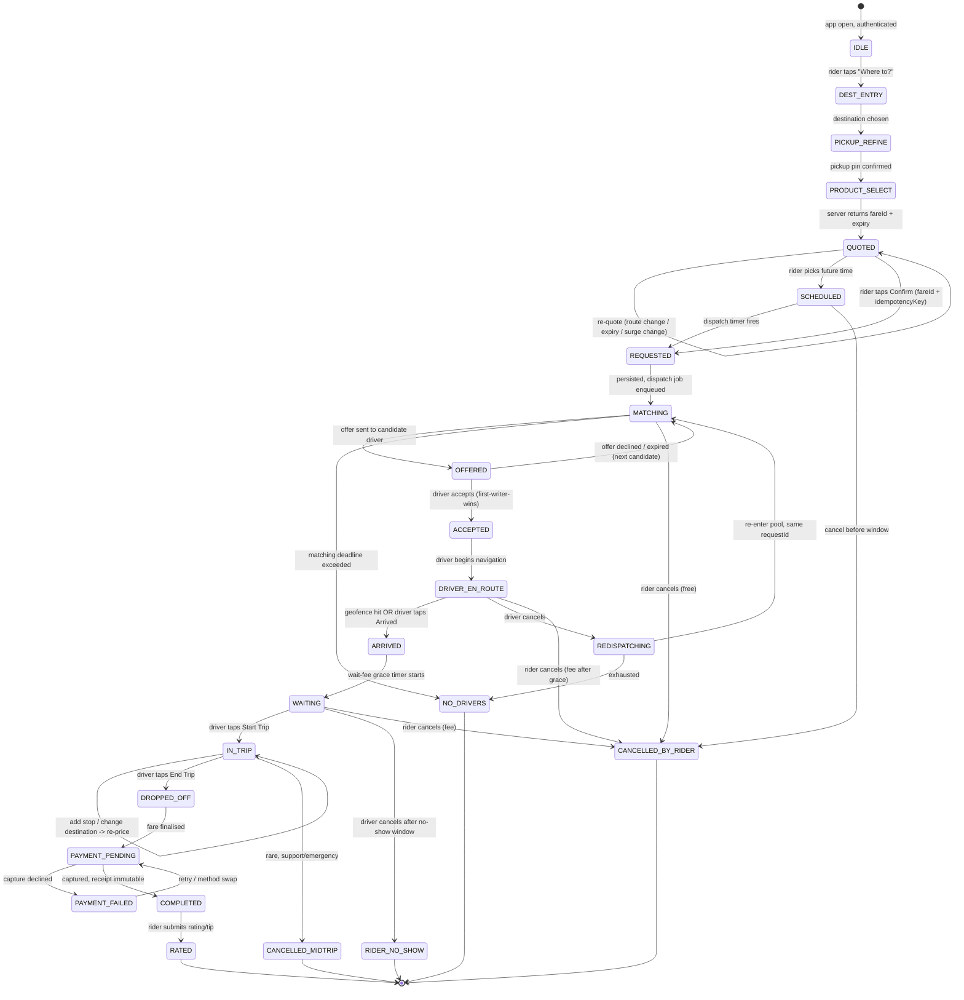

# Uber & Bolt Rider App Architecture — Engineering Reference Dossier

> Purpose: an implementable reference for re-wiring a production ride-hailing rider app
> (React Native/Expo client + Node/Express + Prisma/Postgres backend, Ghana market).
> Everything here is either sourced from a primary/public document or explicitly marked **INFERRED**.
>
> Compiled 2026-08-02. ~40 sources cited inline.

---

## 0. How to read this document

### 0.1 Source tiering

| Tier | Meaning | Examples used here |
|---|---|---|
| **P1** | Uber/Bolt engineering blog, Uber OSS repos, official API docs | RAMEN posts, Fulfillment Platform posts, `developer.uber.com` |
| **P2** | Official product/help pages that describe user-visible state and timing rules | Uber Help, Bolt Support, Uber Marketplace pages |
| **P3** | Reverse-engineered endpoint catalogues, ex-employee/third-party writeups | `runexec/uber-mobile-rider-endpoints` |
| **INFERRED** | My reconstruction where the public record is silent | flagged per-claim |

### 0.2 The three things that actually make Uber feel like Uber

1. **The server owns the state machine; the client owns nothing but a projection of it.** The client never invents a state. ([Uber Fulfillment Platform: statecharts as the entity lifecycle](https://www.uber.com/en-IN/blog/fulfillment-platform-rearchitecture/))
2. **There is one persistent push channel, not polling.** Uber killed polling in 2015 because 80% of API-gateway traffic was polls. ([Uber's Real-Time Push Platform](https://www.uber.com/en-IN/blog/real-time-push-platform/))
3. **The map is never unmounted; trip stages are content swaps inside one persistent surface,** driven by a business-logic tree, not a view/navigation stack. ([Engineering the Architecture Behind Uber's New Rider App](https://www.uber.com/en-IN/blog/new-rider-app-architecture/))

Everything else in this document is detail hanging off those three.

---

# 1. The canonical rider trip state machine

## 1.1 Uber's public status enum (authoritative, P1)

Uber's public Ride Requests API exposes exactly six statuses in its sandbox state-transition table, plus two terminal states reachable outside the happy path. From [Uber API Sandbox docs](https://developer.uber.com/docs/riders/guides/sandbox) and [Dispatch and Cancellation](https://developer.uber.com/docs/guest-rides/guest-ride-api-build-guide/dispatch-and-cancellation):

| Status | Definition (verbatim/near-verbatim) | Terminal? |
|---|---|---|
| `processing` | "The request is matching to the most efficient available driver" | No |
| `accepted` | "The request has been accepted by a driver and is 'en route' to the start location" | No |
| `arriving` | "The driver has arrived or will be arriving shortly" — Guest Rides doc pins this to **within 0.2 miles of the pickup point** | No |
| `in_progress` | "The request is 'en route' from the start location to the end location" | No |
| `completed` | "The request has been completed by the driver" | **Yes** |
| `driver_canceled` | "The request has been canceled by the driver" — driver may cancel at **any** time | **Yes** |
| `rider_canceled` | Result of `DELETE /requests/{id}` | **Yes** |
| `no_drivers_available` | Terminal: no driver could be found; "the trip ends and no further action will occur" | **Yes** |

Critical rule stated by Uber: **"Status changes must be made in the order listed in this status table. For example, if a request has status: `accepted`, you can only change it to status: `arriving`… The exception to this rule is status: `driver_canceled`, since the driver can cancel a request anytime."** That is a literal description of a server-side `assertTransition()` guard. Your backend must have one.

### What the public enum does NOT include (and your app still needs)

The public API is a 2016-era simplification. The real app has more states. From product behaviour documented in Help Center + the Fulfillment statechart model:

| Real state | Evidence | Notes |
|---|---|---|
| `scheduled` / `reserved` | [Uber Reserve](https://help.uber.com/riders/article/what-is-uber-reserve?nodeId=ccb9a8da-9e44-4038-921f-0360bbabc518) — bookable 30 min to 90 days ahead; "upfront driver matching… offered to interested Drivers as early as 7 days before" | A trip that exists but is not dispatching yet |
| `waiting_for_rider` / no-show window | Help: "wait time fee grace period and the commencement of the no-show window start at the time of a driver's arrival" | Distinct from `arriving`; drives fee timers |
| `redispatching` | Guest Rides: "If the driver cancels after accepting the trip, Uber will attempt to redispatch the trip to another driver" | Request object is **reused**, not recreated |
| `payment_pending` / `unpaid_bill` | Rider endpoint `/rt/riders/{uuid}/unpaid-bills` (P3, [runexec catalogue](https://github.com/runexec/uber-mobile-rider-endpoints)) | Trip completed, money not captured |
| `rating_pending` | Rating card is a post-completion blocking surface in both apps (P2, observed product) | |

## 1.2 Bolt's state vocabulary (P2, reconstructed from Support pages)

Bolt does not publish an API enum. From [Bolt Support](https://bolt.eu/en/support/articles/115003240354/) and the [driver-side flow](https://bolt.eu/en/support/articles/7769413257746/), the driver app literally exposes these actions — which implies the states:

| Bolt term | Maps to Uber | Source |
|---|---|---|
| "order" (not "trip") | request | ["Order was cancelled"](https://bolt.eu/en/support/articles/4405396137874/) |
| searching / allocating | `processing` | "the ride will be allocated to another available driver" |
| accepted | `accepted` | driver "Accept" |
| **Start driving** | `accepted` → driving-to-pickup | driver taps *Start driving* |
| **Arriving** | `arriving` | driver taps *Arriving* |
| **Start the trip** | `in_progress` | "Tap on *Start the trip* only after the rider has entered the vehicle" |
| finished | `completed` | |
| cancelled_by_driver / cancelled_by_rider / auto-cancelled | cancel family | "the order may be cancelled automatically due to the failed rider's payment method verification" |

Note the Bolt nuance: **driver-declared "Arriving" is an explicit driver action**, not purely a geofence. Uber uses a geofence (0.2 mi) *and* the driver's arrival action. Design decision for you: use **both** — geofence auto-arrival with driver override, because in Ghana GPS accuracy is unreliable and drivers frequently tap "arrived" from a block away.

## 1.3 The full state machine (merged, implementable)



## 1.4 Authority matrix — who is allowed to cause each transition

**Rule: the client is never authoritative. It emits *intents*; the server emits *states*.**
Uber formalises this: statechart *triggers* are "either a user signal that represents a user intent or a system event", and triggers are "exposed as RPC to allow external systems (user applications, periodic events, event pipelines, and other systems) to invoke the trigger through the RPC interface" ([Fulfillment Platform](https://www.uber.com/en-IN/blog/fulfillment-platform-rearchitecture/)).

| Transition | Trigger origin | Authoritative writer | Client may optimistically render? |
|---|---|---|---|
| QUOTED | rider intent | pricing service (signs fareId) | Yes (price shown from server payload only) |
| REQUESTED | rider intent | trip service | **Optimistic "Requesting…" only** — never `MATCHING` |
| MATCHING → OFFERED | system | dispatch service | No (rider sees generic "finding driver") |
| OFFERED → ACCEPTED | **driver device** intent | trip service (CAS on offer row) | No |
| ACCEPTED → DRIVER_EN_ROUTE | driver device / system | trip service | No |
| → ARRIVED | driver device **or** server geofence | trip service | No |
| → IN_TRIP | driver device | trip service | No |
| → DROPPED_OFF | driver device | trip service | No |
| → PAYMENT_* | system | payments service | No |
| CANCELLED_BY_RIDER | rider intent | trip service | Optimistic "Cancelling…" spinner only |
| CANCELLED_BY_DRIVER / REDISPATCH | driver device | trip service | No |
| NO_DRIVERS | system timer | dispatch service | No |

### How the client is *prevented* from inventing state

Three mechanisms, all of which you should copy:

1. **The client has no state-setting API.** There is no `PATCH /trip/status`. There are only intent endpoints: `POST /trips/{id}/cancel`, `POST /trips/{id}/stops`. The server decides what state results.
2. **Every pushed trip payload carries a monotonic version.** RAMEN attaches "incremental sequence numbers" per connection; the Fulfillment layer additionally versions the entity (each Spanner row has commit timestamps and each entity change carries a version number — see the payments `EntityChangeLog` pattern in [Revolutionizing Money Movements](https://www.uber.com/en-IN/blog/money-scale-strong-data/)). The client **drops any payload whose version ≤ current**.
3. **Out-of-order delivery is expected and handled by skipping forward.** Uber's webhook docs say it explicitly: *"Webhooks can be sent more than once and the delivery is not guaranteed to be in order… In the case of out of order statuses, the expected behavior is to manage the state on the client and skip to the latest status."* ([Webhooks](https://developer.uber.com/docs/riders/guides/webhooks))

> **Implementation rule for us:** every trip payload must include `{ tripId, status, version, updatedAt }`. Client reducer: `if (incoming.version <= current.version) return current;`. Additionally maintain a client-side *terminal state lock*: once a trip reaches a terminal status, never accept a non-terminal update for that `tripId`.

## 1.5 Idempotency & dedup

| Operation | Uber/Bolt mechanism | Evidence |
|---|---|---|
| Fare quote | `fare_id` is an opaque **64-hex-char** server-signed token, e.g. `d30e732b8bba22c9cdc10513ee86380087cb4a6f89e37ad21ba2a39f3a1ba960` | [POST /v1.2/requests](https://developer.uber.com/docs/riders/references/api/v1.2/requests-post) |
| Create request | Request returns a server-generated `request_id` UUID with **202 Accepted**; duplicate submits while a trip is live are rejected with `409 current_trip_exists` | same |
| Surge acceptance | `surge_confirmation_id` with explicit `expires_at` unix ts; premature expiry yields `fare_expired` | same |
| Push message dedup | RAMEN messages carry a per-type dedup config: "sending the most recent push message of a given type was enough… allowed us to reduce the overall data transfer rate" | [RAMEN](https://www.uber.com/en-IN/blog/real-time-push-platform/) |
| Webhook dedup | `event_id` "unique by event_type/request_id/status"; consumer filters on `resource_id + status` | [Webhooks](https://developer.uber.com/docs/riders/guides/webhooks) |
| Chat message dedup | `clientMesssageId` [sic] on `POST /rt/communications/message` — client-generated idempotency key | [runexec catalogue](https://github.com/runexec/uber-mobile-rider-endpoints) |
| Payment exactly-once | "exactly-once payment processing by the means of idempotency and strong consistency"; "We use unique identifiers as identifiers of users, jobs, and orders. And we generate the unique identifiers **deterministically**. The processed order unique identifiers are used to guarantee exactly once order processing." | [Payments Platform](https://www.uber.com/en-IN/blog/payments-platform/), [Money Movements](https://www.uber.com/en-IN/blog/money-scale-strong-data/) |

### Concrete idempotency contract to implement

```http
POST /v1/trips
Idempotency-Key: 5f3c9c1e-... (client-generated UUIDv4, persisted before send, reused on retry)
Content-Type: application/json

{
  "fareId": "d30e732b...ba960",
  "productId": "eyego-x",
  "pickup":  { "lat": 5.6037, "lng": -0.1870, "address": "Osu Oxford St", "placeId": "..." },
  "dropoff": { "lat": 5.5600, "lng": -0.2050, "address": "Kaneshie Market" },
  "stops": [],
  "paymentMethodId": "pm_momo_024xxxxxxx",
  "seatCount": 1,
  "clientRequestedAt": "2026-08-02T09:14:22.031Z"
}
```

Server behaviour:
- `Idempotency-Key` row is inserted in the **same transaction** as the trip. Unique index on `(userId, idempotencyKey)`.
- Replay of the same key returns the **same** `202` body byte-for-byte, never a second trip.
- If the user already has a live trip → `409 { code: "current_trip_exists", tripId }` and the client hard-navigates into that trip.

**Driver-accept dedup (two drivers accept simultaneously):** compare-and-set on the offer row.
```sql
UPDATE trip
   SET status = 'ACCEPTED', driver_id = $driverId, version = version + 1
 WHERE id = $tripId AND status IN ('MATCHING','OFFERED') AND driver_id IS NULL;
-- rowCount = 0  => loser; return 409 OFFER_ALREADY_TAKEN, driver app shows "Trip no longer available"
```
This is the same primitive Uber replaced Ringpop's application-level serial queue with when they moved to Spanner: "Spanner keeps track of locks across rows and issues transaction aborts when there is contention between transactions." ([Building Uber's Fulfillment Platform](https://www.uber.com/en-IN/blog/building-ubers-fulfillment-platform/))

---

# 2. The request → dispatch handshake as the rider experiences it

## 2.1 Timeline of "the instant the rider taps Confirm"

| t | What happens | Where | Evidence |
|---|---|---|---|
| t0 | Button enters *pending* state, **disabled**, haptic. No status text invented. | client | INFERRED (product behaviour) |
| t0 | `POST /trips` with `fareId` + `Idempotency-Key` | client → gateway | [POST /requests](https://developer.uber.com/docs/riders/references/api/v1.2/requests-post) |
| t0+ε | Gateway runs middleware stack: protocol manager → auth → rate-limit → handler → backend client, with circuit breaker | API gateway | [Architecture of Uber's API gateway](https://www.uber.com/en-IN/blog/architecture-api-gateway/) |
| ~t0+80ms | Trip row + waypoints persisted **atomically**; offer job enqueued; post-commit tasks written in the same transaction (LATE table) | fulfillment | [Fulfillment re-architecture](https://www.uber.com/en-IN/blog/fulfillment-platform-rearchitecture/) |
| ~t0+120ms | **`202 Accepted`** returned with `status: "processing"`, `vehicle: null`, `driver: null`, `location: null`, `eta: 5` | server → client | [POST /requests](https://developer.uber.com/docs/riders/references/api/v1.2/requests-post) |
| t0+120ms | Client swaps bottom-sheet content to "Finding your driver". Map camera transitions to pickup-focused. Map is **not** remounted. | client | [Rider app architecture](https://www.uber.com/en-IN/blog/new-rider-app-architecture/) |
| t0 + few s | **Batched matching window**: "if we wait just a few seconds after a request… enough time for a batch of potential rider-driver matches to accumulate" | dispatch | [Uber Marketplace: Matching](https://www.uber.com/us/en/marketplace/matching/) |
| — | Offer pushed to a driver; driver offers "have a validity of 30 seconds" | dispatch → driver | [Next-Gen Push Platform on gRPC](https://www.uber.com/en-IN/blog/ubers-next-gen-push-platform-on-grpc/) |
| — | Driver accepts → trip + supply entities updated in **one** transaction ("If a driver accepts a trip offer, we have to modify the trip entity and the supply entity, and add waypoints of the trip in the supply entity's plan") | fulfillment | [Fulfillment re-architecture](https://www.uber.com/en-IN/blog/fulfillment-platform-rearchitecture/) |
| — | Fireball detects the state change and decides *who* gets a push: "when a driver 'accepts' an offer, the driver and trip entity state changes. This change triggers the Fireball service. Then, based on a configuration, Fireball decides what type of push messages should be sent to the involved marketplace participants." | push platform | [RAMEN](https://www.uber.com/en-IN/blog/real-time-push-platform/) |
| — | Rider client receives a **full trip payload** over the persistent channel; sheet morphs to driver card. | client | same |

**Response shape returned immediately (mirror this exactly in spirit):**
```json
{
  "request_id": "852b8fdd-4369-4659-9628-e122662ad257",
  "product_id": "a1111c8c-c720-46c3-8534-2fcdd730040d",
  "status": "processing",
  "vehicle": null,
  "driver": null,
  "location": null,
  "eta": 5,
  "surge_multiplier": null
}
```
Note the design: **all driver-related fields are present-but-null**, so the client's decoder never has to branch on schema shape, only on `status`. Copy this. A single `Trip` type with nullable driver/vehicle blocks eliminates an entire class of RN crashes.

## 2.2 Fare quote lifecycle

### Uber

- **Upfront price** is computed from "estimated trip time and distance from origin to destination, as well as demand patterns for that route at that time… any applicable tolls, taxes, surcharges, and fees (with the exception of wait time fees)" ([Upfront pricing explained](https://www.uber.com/us/en/ride/how-it-works/upfront-pricing/)).
- The quote is materialised as **`fare_id`**, a long opaque hex string. The rider app calls `POST /requests/estimate` (or `GET /rt/fare/estimate` on the private API, params `origin_lat, origin_lng, vehicle_view_ids, destination_lat, destination_lng`) and receives the id; `POST /requests` then **requires** it.
- **The fare ID is the binding.** It is not advisory. Expiry produces `409 fare_expired` ("The fare has expired for the requested product. Please get estimates again, confirm the new fare, and then re-request") and an invalid one produces `422 invalid_fare_id`.
- **Surge is a second, separate token.** On surge, `POST /requests` returns `409 Conflict` with:
```json
{ "meta": { "surge_confirmation": {
    "href": "https://api.uber.com/v1/surge-confirmations/e100a670",
    "surge_confirmation_id": "e100a670",
    "multiplier": 1.4,
    "expires_at": 1459191276 } },
  "errors": [{ "status": 409, "code": "surge",
               "title": "Surge pricing is currently in effect for this product." }] }
```
  The rider must explicitly accept; the accepted token is replayed as `surge_confirmation_id`. Uber notes it "could expire prematurely to the timestamp."
- **Re-quote triggers** (from [Review change in upfront trip price](https://help.uber.com/en/riders/article/review-change-in-upfront-trip-price?nodeId=f5a6c432-2a21-431e-966d-623087cb24e2)): change of destination, extra stops, "significant changes to the route or duration of the trip", passing an unmodelled toll, wait-time fees, multi-stop fees. When destination changes, **"the system switches to charging based on the time and distance of the actual trip instead"** — i.e. upfront pricing is *voided* and metered pricing takes over.
- **Uber Reserve** is the exception: "Time and distance pricing does not apply to Uber Reserve, which is paid as an upfront fare."

### Bolt

- Same three components, stated plainly: **"Base fare: the price for pickup; Minute rate: time from start to end of a journey; Mile/Kilometre rate: distance of the route covered; Dynamic pricing, if applicable"** ([Upfront pricing in the UK](https://bolt.eu/en/support/articles/360020422620/)).
- Bolt is more explicit that the quote is a **floor, not a cap**: *"Upfront pricing is usually the minimum amount you can expect to pay for a Bolt ride"*, with named override conditions: traffic overrun → "the price will be calculated based on the actual time and distance travelled"; toll/congestion; destination change; extra stops; rider-requested route change.
- **Dynamic pricing UI contract:** *"When prices are increased, you will see an arrow pointing up next to the trip price."* Bolt does not show a multiplier like Uber's `1.4x`; it shows a directional glyph. Cheaper to build, less user anger. Consider copying for Ghana.
- Driver-side, Bolt supports **driver-set pricing within a range** ("Distance rate is set automatically unless you have set your own pricing from the provided range"), which Uber does not. Scheduled rides force standard pricing: "Only standard Bolt pricing is used with scheduled rides as custom pricing… is not compatible."

### The fare-ID-signed-by-server pattern (implement this)

```
POST /v1/fares/quote  { pickup, dropoff, stops[], productId }
  ->  {
        fareId: "<base64url(payload).base64url(hmac_sha256(payload, FARE_SIGNING_KEY))>",
        currency: "GHS",
        total: 4250,                     // minor units, integer, never float
        breakdown: { base, perKm, perMin, surgeMultiplier, tolls, fees, discounts },
        distanceMeters, durationSeconds,
        surgeMultiplier: 1.0,
        expiresAt: "2026-08-02T09:16:52Z",   // 120s typical
        quoteVersion: 3
      }
```
Signed payload contents (so the server can validate without a DB read):
`{ userId, productId, pickupH3, dropoffH3, total, currency, surge, issuedAt, expiresAt, nonce }`

Server rules:
- `POST /trips` recomputes HMAC. Mismatch → `422 invalid_fare_id`. Expired → `409 fare_expired`.
- Also store the `nonce` in a short-TTL set → a fareId can be **redeemed exactly once**. This blocks the "screenshot the cheap fare and replay it" attack that hand-rolled clones always have.
- Quote TTL: Uber/Bolt do not publish theirs. **INFERRED: 90–180s** is the right band — long enough for MoMo PIN entry, short enough that surge doesn't drift. Ghana MoMo confirmation can take 30–60s, so do **not** go below 120s.
- On expiry the client must **re-quote silently and show a diff** if the price moved (Uber shows a two-stage confirmation screen when multiplier ≥ 2.0 — see sandbox doc: "A multiplier greater than or equal to 2.0 will require the two stage confirmation screen").

## 2.3 What the rider actually sees while matching

The "searching" animation is **not** a decorative spinner. Public evidence for what it reflects:

- Uber's rider app pre-fetches and streams **nearby drivers**: RAMEN exists partly to deliver "nearby drivers when you open the app" ([RAMEN](https://www.uber.com/en-IN/blog/real-time-push-platform/)). The cars you see circling during search are real vehicle positions from the same push channel, filtered to your product type.
- The pulsing radius is anchored to the **confirmed pickup point**, not to raw GPS — Uber has dedicated pickup-snapping endpoints (`/rt/locations/pickups/snap`, `/rt/locations/pickups/venue`, `/rt/locations/pickups/geocode_region`, `/rt/locations/pickups/dynamic`) (P3, [runexec](https://github.com/runexec/uber-mobile-rider-endpoints)).
- The wait is **not dead time** — batched matching deliberately holds the request for a few seconds to improve the global assignment ([Marketplace: Matching](https://www.uber.com/us/en/marketplace/matching/)).

**ETA-to-match estimation.** Uber's ETA stack is DeepETA: a routing engine produces a physical ETA from map data + real-time traffic as "a sum of segment-wise traversal times along the best path", then an ML model predicts the *residual* between routing ETA and observed outcome — "ETA post-processing" ([DeepETA](https://www.uber.com/en-IN/blog/deepeta-how-uber-predicts-arrival-times/)). This is the highest-QPS model at Uber. **INFERRED for us:** you cannot build DeepETA. Do the physical half honestly (routing-engine ETA from the matched driver's snapped position to the pickup, refreshed on each location push) and apply a small learned/static correction factor per city and time bucket. Never show a static "5 min".

**When "no drivers available" fires.** Uber does not publish the timeout. Facts we do have:
- It is a **terminal** state — "the trip ends and no further action will occur."
- It fires both from initial matching exhaustion and from redispatch exhaustion.
- Sandbox forces it via `drivers_available: false`, meaning it's a first-class simulated condition — build the same test hook.

**INFERRED recommended timings for a Ghana market** (thin supply, high decline rates, patchy data):

| Knob | Value | Rationale |
|---|---|---|
| Batch accumulation window | 3–5 s | Uber's "few seconds"; longer hurts perceived responsiveness |
| Offer TTL per driver | 15–20 s | Uber's driver offers are 30 s; 30 s is too slow when you cascade 4 drivers |
| Cascade depth | 5–8 drivers, expanding radius | |
| Total matching deadline | 120–180 s before `NO_DRIVERS` | Riders abandon around 2 min |
| Rider-visible "still looking" copy change | at 45 s and 90 s | Prevents the "is it frozen?" perception |

## 2.4 Driver-cancel handling — the single most-botched flow in clones

Uber's documented behaviour ([Dispatch and Cancellation](https://developer.uber.com/docs/guest-rides/guest-ride-api-build-guide/dispatch-and-cancellation)):

> "If the driver cancels after accepting the trip, Uber will attempt to redispatch the trip to another driver: **Driver Redispatch** — Uber will attempt to assign a new driver. **No Drivers Available** — If no driver is found, the trip will enter a terminal state called `no_drivers_available`."

And on fees: *"If the driver waits for at least 5 minutes at the pickup location and then cancels, a no-show cancellation fee is charged. If the driver cancels before 5 minutes, there is no fee, and Uber will attempt to redispatch another driver."*

Bolt: *"the ride will be allocated to another available driver"* ([scheduled rides](https://bolt.eu/en/support/articles/7769413257746/)).

**Answers to the three questions asked:**

1. **Is the rider silently bounced back to searching?** No — silent is wrong and neither app does it silently. The rider gets an explicit notification/state ("Your driver cancelled — finding you another driver"), then the searching surface returns. The push platform makes this cheap: one `driver_canceled` trigger fans out to both parties via Fireball.
2. **Is the same request object reused?** **Yes.** Uber's language is "redispatch the trip", and the terminal `no_drivers_available` is described as the *trip* ending — so the trip entity persists across the reassignment. Your `tripId` must survive driver churn. Creating a new trip breaks the receipt, the share link, the support ticket and the rider's mental model.
3. **Is there a distinct "finding you another driver" state?** Yes, functionally — model it as `REDISPATCHING`, which is a substate of matching with a *previous driver* recorded. Statecharts make this natural: "a statechart is a finite-state machine where each state may define its own subordinate state machines, called substates" ([Fulfillment re-architecture](https://www.uber.com/en-IN/blog/fulfillment-platform-rearchitecture/)).

**Anti-rematch rule:** Uber states it will "modify pairings of drivers and riders in certain instances to help maintain a safe platform; for example, we prevent matches if one has given the other a one-star rating in the past" ([Marketplace: Matching](https://www.uber.com/us/en/marketplace/matching/)). Add the cancelling driver to a per-trip exclusion set so redispatch cannot bounce back to them.

---

# 3. Realtime transport & data sync — the core

## 3.1 Uber's push platform: the full history (all P1)

### Phase 0 — polling (pre-2015). Why they killed it

Verbatim from [Uber's Real-Time Push Platform](https://www.uber.com/en-IN/blog/real-time-push-platform/):

- "At some point, **80% of requests made to the backend API gateway were polling calls**."
- "Aggressive polling keeps the app responsive, but leads to larger server resource utilization. Any bugs in the polling frequency results in significant backend load and degradation."
- "Polling leads to faster battery drain, app sluggishness, and network-level congestion. This is especially evident in places with **2G/3G networks or spotty networks**."
- "At its peak, the app was polling **dozens of APIs**."
- "**Cold startup of an app was the most challenging scenario for a polling strategy.** Every time the app was opened, all the features wanted to pull the latest state… This led to multiple competing concurrent API calls and the app could not render until critical components were retrieved."

> This paragraph is a precise description of what a naive RN ride-hailing clone does today. It is the root cause of the "disjointed" feel.

### Phase 1 — RAMEN over SSE (2015)

**Name:** RAMEN = **R**ealtime **A**synchronous **ME**ssaging **N**etwork.

**Design principles (verbatim, 4 of them):** easier migration from polling to push; ease of development; reliability ("All messages should be sent reliably over the network and retried if delivery fails"); wire efficiency ("With Uber growing rapidly into developing countries, the cost of data usage was a challenge for our users").

**Why SSE over WebSockets:** "For an application protocol in 2015, our options were to utilize HTTP/1.1 with long polling, Web Sockets or finally Server-Sent events (SSE). Based on the various considerations like **security, support in mobile SDKs, and binary size impact, we settled on using SSE**. Its simplicity and operability on the already supported HTTP + JSON API stack at Uber made it our choice."

**The protocol, exactly:**

```
1. Client connects:      GET /ramen/receive?seq=0
2. Server responds:      HTTP 200, Content-Type: text/event-stream
3. Server sends all pending messages in DESCENDING PRIORITY order,
   attaching incremental sequence numbers 1,2,3,...
4. TCP guarantees ordering; a gap means the connection died.
   Client reconnects with the LARGEST seq it actually received:
                         GET /ramen/receive?seq=2
   Server resends from seq=3 (or a newer higher-priority message).
5. Heartbeat: server sends a 1-BYTE message every 4 seconds.
   Client sees no heartbeat/message for 7 seconds -> assume dead, reconnect.
6. Reconnect-with-higher-seq acts as an implicit ACK (server flushes older msgs).
7. On a good connection the client may stay up for minutes, so it ALSO calls
                         POST /ramen/ack?seq=N   every 30 seconds
   regardless of connection quality.
```

Direct quotes worth keeping: *"This protocol builds the required resumability of streaming connection with the server doing the majority of the storekeeping and is quite simple to implement on the client side."* And: *"Our system provides an 'at-least-once' guarantee for delivery."*

**Message metadata model (three knobs per message type):**

| Knob | Values / behaviour |
|---|---|
| **Priority** | High (core UX), Medium (incremental UX), Low (big payloads / low frequency). On connect, messages go into the socket in **descending priority**. High-priority messages get "server side retries in case of RPC failures and… support for cross region replication." |
| **TTL** | "each message has a defined time to live value ranging from a few seconds to **up to 30 minutes**. The message delivery system will persist the message and retry delivery of the message until the time to live value expires." |
| **Dedup** | "determines if a push message should be deduplicated in the case when the same message type is generated multiple times through various triggers or retries. For the majority of our use cases, **sending the most recent push message of a given type was enough**." |

**Architecture components:**
- **Fireball** — "a microservice responsible for solving the problem of *when to push a message?*" Listens to system events; config-driven; fans one trigger into multiple payloads to multiple users. Triggers include "a user action like requesting a ride, the app opening, a timer ticking on a fixed interval, a backend business event on the message bus, or **geographic egress/ingress events**."
- **API Gateway** — decides *what* to push. Endpoints are categorised **Pull** (called by device) and **Push** (called by Fireball, with a "Push" middleware that intercepts the pull-API response and forwards it to the delivery system). **Key insight: the same handler serves both.** "the same logic is used whether your app is pulling a 'user' object via a pull API call or Fireball is sending a 'user' object via a push API call."
- **RAMEN Server / Streamgate** — holds connections, stores messages "either in memory and backed in a database", stores **device context** per connection (hashed from user + device params, so multiple devices/apps are isolated).

**Gen-1 implementation:** Node.js + **Ringpop** (consistent-hash sharding by user UUID) + **Redis**.
**Scale reached:** "over **70,000 QPS** push messages per second to three different types of apps by maintaining up to **600,000 concurrent streaming connections**."

**Why gen-1 broke:** "Ringpop-based distributed sharding is a very simple architecture, but does not scale as the number of nodes in the ring increases. The Ringpop library used a **gossip protocol**… The time of convergence for the gossip protocol also increases as the size of the ring increases. Additionally, Node.js workers were single threaded and would have elevated levels of **event loop lag**… These issues could result in topology information that is inconsistent and lead to **message loss, timeouts, and errors**."

### Phase 2 — RAMEN gen-2 (2017): Netty + ZooKeeper + Helix + Redis + Cassandra

- **Streamgate**: implements the RAMEN protocol on Netty; a Helix *participant*.
- **StreamgateFE**: Helix *spectator*; reverse proxy that shards every request (from Fireball, gateway, or apps) by user and routes to the owning Streamgate worker.
- **Helix Controllers**: five-node service; brain of topology management; reallocates shards when Streamgate nodes start/stop.
- **Cassandra** for durable, cross-region-replicated message storage; **Redis** as a capacity cache "to avoid thundering herd problems commonly associated with the sharded systems on deployments or failover events."
- Result: **99.99% server-side reliability**, **>1.5M concurrent connections**, **>250,000 messages/second**, 10+ app types across iOS/Android/Web.

### Phase 3 — RAMEN over gRPC bidi streaming on QUIC/HTTP3 (2019→2022)

From [Uber's Next Gen Push Platform on gRPC](https://www.uber.com/en-IN/blog/ubers-next-gen-push-platform-on-grpc/):

Problems with SSE that forced the move:
1. **Loss of acknowledgements** — "The delivery state of a message is unknown for up to 30 seconds after it is written to a RAMEN connection. A lot of critical messages like **offers sent to drivers have a validity of 30 seconds**. This prevents us from resending critical push messages like driver offers."
2. **Poor connection stability** — "client implementations across different platforms have many nuanced differences in handling errors, timeouts, backoffs or app lifecycle events (open or close), network state changes, hostname, and datacenter failovers. This results in **variability in performance across versions**."
3. **Transport limits** — unidirectional; text-only (base64 bloat for binary); heartbeats share the stream with messages so a big payload on a slow link causes **head-of-line blocking** and a spurious disconnect.

What changed:
- Bidirectional gRPC stream. **Acks are instant, on the reverse stream** — no separate `/ramen/ack` RPC.
- Heartbeat cadence changed to **every 5 seconds** and heartbeats/control messages live on a separate HTTP/2 stream.
- Request model carries `SeqID` + message acks + **feature acks** (acks emitted by the feature-team plugin that consumed the message) + **control messages** (client can tell server to terminate; reserved for flow control and stream prioritization).
- Response model is a union: RAMEN message | control message | heartbeat.
- Runs over **QUIC/HTTP3** via Cronet — "QUIC brought us a 10-30 percent improvement in tail-end latencies for HTTPS traffic"; gRPC "can use Cronet as transport, which allows RAMEN to **reuse the QUIC session from the real-time traffic**, further reducing the latency for the first RAMEN message."
- **Gzip compression became mandatory**: without it, >1MB payloads took "20 to 50 seconds" on Edge/3G and starved the heartbeat, producing false disconnects. With gzip: ~5 s. *(Note the asymmetry they call out: SSE didn't have this problem because "the lower-level protocol allows for reading chunks of the payload instead of waiting for the whole payload to arrive as seen in gRPC.")*
- **Fallback layer**: "The fallback layer was built to detect failures in connectivity via the gRPC stack and would quickly fallback to the SSE-based stack if needed."

Results: **gRPC connect latency p95 improved ≥45%**; push success rates up 1–2% across all apps.

### 3.2 What this means for a React Native app in Ghana (INFERRED, but tightly reasoned)

You cannot build Streamgate. You can build the **protocol semantics**, which is what actually matters:

| RAMEN property | Your implementation |
|---|---|
| Persistent channel | Socket.IO / raw WebSocket / SSE over HTTPS. **SSE is genuinely the right first choice** for the same reasons Uber picked it in 2015: HTTP-native, survives proxies, trivial server, tiny client. |
| Sequence numbers | Every message: `{ seq, type, priority, ttlMs, payload }`. Client stores `lastSeq` in memory + MMKV. Reconnect: `GET /stream?seq=<lastSeq>`. |
| Server-side storekeeping | A per-user mailbox in Redis (`ZADD mailbox:{userId} <seq> <msg>`), trimmed on ack. |
| At-least-once + dedup | Client keeps a bounded `Set<seq>` of processed ids; dedup by `(type, resourceId)` keeping the newest. |
| Heartbeat | Server → client every **4–5 s**; client declares dead at **7–10 s** of silence. Do not use TCP keepalive; carrier NATs lie. |
| Reconnect backoff | Full jitter exponential: `delay = rand(0, min(30s, 500ms * 2^n))`. Reset `n` on a *successful message*, not on a successful connect. |
| Priority | 3 buckets. Flush high first on (re)connect. Trip-state messages are always High. |
| TTL | Trip-state: 30 min. Driver-location: **5 s** (a stale position is worse than none). Promos: 30 min. |
| Compression | gzip/permessage-deflate ON. Ghana MTN/Vodafone data is metered and slow; this is not optional. |
| Fallback | If the stream fails to establish twice, fall back to **adaptive polling** of `GET /trips/current` at 3 s (in-trip) / 10 s (idle) and show a subtle "reconnecting" affordance. Uber built exactly this fallback muscle. |

## 3.3 Driver-location pushes to the rider: shape, cadence, smoothing

**Cadence (P2/P3, best available):** community-documented Uber behaviour is a GPS ping every **4–6 s** typically, tightening to ~2–4 s with a passenger onboard and relaxing to 10–30 s when idle to save battery ([summary of driver-forum + writeups](https://medium.com/@decodinggtech/how-uber-tracks-drivers-without-true-real-time-69cb0ce127e2)). Treat this as directional, not gospel. Uber's own published number for *push* is the heartbeat (4 s SSE / 5 s gRPC), which sets the practical floor for how often a rider can learn anything.

**Snapping: server-side, not client-side.** Uber operates a dedicated pickup/snap surface (`/rt/locations/pickups/snap`) and describes GPS error in urban canyons reaching **"50 meters or more due to signal blockage and reflections"**, addressed by a **client-server architecture using 3D maps and probabilistic computation over raw Android GNSS API data** ([Rethinking GPS](https://www.uber.com/en-SE/blog/rethinking-gps/)). They also built the **Beacon** hardware with accelerometer dead-reckoning "to smooth sudden location jumps typical of GNSS behavior in urban canyon areas" ([Beacon](https://www.uber.com/en-SE/blog/beacon-improving-pickups-with-better-location-accuracy/)).

> **Decision for us:** snap on the **server**. The driver device sends raw fixes; the backend map-matches to the route polyline and publishes *snapped* positions to the rider. Reasons: (a) one implementation instead of two clients, (b) the server already owns the route, (c) an RN client doing map-matching will drop frames.

**Payload shape to publish to riders (INFERRED, modelled on what the UI needs):**
```json
{
  "seq": 4821,
  "type": "TRIP_DRIVER_LOCATION",
  "priority": "HIGH",
  "ttlMs": 5000,
  "tripId": "trp_01J...",
  "version": 3120,
  "at": "2026-08-02T09:21:04.512Z",
  "point":   { "lat": 5.60412, "lng": -0.18693 },
  "snapped": { "lat": 5.60409, "lng": -0.18701, "routeIndex": 137, "offsetMeters": 3.1 },
  "bearing": 214.5,
  "speedMps": 8.4,
  "accuracyMeters": 12,
  "etaSeconds": 214,
  "remainingMeters": 1840,
  "routeRevision": 7
}
```

Design notes baked into that payload:
- `bearing` is **GPS course over ground**, never the compass. A phone in a cradle points wherever the cradle points.
- `routeIndex` + `routeRevision` let the client animate *along the polyline* instead of great-circle lerping through buildings. When `routeRevision` bumps, the client replaces the polyline and hard-snaps the marker once.
- `etaSeconds`/`remainingMeters` come from the server so the rider and driver never disagree.
- Drop `snapped` for the free-roam/idle case (nearby cars on the home screen) — those can be raw and cheap.

**Client-side smooth animation (the thing that makes it feel like Uber):**

```
On each location message:
  1. If gap since last > 15s OR distance > 150m -> teleport (no animation).
  2. Else animate marker from current rendered position to snapped position
     over min(interval, 1.2 * observedInterval) using linear-in-time,
     following the route polyline segment list between routeIndex_prev..routeIndex_new.
  3. Animate bearing separately with shortest-angle interpolation
     (handle the 359 -> 1 wrap), ease-out, ~300ms.
  4. Never animate if |Δposition| < 2m — jitter looks like a vibrating car.
  5. Run all of it on the UI thread (Reanimated worklet / native driver).
     JS-thread animation is the #1 reason clone maps stutter.
```

Uber calls the visual outcome "route lines on the screen" as a first-class RAMEN use case, alongside "pickup time, arrival time… nearby drivers when you open the app."

## 3.4 Push notifications (FCM/APNs) vs the persistent channel

| Concern | Channel | Rationale |
|---|---|---|
| Trip state changes while app is **foreground** | Persistent stream | Lower latency, no OS throttling, carries the full payload |
| Driver location | Persistent stream **only** | Never FCM — you'd be rate-limited and battery-shamed |
| Trip state changes while app is **background/killed** | FCM/APNs | The only mechanism the OS guarantees |
| "Your driver has arrived" | **Both** — stream if connected, FCM as a parallel high-priority notification | Redundancy is correct here; dedup on `(tripId, status)` |
| Marketing/promos | FCM data+notification | |

**The silent-push wake pattern.** Uber's own trigger list for Fireball includes "the app opening" and timer ticks — and gen-2/3 RAMEN exists precisely because mobile connections die. The industry pattern (INFERRED for our stack, standard practice):

- iOS: `content-available: 1` with `apns-push-type: background`, `apns-priority: 5`. Budget: a handful per hour, throttled by iOS. Use it to say *"something changed, refetch"* — never to carry state.
- Android: FCM **high-priority data message**; on Android 12+ this grants a short foreground-service window. Same rule: it's a *wake*, not a payload.
- On wake: the app opens the stream, or if that fails, calls `GET /trips/current` once. **Everything reconciles through one endpoint.**
- Ghana-specific: many low-end Androids ship aggressive OEM battery killers (Transsion/Tecno/Infinix/itel dominate the market). Assume FCM delivery is best-effort at best. **The `GET /trips/current` rehydration path is your real safety net, not push.**

## 3.5 Cold start / app-kill mid-trip: the ONE-CALL rehydration

Uber's stated cold-start pain was competing concurrent API calls. Their answer on the private API is a single bootstrap: **`POST /rt/apps/bootstrap-rider`** (P3, [runexec](https://github.com/runexec/uber-mobile-rider-endpoints)), complemented by **`GET /rt/riders/me/dispatch-view`** — a rider-scoped view of the current dispatch. The public API's equivalent is `GET /requests/current`, which webhook docs describe as the thing push lets you stop polling: *"This will notify your application when a user goes on trip and each time the state changes without having to continuously poll `GET /requests/current`."*

**Design the endpoint like this:**

```http
GET /v1/bootstrap
Authorization: Bearer <jwt>
```
```json
{
  "serverTime": "2026-08-02T09:21:07Z",
  "user": { "id": "usr_...", "name": "Ama", "phone": "+233...", "rating": 4.9 },
  "activeTrip": {
    "id": "trp_01J...",
    "status": "DRIVER_EN_ROUTE",
    "version": 3120,
    "createdAt": "...", "acceptedAt": "...", "arrivedAt": null,
    "pickup": { "lat": 5.6037, "lng": -0.1870, "address": "..." },
    "dropoff": { "lat": 5.5600, "lng": -0.2050, "address": "..." },
    "stops": [],
    "product": { "id": "eyego-x", "name": "EyeGo X", "seats": 4 },
    "fare": { "quoted": 4250, "currency": "GHS", "isUpfront": true, "final": null },
    "driver": { "id": "drv_...", "firstName": "Kofi", "rating": 4.87,
                "photoUrl": "...", "maskedPhone": "+233303xxxxxx" },
    "vehicle": { "make": "Toyota", "model": "Vitz", "color": "Silver", "plate": "GR 1234-21" },
    "driverLocation": { "lat": 5.6068, "lng": -0.1901, "bearing": 190.2, "at": "..." },
    "route": { "polyline": "encoded...", "revision": 7, "etaSeconds": 214, "remainingMeters": 1840 },
    "cancellation": { "freeUntil": "2026-08-02T09:19:44Z", "feeMinor": 500 },
    "chatUnread": 1,
    "sos": { "enabled": true, "emergencyNumber": "191" }
  },
  "scheduledTrips": [ /* upcoming reservations */ ],
  "unratedTrip": null,
  "unpaidBills": [],
  "paymentMethods": [ /* pre-fetched, see 4.4 */ ],
  "savedPlaces": [ /* home, work */ ],
  "config": { "featureFlags": {...}, "minAppVersion": "2.4.0" }
}
```

Rules:
- **One call. Under 400ms p95. Non-blocking for everything except `activeTrip`.**
- The client renders the trip surface **directly from this payload**, then opens the stream with `seq=0` — the server flushes any pending high-priority messages.
- If `activeTrip` is non-null on cold start, the app must **deep-navigate into the trip surface before the first frame**, not after a flash of the home screen. That flash is the #1 tell of an amateur clone.
- `unratedTrip` forces the rating modal. `unpaidBills` blocks new requests (Uber does this: `403 pay_balance`, `409 missing_payment_method`).

## 3.6 Offline / degraded network rules

Uber's edge terminates TLS over TCP **or QUIC**, forwarding to the nearest DC, and can "dynamically failover and reroute incoming requests to private data centers" ([Failover handling](https://www.uber.com/blog/eng-failover-handling/)). On the client, Uber's networking stack has explicit interceptors for **failover & redirect, header/OAuth enrichment, and network monitoring** capturing "end-to-end latency, time to create connection, time to TLS, time to lookup host, response status code, network errors, request path" ([Next-Gen Push](https://www.uber.com/en-IN/blog/ubers-next-gen-push-platform-on-grpc/)).

**What the rider app may render from cache (INFERRED but strict):**

| Data | Cacheable? | Max staleness shown without a warning |
|---|---|---|
| Saved places, recent destinations | Yes | Indefinite |
| Payment methods list | Yes | 24 h |
| Product list & static prices | Yes | 1 h, and re-quote before Confirm regardless |
| Map tiles | Yes | Indefinite (pre-cache the operating city) |
| Trip **status** | **No** | Show last-known with an explicit "Reconnecting…" chip and a greyed timestamp |
| Driver **location** | Marked stale | >10 s → fade marker to 60% opacity; >30 s → show "Last seen 34s ago" |
| Fare quote | **No** | Expired quote must block Confirm |

**Optimistic UI rules:**
- Allowed: pressing Confirm shows a pending state; sending a chat message shows it greyed with a clock icon; cancel shows a spinner.
- **Forbidden:** rendering `MATCHING`, `ACCEPTED`, `ARRIVED`, `IN_TRIP` or `COMPLETED` before the server says so. Every one of these has real money or safety attached.
- Outbox pattern for writes that must survive: chat messages, ratings, tips, SOS. Persist to disk with a client id, retry with backoff, dedup server-side on `clientMessageId`.

---

# 4. Client architecture of the rider app

## 4.1 The persistent map + half-sheet model

Uber's rider rewrite (2016) split the app into **Riblets** whose defining property is: *"routing is guided by business logic as opposed to view logic"* and *"This allows the business logic tree structure and depth to be different from the view tree, which will have a **flatter hierarchy**. This helps simplify screen transitions."* ([New Rider App Architecture](https://www.uber.com/en-IN/blog/new-rider-app-architecture/))

The canonical example given in that post is exactly our problem:

> *"the **Ride Riblet** is a viewless Riblet that checks whether a user has an active trip. If the rider does, it attaches the **Trip Riblet**, which will show the trip on a map. If not, it attaches the **Request Riblet**, which will show the screen to allow users to request a trip."*

That is the whole architecture of a rider app in two sentences: **a viewless business node decides which content occupies the one persistent surface.**

The plugins post gives the actual rider RIB tree shape: `Root → LoggedIn → … → Request → Refinement Steps → {Airport Refinement, Location Refinement, Confirmation, …}` with **"30+ different possible children under Refinement Steps"** ([Plugins](https://www.uber.com/en-IN/blog/plugins/)).

**Why the map is never unmounted:**
1. Map instantiation is the single most expensive operation in the app (GL context, style JSON, tile cache warm-up). Remounting on every stage costs 300–1200ms and a white flash.
2. Camera continuity is the product. A camera that jump-cuts between screens destroys the sense that you're looking at one continuous world.
3. Marker/annotation identity must persist so the driver car animates rather than pops.

**Translation to Expo Router / React Native:**

```
app/
  _layout.tsx                      <- MapHost mounted ONCE here, absolutely positioned, zIndex 0
  (tabs)/...
components/trip/
  TripSurface.tsx                  <- the ONE bottom sheet; never unmounts
  stages/
    IdleStage.tsx                  (Where to?)
    DestinationEntryStage.tsx
    PickupRefineStage.tsx
    ProductSelectStage.tsx         (quotes)
    SearchingStage.tsx
    DriverEnRouteStage.tsx
    ArrivedStage.tsx
    InTripStage.tsx
    PaymentStage.tsx
    RatingStage.tsx
```

- `TripSurface` picks a stage from `trip.status` via a pure map. **No `router.push` between trip stages.** Route pushes are only for orthogonal surfaces (profile, wallet, help, chat-as-modal).
- Stage swap = animated height + cross-fade of children, not a navigator transition.
- Each stage is a *plugin*: it declares `{ snapPoints, cameraIntent, mapOverlays, actions }`. The host owns the sheet and camera; stages only declare intent. This is the Uber plugin-point pattern — "80 percent of the Uber rider app's application layer now lives inside plugins. The remaining 20 percent of the code glues the application together."

**Core vs non-core.** Uber's hardest-won rule: *"Core code—everything needed to sign up, take, complete, or cancel a trip—must run. Changes and additions to core code go through a stringent review process. Optional code undergoes less stringent review and can be turned off without stopping Uber's core business."* And on the driver app: **the entire map library is non-core** — "even if we run into a catastrophic failure with our map functionality… we can disable it and allow drivers to progress through the job flow" ([Driver App RIBs](https://www.uber.com/en-IN/blog/driver-app-ribs-architecture/)).

> **Adopt this literally.** Every EyeGo trip stage must have a text-only degraded rendering that works with the map crashed or the tiles unavailable. Wrap the map in an error boundary that, on failure, renders the sheet full-height with addresses + ETA + driver card + actions. Ship a remote flag `map.enabled`. Add a CI test that runs the full request→complete flow with all non-core plugins disabled — Uber does exactly this: "on each change we commit, we run UI tests that exercise the core flows of the application with all plugins disabled."

## 4.2 Single source of truth & reconciliation

Uber's data-flow rule ([New Rider App Architecture](https://www.uber.com/en-IN/blog/new-rider-app-architecture/)):

> *"In the new architecture, data flows in one direction. It goes from service to model stream and then from model stream to Interactor. Interactors, schedulers, and **push-notifications from the network** can ask services to make changes to the model stream. The model stream produces **immutable models**. This enforces the requirement that the Interactor classes must use the service layer to make changes to the application's state."*

**Store shape for us (Zustand or equivalent — one store, not five):**

```ts
type TripStore = {
  // server truth
  trip: Trip | null;              // immutable, replaced wholesale
  tripVersion: number;            // monotonic; guards every write
  driverLocation: DriverLoc | null;
  route: { polyline: string; revision: number; etaSeconds: number } | null;

  // local-only, never sent, never confused with server truth
  ui: {
    stageOverride: null | 'CANCEL_CONFIRM' | 'ADD_STOP';
    sheetIndex: number;
    pendingIntent: null | { kind: 'REQUEST' | 'CANCEL' | 'ADD_STOP'; startedAt: number };
  };

  // outbox
  outbox: OutboxItem[];           // chat, rating, tip, sos — persisted
};
```

**Reconciliation rules (the "server always wins?" question, answered precisely):**

1. **Server always wins on `status`, `fare`, `driver`, `vehicle`, `route`.** No exceptions, no merge.
2. **Version gate:** `if (incoming.version <= state.tripVersion) drop`.
3. **Terminal lock:** once `status ∈ TERMINAL`, ignore all non-terminal updates for that `tripId`.
4. **Pending-intent timeout:** `ui.pendingIntent` is cleared when (a) a server payload arrives whose status reflects the intent, or (b) 12 s elapse → show an inline error and re-enable the button. **Never leave a button disabled forever** because a push was lost. This single rule fixes most "the app is stuck" reports.
5. **Local UI state is never derived from optimistic server state.** If the user tapped Cancel and the server hasn't confirmed, the sheet still shows the driver card with a spinner over the cancel button — it does not pre-render the "cancelled" screen.
6. **Location is eventually consistent and may regress.** Accept out-of-order location by timestamp: `if (incoming.at <= current.at) drop`, independent of the trip version counter.

## 4.3 Camera behaviour per stage

Uber gives no per-stage camera spec publicly. This table is **INFERRED** from observed behaviour of both apps + hard-won mobile-map practice, and is directly implementable.

| Stage | Camera intent | Gesture policy |
|---|---|---|
| IDLE | Follow user, zoom ~15.5, north-up. Nearby-driver markers visible. | Free pan; panning detaches follow and shows a "recenter" FAB |
| DESTINATION_ENTRY | Camera **frozen**; map dimmed behind the search sheet | Disabled |
| PICKUP_REFINE | Zoom 17–18 on the draggable pin; snapped-pickup suggestions as chips | Pan moves the pin (map-under-pin pattern), not the pin over the map |
| PRODUCT_SELECT | `fitBounds([pickup, dropoff])` with sheet-aware bottom padding | Free; **do not re-fit** on every quote refresh |
| SEARCHING | Zoom ~16 centred on pickup; pulse ring; drivers animate | Free; recenter FAB |
| DRIVER_EN_ROUTE | `fitBounds([driver, pickup])`, re-fit **throttled to every 5 s** and only if the driver moved >40 m or has left the viewport | Free; user gesture suspends auto-fit for 8 s then a "recenter" chip appears |
| ARRIVED | Zoom 18 on pickup, driver marker prominent | Free |
| IN_TRIP | Follow the driver, bearing-up (rotate to `bearing`), zoom 16, camera offset so the car sits ~1/3 from the bottom above the sheet | Free; suspend follow 8 s after any gesture |
| DROPPED_OFF / PAYMENT / RATING | Frozen on the dropoff; map dimmed | Disabled |

**Non-negotiable camera rules learned the hard way:**
- Never call `fitBounds` with a degenerate bbox (pickup == driver, or a single point). This is a classic native-crash source in MapLibre/Mapbox. Guard: if `bbox` width or height < ~50 m, use `setCamera({center, zoom})` instead.
- Always pass `padding` that accounts for the current sheet height, or the driver marker hides behind the sheet.
- One camera owner. Stages *request* a camera intent; a single `useTripCamera` hook decides and executes. Two components animating the camera = fighting = jitter.
- Any user gesture sets `userControlled = true` for N seconds. Auto-camera must check that flag before every move. This is the difference between "the map helps me" and "the map fights me."

## 4.4 Prefetching — why Confirm feels instant

Uber's private endpoint surface shows an aggressive prefetch posture (P3, [runexec](https://github.com/runexec/uber-mobile-rider-endpoints)):
`POST /rt/apps/bootstrap-rider`, `GET /rt/riders/me/dispatch-view`, `GET /rt/product/city/rider-view`, `GET /rt/payment/v2/payment_profiles`, `GET /rt/locations/locations`, `GET /rt/locations/tag/locations`, `GET /rt/locations/upfront`, `GET /rt/locations/v2/predictions`, `GET /rt/locations/pickups/dynamic`, `GET /rt/config/all-experiments`, `GET /rt/riders/unexpired-and-valid-promotions`, `GET /rt/reservation/feasibility`.

Note `/rt/locations/upfront` and `/rt/locations/v2/predictions` — Uber predicts your destination **before you type**, and `/rt/reservation/feasibility?originLat&originLng` checks whether scheduling is even possible at your location before showing the UI.

**Prefetch schedule to implement:**

| When | Fetch | Why |
|---|---|---|
| App launch (parallel with splash) | `/v1/bootstrap` | Everything below rides on this |
| App launch | Map style + city tile pack | No blank map on first frame |
| Home idle | Nearby drivers (via stream, not HTTP) | The cars must already be there |
| Home idle | Predicted destinations (home/work/recent/time-of-day) | Zero-typing destination selection |
| Destination chosen | **Immediately** quote all products in one call | Product list must render with real prices, never "…" |
| Destination chosen | Route polyline + ETA | Map draws the line before the sheet finishes animating |
| Product selected | Warm the payment method (MoMo token validity check) | Catch `invalid_payment` *before* Confirm, not after |
| Product selected | Pre-open/verify the push stream | So the `ACCEPTED` message lands in <1 RTT |

**Ghana-specific:** pre-flight the mobile-money method. Uber's error taxonomy has `invalid_payment`, `invalid_payment_method`, `outstanding_balance_update_billing`, `insufficient_balance`, `card_assoc_outstanding_balance`, `missing_payment_method`, `payment_method_not_allowed` — seven distinct pre-request payment failures, all returned **before** a trip exists. Do the same: validate payment at quote time, not at capture time.

---

# 5. Backend / service decomposition relevant to the rider

## 5.1 Services and ownership

| Service | Owns | Uber's name/analogue | Consistency |
|---|---|---|---|
| **API Gateway / Edge** | AuthN/AuthZ, rate limiting, protocol conversion, circuit breaking, audit log, header enrichment, **push-vs-pull duality** | Edge Gateway / Zanzibar ([API gateway](https://www.uber.com/en-IN/blog/architecture-api-gateway/)) | n/a |
| **Fulfillment / Trip lifecycle** | The trip statechart, waypoints, driver-supply linkage, transitions | Fulfillment Platform (`rt-demand`/`rt-supply` → Spanner+statecharts) | **Strong** |
| **Dispatch / Matching** | Candidate selection, offers, offer TTL, cascade, batching, redispatch | DISCO / Marketplace Matching | Strong on the assignment write, eventual on candidate views |
| **Pricing / Fares** | Quote generation + signing, surge, final fare computation, re-price on route change | Fares Platform | Strong on the fare row; eventual on surge inputs |
| **Geo / Maps / ETA** | Geocoding, autocomplete, pickup snapping, routing, ETA | Maps + DeepETA + H3 | Eventual |
| **Location ingest** | Driver GPS ingest, map-matching, geospatial index, geofence events | (Kafka + geo index; H3/S2) | Eventual |
| **Push platform** | Connection state, mailbox, seq/ack, delivery, TTL, dedup, priority | Fireball + Streamgate (RAMEN) | At-least-once |
| **Payments** | Authorisation, capture, refunds, ledger, disbursement | Gulfstream (5th gen) | **Strong**, exactly-once |
| **Notifications** | FCM/APNs, SMS, templates, quiet hours | | At-least-once |
| **Safety** | SOS, trip share, RideCheck-style anomaly detection, masked calling | Safety Toolkit | Strong on SOS record |
| **Support / Disputes** | Tickets, fare adjustments, lost items | Customer Obsession ticket routing (Cadence-orchestrated) | Strong |

## 5.2 Durable trip workflows (Cadence/Temporal)

Uber open-sourced **Cadence**: *"a distributed, scalable, durable, and highly available orchestration engine to execute asynchronous long-running business logic"*, running **"over 12 billion executions and 270 billion actions a month just at Uber"** and powering **"over 1000 services at Uber from T0 (most critical) to T5"** ([Cadence](https://github.com/cadence-workflow/cadence), [Uber blog](https://www.uber.com/us/en/blog/open-source-orchestration-tool-cadence-overview/)). The canonical example given for Cadence is literally a ride: *"a customer requests a ride, a driver accepts, the trip starts, payment is processed, a rating is given — a whole sequence of events that needs to happen reliably, even if things go sideways."*

The two properties that eliminate half-finished trips:
1. **The workflow's state is the durable record.** "The client library… ensures state persistence between events even in case of worker failures."
2. **Timers are durable.** `workflow.Sleep` / `workflow.Timer` — "the timer settings are persisted and the events are generated even if workers executing the workflow crash." Every ride-hailing timer (offer TTL, matching deadline, free-cancel window, wait-fee grace, no-show window, quote expiry, capture retry) is a durable timer. **A ride-hailing backend without durable timers will strand trips. This is not optional.**

**If you cannot run Temporal**, replicate the two primitives Uber built when they left Ringpop:

- **Post-commit tasks written inside the same transaction** — Uber's **LATE** (Latent Asynchronous Task Execution): *"All post-commit operations and timers are committed along with the read-write transaction to a separate LATE action table… LATE application workers scan and pick up rows from this table and guarantee at-least-once execution."* ([Fulfillment re-architecture](https://www.uber.com/en-IN/blog/fulfillment-platform-rearchitecture/))
- **A scanner that avoids hotspots** — their LATE schema prefixes the monotonically-increasing `CreatedAt` commit timestamp with a `ShardId` in the primary key, with one tailer per shard scanning forward from the last-seen timestamp ([Building the Fulfillment Platform](https://www.uber.com/en-IN/blog/building-ubers-fulfillment-platform/)).

**Postgres/Prisma version (directly implementable):**

```prisma
model ScheduledTask {
  id          String   @id @default(cuid())
  shardId     Int                       // random 0..15 to spread the index
  runAt       DateTime
  kind        String                    // OFFER_EXPIRE | MATCH_DEADLINE | FREE_CANCEL_END |
                                        // WAIT_FEE_START | NO_SHOW | QUOTE_EXPIRE | CAPTURE_RETRY
  payload     Json
  attempts    Int      @default(0)
  lockedUntil DateTime?
  status      String   @default("PENDING") // PENDING | DONE | DEAD
  createdAt   DateTime @default(now())
  @@index([shardId, status, runAt])
}
```
```sql
-- worker claim, one shard per worker, SKIP LOCKED avoids the thundering herd
UPDATE "ScheduledTask" SET "lockedUntil" = now() + interval '60 seconds', attempts = attempts + 1
WHERE id IN (
  SELECT id FROM "ScheduledTask"
   WHERE "shardId" = $1 AND status = 'PENDING' AND "runAt" <= now()
     AND ("lockedUntil" IS NULL OR "lockedUntil" < now())
   ORDER BY "runAt" LIMIT 50 FOR UPDATE SKIP LOCKED
) RETURNING *;
```
The task row is inserted **in the same Prisma `$transaction` as the state change that scheduled it.** That's the whole trick.

## 5.3 Data model sketch

```prisma
model Trip {
  id             String   @id @default(cuid())
  riderId        String
  driverId       String?
  status         TripStatus
  version        Int      @default(0)         // monotonic; bumped on every write
  productId      String
  fareQuoteId    String?  @unique
  pickupLat      Float
  pickupLng      Float
  pickupAddress  String
  pickupH3       String                        // resolution 8/9 cell for indexing
  dropoffLat     Float?
  dropoffLng     Float?
  dropoffAddress String?
  requestedAt    DateTime @default(now())
  acceptedAt     DateTime?
  arrivedAt      DateTime?
  startedAt      DateTime?
  endedAt        DateTime?
  cancelledAt    DateTime?
  cancelledBy    CancelActor?
  cancelReason   String?
  previousDriverIds String[]                   // redispatch exclusion set
  finalFareMinor Int?
  currency       String   @default("GHS")
  distanceMeters Int?
  durationSeconds Int?
  waypoints      Waypoint[]
  events         TripEvent[]
  assignments    Assignment[]
  @@index([riderId, status])
  @@index([driverId, status])
  @@index([status, requestedAt])
}

// Uber's model: "a waypoint represents a location and the set of tasks
// that can be performed at the location"; a simple trip has pickup+dropoff,
// multi-destination adds 'via' waypoints in between.
model Waypoint {
  id        String @id @default(cuid())
  tripId    String
  seq       Int
  kind      WaypointKind      // PICKUP | VIA | DROPOFF
  lat       Float
  lng       Float
  address   String
  arrivedAt DateTime?
  completedAt DateTime?
  @@unique([tripId, seq])
}

// Append-only. NEVER updated, NEVER deleted. This is the audit log and the
// source for replaying, for disputes, and for offline analytics.
model TripEvent {
  id        String   @id @default(cuid())
  tripId    String
  seq       Int
  type      String            // REQUESTED, OFFER_SENT, OFFER_DECLINED, ACCEPTED,
                              // ARRIVED, STARTED, STOP_ADDED, DEST_CHANGED,
                              // ENDED, FARE_FINALISED, CAPTURED, RATED, ...
  actor     String            // RIDER | DRIVER | SYSTEM | SUPPORT
  actorId   String?
  payload   Json
  createdAt DateTime @default(now())
  @@unique([tripId, seq])
  @@index([tripId, createdAt])
}

model FareQuote {
  id           String   @id @default(cuid())
  riderId      String
  productId    String
  totalMinor   Int
  currency     String
  breakdown    Json
  surge        Float    @default(1.0)
  distanceMeters Int
  durationSeconds Int
  signature    String                       // HMAC over the canonical payload
  nonce        String   @unique             // single-redemption
  issuedAt     DateTime @default(now())
  expiresAt    DateTime
  redeemedAt   DateTime?
  redeemedByTripId String?
}

model Assignment {                          // one row per driver offered
  id         String   @id @default(cuid())
  tripId     String
  driverId   String
  offeredAt  DateTime @default(now())
  expiresAt  DateTime
  respondedAt DateTime?
  outcome    AssignmentOutcome              // PENDING | ACCEPTED | DECLINED | EXPIRED | CANCELLED
  @@unique([tripId, driverId])
  @@index([driverId, outcome])
}

model IdempotencyKey {
  key        String  @id
  userId     String
  endpoint   String
  requestHash String
  responseBody Json
  statusCode Int
  createdAt  DateTime @default(now())
  @@unique([userId, key, endpoint])
}
```

**Event sourcing posture (pragmatic).** Uber's Fulfillment stores each entity as "the byte representation of the current statechart representation" plus a separate relationship table, and emits events for "hundreds of offline datasets." So: **current state is a row (fast reads), history is an append-only event log (audit/replay/disputes).** Don't rebuild state from events on the hot path.

## 5.4 Payments: exactly-once capture and the immutable receipt

Uber's four stated design goals for Gulfstream: *"high reliability through an active-active architecture, **exactly-once payment processing by the means of idempotency and strong consistency**, auditability via **double-entry bookkeeping**, and the ability to scale the platform to new business lines, payment types, and geographies."* ([Payments Platform](https://www.uber.com/en-IN/blog/payments-platform/))

The concrete model ([Money Movements](https://www.uber.com/en-IN/blog/money-scale-strong-data/)):

> *"Each **Job** represents a ridesharing trip… There could be multiple **orders** that belong to the same Job due to adjustments, incentives, tips, etc. Each order contains multiple **order entries** and each order entry represents an amount of money moving in or out of a user's account… **The sum of all the entries is zero** (the system cannot create or destroy money)."*

Worked example they publish for a GHS-equivalent GH¢20 trip with a GH¢2 service fee:

| Entry | Amount | Account |
|---|---|---|
| Trip fare | −18 | Payer Escrow |
| Service fee | −2 | Payer Escrow |
| Trip fare | +18 | Payee Escrow |
| Service fee | +2 | Uber Escrow |
| **Sum** | **0** | |

Plus: *"Our systems guarantee orders to be **immutable**. We process orders after we persist them."* And on retries: *"The foundation of a highly reliable payment system includes **exponential retries of temporarily failing payments over a long period of time**."*

**Implementation for EyeGo:**

1. `LedgerEntry` table, append-only, `sum(amount) = 0` enforced per `orderId` by a DB constraint or a transactional assertion.
2. Deterministic order ids: `orderId = sha256(tripId + ':' + orderKind + ':' + sequence)`. Replays collapse.
3. **The receipt is generated once, at `COMPLETED`, from the ledger — and then frozen.** Adjustments create *new* orders against the same job; they never mutate the receipt. Uber's help flow ("We'll review whether your trip qualifies for an adjustment") is exactly a new compensating order.
4. Capture retries live in the durable-timer table with a long horizon (Uber: "over a long period of time"). A failed capture must **not** roll the trip back out of `COMPLETED` — it moves to `PAYMENT_FAILED` and creates an `unpaid_bill` that blocks the next request (Uber: `403 pay_balance`, `400 outstanding_balance_update_billing`).
5. **MoMo-specific (Ghana):** MTN/Vodafone/AirtelTigo collection APIs are asynchronous with callbacks that can be late, duplicated, or lost. Treat the provider reference as the idempotency key; poll status as a backstop; never mark a trip paid on the *initiation* response.

## 5.5 Consistency choices

| Data | Guarantee | Why (Uber's stated reasoning) |
|---|---|---|
| Trip state, assignments, waypoints | **Strong / serializable** | The old AP architecture caused: "In the case of split-brain situations (happening during deploys, region failovers) inconsistencies could occur due to concurrent writes, which could end up overwriting each other, since Cassandra exhibited a last-write-wins semantic." They moved to Spanner for "External Consistency… the strictest concurrency-control guarantee." |
| Multi-entity writes (trip + supply) | **One transaction** | The old Saga approach meant "Between the operations that formed a logical transaction, the system was in an internally inconsistent state" and "developers often had to think about compensating actions" |
| Payments | **Strong + exactly-once** | double-entry, deterministic ids |
| Driver location | **Eventual** | ~1M+ updates/sec class problem; last-write-wins is correct here |
| ETAs, surge, nearby-driver counts | **Eventual** | ML/streaming derived |
| Ratings, aggregate stats | **Eventual** | |
| Chat | At-least-once + client dedup | `clientMesssageId` |

For a Postgres/Prisma stack: use `SERIALIZABLE` or `REPEATABLE READ` + explicit row locks for the trip transition path, and default `READ COMMITTED` everywhere else. Put driver locations in Redis (or a separate table with no FK contention), **not** in the trips table — a location write must never contend with a state transition.

---

# 6. Edge cases & failure modes (37 enumerated)

Each row: the situation, the product behaviour Uber/Bolt exhibit, and the mechanism.

| # | Situation | Expected product behaviour | Mechanism / evidence |
|---|---|---|---|
| 1 | **Driver cancels after accepting, before pickup** | Rider notified; **same trip** re-enters matching; free for rider; no fee to driver if <5 min | "Uber will attempt to redispatch the trip to another driver"; "If the driver cancels before 5 minutes, there is no fee" ([Dispatch & Cancellation](https://developer.uber.com/docs/guest-rides/guest-ride-api-build-guide/dispatch-and-cancellation)) |
| 2 | **Redispatch finds nobody** | Terminal `no_drivers_available`; rider gets an explicit end-state, not an infinite spinner | same |
| 3 | **Driver goes offline / loses signal mid-trip** | Trip stays `IN_TRIP`; rider marker goes stale with a visible "last seen" timestamp; no auto-complete | INFERRED + RAMEN TTL semantics. **Never auto-complete a trip on driver silence.** |
| 4 | **Rider force-quits mid-trip** | Cold start lands **directly** in the trip surface via one bootstrap call | `/rt/apps/bootstrap-rider`, `GET /requests/current` |
| 5 | **Rider cancels 1s before driver accepts (race)** | Exactly one wins. Cancel loses if accept committed first; rider then sees the driver card and a *fee-bearing* cancel option | CAS on trip row; Uber's grace period is 3 min post-accept |
| 6 | **Two drivers accept simultaneously** | First writer wins; loser sees "trip no longer available" | Spanner "issues transaction aborts when there is contention"; our CAS `UPDATE … WHERE status='MATCHING'` |
| 7 | **Duplicate Confirm tap / retry after timeout** | One trip only | `Idempotency-Key` + `409 current_trip_exists` |
| 8 | **Fare quote expires while rider hesitates** | `409 fare_expired` → silent re-quote, show price diff if changed | [POST /requests error table](https://developer.uber.com/docs/riders/references/api/v1.2/requests-post) |
| 9 | **Surge starts between quote and confirm** | `409 surge` with a signed `surge_confirmation_id` + `expires_at`; ≥2.0x forces a **two-stage confirmation screen** | POST /requests + [Sandbox](https://developer.uber.com/docs/riders/guides/sandbox) |
| 10 | **GPS drift at pickup / wrong pin** | Server-side snapping to a known pickup point; rider can adjust the pin; venue-specific pickup zones | `/rt/locations/pickups/snap`, `/venue`, `/dynamic`; ["urban canyon errors of 50 m or more"](https://www.uber.com/en-SE/blog/rethinking-gps/) |
| 11 | **Driver arrives before the rider is ready** | `arriving` at 0.2 mi; on arrival, wait-fee grace timer + no-show window both start | "A driver's arrival time is based on technology that uses GPS coordinates, which do not always perfectly correspond to real-world coordinates" ([Upfront price change](https://help.uber.com/en/riders/article/review-change-in-upfront-trip-price?nodeId=f5a6c432-2a21-431e-966d-623087cb24e2)) |
| 12 | **Rider no-show** | Driver may cancel after ≥5 min at pickup → rider charged a no-show fee = max(city minimum, time+distance from match to pickup); **no other fees stack** | "If a cancellation fee is charged, no other fees (like wait time or long pickup) will apply" |
| 13 | **Rider cancels after the grace window** | Fee = higher of city minimum or time/distance from match to pickup. Uber grace: **3 min** (5 min for Bike/Parcel/Intercity) | [Cancelling a ride](https://help.uber.com/riders/article/cancelling-a-ride?nodeId=edf3d665-70c2-4e53-b890-00357de4012d) |
| 14 | **Rider changes destination mid-trip** | Driver notified instantly, nav re-routes; **upfront price is voided**, billing switches to actual time+distance | [Review change in upfront trip price](https://help.uber.com/en/riders/article/review-change-in-upfront-trip-price?nodeId=f5a6c432-2a21-431e-966d-623087cb24e2); Bolt: "the upfront price will be adjusted" |
| 15 | **Rider adds a stop mid-trip** | New `VIA` waypoint appended; fare recalculated; per-minute waiting charge at the stop | Uber multi-stop; Uber Reserve supports up to **5 stops including destination** |
| 16 | **Rider requests a different route than nav** | Bolt explicitly re-prices: "If you request the driver to take a different route, the price may be adjusted" | [Bolt upfront pricing](https://bolt.eu/en/support/articles/360020422620/) |
| 17 | **Toll/congestion charge not in the quote** | Added post-hoc; Bolt notes the inverse case too (charged area not entered → quote is not always the floor) | same |
| 18 | **Network dead at dropoff (driver side)** | Driver's End-Trip is queued in a local outbox and replayed; server dedups on `clientEventId`; rider sees completion when it lands | INFERRED, mirrors chat `clientMesssageId` |
| 19 | **Network dead at dropoff (rider side)** | Trip completes server-side regardless; rider sees it on reconnect via bootstrap + `unratedTrip` | |
| 20 | **Trip completed while rider app is backgrounded** | FCM/APNs high-priority notification + on-open bootstrap shows receipt & rating | §3.4 |
| 21 | **Payment declined at completion** | Trip stays `COMPLETED`; an unpaid bill is created; next ride request is **blocked** until resolved | `403 pay_balance`, `409 missing_payment_method`, `400 outstanding_balance_update_billing` |
| 22 | **Double-charge risk on capture retry** | Deterministic order ids + processed-id set → exactly-once | [Money Movements](https://www.uber.com/en-IN/blog/money-scale-strong-data/) |
| 23 | **Payment method invalid *before* request** | Rejected pre-trip with a specific code, never mid-trip | 7 distinct pre-request payment error codes |
| 24 | **Rider banned / too many cancellations** | `403 user_not_allowed`, `403 too_many_cancellations` — request blocked with a specific reason | POST /requests error table |
| 25 | **Unverified phone / email / national ID** | `403 unverified`, `400 unconfirmed_email`, `403 missing_national_id` | same |
| 26 | **Product unavailable at that location** | `403 product_not_allowed`, `422 outside_service_area`, `404 no_product_found` | same |
| 27 | **Pickup == dropoff, or trip too long** | `422 same_pickup_dropoff`, `422 distance_exceeded` (Uber: 100 miles) | same |
| 28 | **Auto-cancel on failed payment verification** | Bolt cancels the order automatically; explicitly **does not** penalise the driver's score | [Order was cancelled](https://bolt.eu/en/support/articles/4405396137874/) |
| 29 | **Scheduled ride: driver never goes online** | Bolt reallocates: "You must be online by the set time… Otherwise, the ride will be allocated to another available driver" | [Scheduled rides](https://bolt.eu/en/support/articles/7769413257746/) |
| 30 | **Scheduled ride: rider cancels late** | Bolt auto-applies the fee and credits the driver if cancelled <1 h before pickup; Uber Reserve: free up to 1 h before, fee inside 1 h | Bolt + [Uber Reserve](https://help.uber.com/riders/article/what-is-uber-reserve?nodeId=ccb9a8da-9e44-4038-921f-0360bbabc518) |
| 31 | **Scheduled airport pickup, flight delayed** | Reservation auto-adjusts to flight data; flight cancelled → trip cancelled free | Uber Reserve |
| 32 | **Phone-number privacy** | Both numbers masked via a call-anonymisation provider; Uber also offers in-app VoIP; SMS disabled in favour of in-app chat | [Phone anonymisation](https://www.uber.com/en-GH/blog/phone-anonymisation-2/) |
| 33 | **Chat history after the ride** | Bolt: chat history **deleted on ride completion**; calling remains available for **24 h** | [How to contact my driver](https://bolt.eu/en/support/articles/360021642019/) |
| 34 | **Crash or unexpected long stop** | RideCheck: GPS + accelerometer + gyroscope detect anomalies, ML screens false positives, **both** parties prompted "is everything OK?" | [RideCheck](https://www.uber.com/us/en/newsroom/ridecheck/) |
| 35 | **Emergency (SOS)** | In-app emergency button surfaces live location, vehicle info, plate to the dispatcher — auto-shared in some cities | [Uber Ride Safety](https://www.uber.com/us/en/ride/safety/) |
| 36 | **Share my trip** | Trusted contacts get a live-tracking link; Uber exposes `/rt/trips/{tripUuid}/share-yo-ride` and `/contacts` | Safety Toolkit + P3 endpoint catalogue |
| 37 | **Dispute after the ride** | Ticket flow with fare-adjustment review; Uber's private API has literal support nodes: `/rt/support/custom-nodes/appease-bad-route/{tripId}` and `/appease-rider-cancellation/{tripId}` | [runexec catalogue](https://github.com/runexec/uber-mobile-rider-endpoints); ticket routing runs on Cadence |

**Bonus failure modes worth designing for explicitly (INFERRED):**

38. **Clock skew on the device.** Never compute "free cancel until" from device time. Ship `serverTime` in bootstrap and every push; render all countdowns from `serverTime + elapsedMonotonic`.
39. **Duplicate push after reconnect.** The `seq` gate handles it; also dedup on `(type, tripId, version)`.
40. **App upgraded mid-trip.** `minAppVersion` in bootstrap config; a force-upgrade screen must still let an in-progress trip complete or be cancelled.
41. **Driver's app clock/GPS spoofing.** Server-side plausibility check: reject location jumps implying >180 km/h; flag for review rather than silently accepting.
42. **Rider requests from inside a moving vehicle.** Pickup pin drifts. Freeze the pickup on Confirm and re-snap only if the rider explicitly moves it.

---

# 7. MVP demo vs App-Store-production

This section is deliberately blunt. Every line is a thing that separates a clone that "works on my Pixel" from one people trust with money at 2am in Accra.

## 7.1 Store & legal gates (hard blockers)

| Requirement | Detail |
|---|---|
| **iOS background location justification** | Apple requires you to "clearly explain why each permission is needed — both inside the app **and in the Review Notes**", and to offer limited functionality without access where possible ([App Review guidance summary](https://theapplaunchpad.com/blog/ios-app-store-review-guidelines/)). For a rider app, `whenInUse` is defensible; `always` needs a real feature (e.g. trip-status while backgrounded) and will be scrutinised. |
| **iOS privacy nutrition labels** | Must declare precise location, contact info, identifiers, purchases, usage data, diagnostics, and whether each is *linked to the user*. "If a reviewer finds that your app collects data not declared in your nutrition labels, your app will be rejected." ([App Privacy Details](https://developer.apple.com/app-store/app-privacy-details/)) |
| **Android background location declaration** | Play Console requires a **permissions declaration form** plus a **video demonstration ≤30 s** showing the prominent-disclosure dialog and the feature that needs it. "The inclusion of multiple features in the video will result in an app's rejection." ([Understanding location in the background](https://support.google.com/googleplay/android-developer/answer/9799150?hl=en)) |
| **Android prominent disclosure** | A pop-up *before* the runtime permission prompt, in-app, explaining use. Missing it → literal rejection email "Prominent disclosure not found." ([Best practices](https://support.google.com/googleplay/android-developer/answer/11150561?hl=en)) |
| **Core-functionality test** | Background location "should only be requested if it's required for the core functionality of the app." Don't request it for the rider app unless you actually use it. Most rider apps do **not** need `always`. |
| Payments | If you take money for physical services (rides), Apple's IAP rules do **not** apply — but your payment flow must not look like digital goods. Ghana MoMo integration is fine. |
| Data deletion | Both stores now require an in-app account-deletion path and a public web deletion URL. |
| Emergency features | If you ship an SOS button, be accurate about what it does. Do not claim automatic dispatch you haven't built. |

## 7.2 Reliability bar

| Metric | Production bar | Uber's stated posture |
|---|---|---|
| Crash-free **sessions** | ≥ 99.5% (aim 99.8%) | Uber targets **99.99% availability of the core rider experience**: "one cumulative hour of downtime a year, one minute of downtime a week, or one failure per 10,000 runs" ([Rider app architecture](https://www.uber.com/en-IN/blog/new-rider-app-architecture/)) |
| Crash-free **users** | ≥ 99.0% | |
| Cold start to interactive | < 2.0 s on a mid-tier Android (Tecno-class) | Uber rebuilt push partly because cold start was the worst polling case |
| Bootstrap p95 | < 400 ms | |
| Confirm → `202` p95 | < 500 ms | |
| Accept → rider sees driver card p95 | < 1.5 s | RAMEN exists for exactly this |
| Push delivery success | > 99% | Uber: ≥99.99% server-side reliability of the push infra |
| ANR rate (Android) | < 0.47% (Play vitals bad-behaviour threshold) | |
| Core flow works with **all** non-core plugins disabled | Must pass in CI | Uber runs this on every commit |

## 7.3 Observability

Minimum viable production telemetry, all of it structured with `tripId` as the correlation key:

- **Client:** crash reporting with symbolication (Sentry/Crashlytics); a network interceptor recording what Uber records — "end-to-end latency, time to create connection, time to TLS, time to lookup host, response status code, network errors, request path" ([Next-Gen Push](https://www.uber.com/en-IN/blog/ubers-next-gen-push-platform-on-grpc/)); stream connect/disconnect/heartbeat-miss counters; a funnel event per trip stage transition.
- **Server:** request logs with an audit trail (Uber's Edge Gateway "emits an access log with rich metadata that is persisted for auditing… helps build a profile of various products across versions, geographies, and apps"); per-transition counters; **stuck-trip alarms** (any trip in a non-terminal state longer than its SLA).
- **The single most valuable dashboard you can build:** *trips by state, by age.* Any bar growing in `MATCHING`, `ACCEPTED`, or `PAYMENT_PENDING` is an outage in progress. Uber's whole Fulfillment rewrite was motivated by inconsistent states that "often required manual intervention."
- **Business:** request→match rate, match→pickup rate, cancellation rate by actor and reason, fare-adjustment rate, payment-failure rate by provider.

## 7.4 The specific wiring failures that make a clone feel "disjointed"

Brutal list. Each of these is a real, common defect, matched to the principle it violates.

1. **The map remounts between screens.** White flash, camera reset, markers pop. → Violates the single persistent surface (§4.1).
2. **Trip stages are `router.push`ed.** Back button escapes a live trip; the map unmounts; the sheet animation is a screen transition. → Same.
3. **Polling for trip status.** 3-second `setInterval` that keeps running in the background, drains battery, and lags state by up to 3 s. → Exactly what Uber killed in 2015.
4. **The client computes the state.** `if (driverDistance < 100) setStatus('ARRIVED')`. Now the rider and driver disagree, and the wait-fee timer is a lie. → Violates server authority (§1.4).
5. **No version gate.** An out-of-order push flips a completed trip back to in-progress. → Uber's webhook doc warns about this in one sentence.
6. **The driver marker teleports.** No interpolation, no bearing smoothing, great-circle lerp through buildings. → §3.3.
7. **`fitBounds` fires on every location update.** The map twitches continuously and fights every gesture. → §4.3.
8. **The camera has two owners.** A stage and a hook both animate it. Jitter. → §4.3.
9. **Fare is recomputed client-side.** Rider and receipt disagree; the fare is trivially manipulable. → §2.2, fare must be server-signed.
10. **Two different distance/fare formulas** (one for the estimate screen, one for the final fare). Prices never match. → One formula, one service, one code path.
11. **Floating-point money.** `4.25 * 3` in GHS. → Integer minor units everywhere.
12. **No idempotency key.** Double-tap creates two trips, two drivers, two charges. → §1.5.
13. **The `arrived`/`start`/`end` buttons are optimistic.** The rider sees "Trip started" before the server knows. → §4.2.
14. **No `GET /trips/current`.** Cold start shows the home screen while a trip is running. Users think their money vanished. → §3.5.
15. **Timers live in `setTimeout` on a Node process.** Deploy → all offer expiries and no-show windows evaporate; trips strand forever. → §5.2 durable timers.
16. **Cancellation has no fee state machine.** Free-cancel window computed on the device clock; refunds argued by hand. → §6 rows 12–13.
17. **Silent failures.** A push fails, a mutation 500s, and the UI shows nothing. The user taps again. And again. → Every failed intent must surface an error and re-enable the control within 12 s.
18. **The driver's phone number is exposed.** No masking. In Ghana this creates real safety and harassment liability. → §6 row 32.
19. **Chat has no outbox.** Messages lost on a tunnel/lift signal drop. → `clientMessageId` + retry.
20. **No terminal-state lock.** A late `driver_location` push resurrects a cancelled trip's UI.
21. **Everything is "core".** No feature flags, so one bad map SDK release bricks the whole app with no remote kill switch. → Uber: "we can fix the issue by disabling the animation remotely… Implementing plugins has empowered us to quickly and effectively resolve multiple large production crashes."
22. **No degraded map path.** Map fails → the trip is unusable, even though all the information the rider needs is text.
23. **Location permission asked at launch** with no context. Denial rate spikes; Play rejects the background declaration.
24. **Gzip off / oversized payloads.** Uber measured 20–50 s for >1 MB payloads on Edge/3G. Ghana has plenty of Edge/3G.
25. **The receipt is mutable.** Support "adjusts" the trip row. Now the ledger and the receipt disagree and you cannot reconcile. → §5.4.

---

# 8. Scorecard rubric

Use this to audit the EyeGo rider app. Every row is testable.

| # | Capability | Uber/Bolt behaviour | Why it matters | How to verify |
|---|---|---|---|---|
| 1 | Server-owned state machine | Statechart entity; triggers are RPCs; illegal transitions rejected | Client can never desync or forge state | Call `POST /trips/{id}/start` as the rider → expect 403/409. Attempt `ACCEPTED → COMPLETED` → expect rejection |
| 2 | Transition guard | "Status changes must be made in the order listed" | Prevents impossible histories | Unit test every illegal (from,to) pair returns an error |
| 3 | Monotonic trip version | Version/seq on every payload | Out-of-order pushes can't regress state | Replay an old payload after a new one; assert the UI does not change |
| 4 | Terminal-state lock | Terminal statuses are absorbing | Cancelled trips can't resurrect | Push a `DRIVER_LOCATION` after `CANCELLED`; assert no UI change |
| 5 | Idempotent trip create | `Idempotency-Key`; `409 current_trip_exists` | No double trips/charges | Fire 10 identical `POST /trips` concurrently → exactly 1 trip |
| 6 | Single-redemption fare id | Signed `fare_id`; `422 invalid_fare_id` on reuse | Blocks price replay attacks | Reuse a redeemed `fareId` → 422 |
| 7 | Fare expiry | `409 fare_expired` | Stops stale/surge-arbitrage pricing | Wait past `expiresAt`, confirm → 409, then silent re-quote in the UI |
| 8 | Surge confirmation token | `409 surge` + `surge_confirmation_id` + `expires_at`; 2-stage UI at ≥2.0x | Explicit consent to higher price | Force surge in a test hook; assert the confirm screen and the replayed token |
| 9 | One fare formula | Estimate and final use the same service | Estimate == receipt | Grep for a second pricing implementation; assert a single module; snapshot-test estimate vs final on an identical route |
| 10 | Integer money | Minor units end to end | No float drift | Static check: no `Float`/`number` money fields in Prisma or DTOs |
| 11 | Server-signed quote | HMAC over canonical payload | Client can't tamper | Mutate `total` in a proxied request → 422 |
| 12 | Persistent push channel | RAMEN (SSE→gRPC) | No polling, low latency, low data | Capture traffic on an idle trip: no repeating status GETs |
| 13 | Seq + resume | `?seq=N`, server resends from `N+1` | No lost messages across drops | Kill the socket mid-trip; assert missed messages are replayed |
| 14 | Heartbeat + dead detection | 4–5 s heartbeat, ~7 s timeout | Detects half-open connections behind carrier NAT | Blackhole the socket; assert reconnect within ~10 s |
| 15 | Backoff with jitter | Exponential + full jitter | Avoids reconnect stampede after an outage | Restart the server with 500 clients; assert reconnects spread |
| 16 | Message TTL | Seconds → 30 min per type | Stale locations never render | Deliver a 20 s-old location; assert it's discarded |
| 17 | Push dedup | Newest-of-type wins | Saves data, avoids flicker | Emit 3 identical status messages; assert 1 render |
| 18 | Priority ordering | High flushed first on connect | Trip state beats promos | Queue promo + status, connect; assert status renders first |
| 19 | Compression | gzip mandatory | Edge/3G viability | Assert `content-encoding: gzip` on stream and REST |
| 20 | Push channel fallback | gRPC → SSE fallback layer at Uber | Outage of one transport ≠ dead app | Disable the stream; assert adaptive polling engages with a visible "reconnecting" chip |
| 21 | One-call rehydration | `bootstrap-rider` / `GET /requests/current` | No flash-of-home on cold start mid-trip | Kill the app mid-trip, relaunch; assert the trip surface renders before the first home frame |
| 22 | Background wake | Silent push → refetch | State correct after backgrounding | Background 10 min, complete the trip from the driver side; assert notification + correct state on open |
| 23 | Persistent map | Map mounted once at layout root | No white flash, camera continuity | Instrument map mount count across a full trip → exactly 1 |
| 24 | Stage-swap not screen-push | One sheet, content swap | Back button can't escape a live trip | Press Android back during `IN_TRIP` → app does not leave the trip |
| 25 | Camera intent ownership | Single camera controller | No jitter/fighting | Grep for camera calls; assert one owner; record a screen video during en-route and check for twitch |
| 26 | Gesture yield | User gesture suspends auto-camera ~8 s | Map doesn't fight the user | Pan during `IN_TRIP`; assert no auto-recenter for 8 s, then a recenter affordance appears |
| 27 | Degenerate bbox guard | Never `fitBounds` on a point | Prevents native map SIGABRT | Set driver == pickup; assert no crash |
| 28 | Marker interpolation | Route-following + shortest-angle bearing | "Feels like Uber" | Visual: car follows roads, never cuts through blocks; no vibration when stationary |
| 29 | Server-side snapping | Snapped position published to riders | One implementation, no client jank | Assert the location payload contains `snapped` + `routeIndex` |
| 30 | Server-authored ETA | Routing ETA (+ correction), pushed | Rider and driver agree | Compare rider ETA and driver ETA on the same trip → identical |
| 31 | Core/non-core split | Map is non-core in Uber's driver app | Kill switch for bad releases | Run the full flow with `map.enabled=false`; trip completes |
| 32 | Remote feature flags | Every plugin behind a flag | Mitigate crashes without a release | Toggle a flag remotely; assert behaviour change without an update |
| 33 | Durable timers | Cadence timers / LATE tasks | Deploys don't strand trips | Schedule an offer expiry, restart the server, assert it still fires |
| 34 | Post-commit tasks in-transaction | LATE table written with the state change | No lost side-effects | Kill the process between commit and dispatch; assert the task still runs |
| 35 | Offer CAS | First accept wins | No double assignment | Two drivers accept concurrently → 1 success, 1 `409` |
| 36 | Redispatch reuses tripId | "Uber will attempt to redispatch **the trip**" | Receipt/share/support continuity | Driver cancels; assert the same `tripId` and an explicit rider-facing message |
| 37 | Anti-rematch set | Uber prevents matches after a 1-star | Rider isn't rematched to the canceller | Assert `previousDriverIds` excluded from the next candidate set |
| 38 | Matching deadline | Terminal `no_drivers_available` | No infinite spinner | Zero drivers online; assert a terminal state within the configured deadline |
| 39 | Cancellation fee state machine | Grace 3 min (Uber), server-clock driven | Fees are defensible | Cancel at 2:55 and 3:05 (server clock) → free / charged |
| 40 | Server time for all countdowns | `serverTime` in every payload | Device clock skew can't be exploited | Set the device clock +1 h; assert the countdown is unchanged |
| 41 | Wait-fee & no-show timers | Start at driver arrival | Fair fees, no-show handling | Trigger arrival; assert both timers start from the server `arrivedAt` |
| 42 | Mid-trip destination change | Re-price to actual time+distance; driver notified | Correct billing, no disputes | Change destination; assert a new fare basis + a `DEST_CHANGED` event |
| 43 | Multi-stop | `VIA` waypoints, up to 5 (Uber Reserve) | Product parity | Add 2 stops; assert waypoint ordering and re-price |
| 44 | Scheduled rides | Dispatch timed to arrival; reallocation if the driver no-shows | Reserve product works | Schedule +30 min; assert dispatch fires at the right offset |
| 45 | Exactly-once capture | Deterministic order ids; processed-id set | No double charges | Replay the capture webhook 5×; assert one ledger movement |
| 46 | Double-entry ledger | Entries sum to zero per order | Reconcilable books | Property test: `sum(entries) == 0` for every order |
| 47 | Immutable receipt | Adjustments are new orders | Auditability, dispute defence | Attempt to mutate a completed receipt → rejected; adjustment creates a new order |
| 48 | Unpaid-bill gate | `403 pay_balance` blocks new requests | Prevents debt spirals | Fail a capture, then request a ride → blocked with a clear reason |
| 49 | Pre-request payment validation | 7 distinct pre-trip payment error codes | Failures surface before a driver is dispatched | Use an invalid MoMo number; assert failure at quote/confirm, not at capture |
| 50 | Append-only event log | `TripEvent` never updated | Disputes, replay, analytics | Assert no `UPDATE`/`DELETE` on the events table (DB-level trigger) |
| 51 | Phone masking | Both numbers anonymised; in-app chat preferred | Safety + regulatory | Assert no raw MSISDN in any rider-facing payload |
| 52 | Chat retention policy | Bolt deletes chat on completion; call available 24 h | Privacy | Assert chat purge job + a 24 h call window |
| 53 | SOS | Emergency button surfaces location, vehicle, plate | Safety, and a launch blocker in many markets | Trigger SOS offline; assert the event is queued and delivered on reconnect |
| 54 | Share trip | Live-tracking link to trusted contacts | Safety expectation | Generate a link, open in a browser; assert live position and expiry after completion |
| 55 | Anomaly check (RideCheck-lite) | Long unexpected stop / route deviation prompt | Detects incidents | Simulate a 10-min stop off-route; assert a check-in prompt to both parties |
| 56 | Stuck-trip alarms | Trips-by-state-by-age dashboard | Outages caught in minutes, not days | Force a trip to sit in `MATCHING`; assert an alert fires |
| 57 | Crash-free rate | ≥99.5% sessions | Store ranking + trust | Crashlytics/Sentry release dashboard |
| 58 | Network telemetry | Uber records TLS/DNS/connect/e2e timings | Diagnose Ghana carrier issues | Assert the interceptor emits all five timings |
| 59 | Offline cache policy | Trip status never rendered from cache without a staleness marker | No false confidence | Airplane mode during `IN_TRIP`; assert "Reconnecting…" + a faded driver marker |
| 60 | Intent timeout | Pending intents auto-clear in ≤12 s | No permanently dead buttons | Blackhole `POST /trips`; assert the button re-enables with an error |
| 61 | Android background-location declaration | Play declaration + ≤30 s video + prominent disclosure | Play rejection blocker | Check the Play Console declaration and the in-app pre-permission dialog |
| 62 | iOS privacy labels match reality | Declared data == collected data | App Review rejection blocker | Diff the label against the actual SDK/network inventory |
| 63 | Account deletion | In-app + web path | Store requirement | Complete deletion end-to-end; assert PII purge with financial-record retention |
| 64 | Min-version gate | `minAppVersion` in bootstrap | Kill broken clients | Set `minAppVersion` above the installed build; assert a force-upgrade screen that still allows an active trip to end |

---

## Appendix A — Sources cited

**Uber Engineering (P1)**
1. [Uber's Real-Time Push Platform (RAMEN)](https://www.uber.com/en-IN/blog/real-time-push-platform/) — Medisetty, Mahajan, Raja, 2020-12-18
2. [Uber's Next Gen Push Platform on gRPC](https://www.uber.com/en-IN/blog/ubers-next-gen-push-platform-on-grpc/) — Raja, Kaladiya, Bhatia, 2022-08-16
3. [Uber's Fulfillment Platform: Ground-up Re-architecture](https://www.uber.com/en-IN/blog/fulfillment-platform-rearchitecture/) — 2021-07-27
4. [Building Uber's Fulfillment Platform for Planet-Scale using Google Cloud Spanner](https://www.uber.com/en-IN/blog/building-ubers-fulfillment-platform/) — 2021-09-29
5. [Engineering the Architecture Behind Uber's New Rider App (Riblets)](https://www.uber.com/en-IN/blog/new-rider-app-architecture/) — Tran, Zhu, 2016-12-20
6. [Architecting Uber's New Driver App in RIBs](https://www.uber.com/en-IN/blog/driver-app-ribs-architecture/) — 2018-11-09
7. [Engineering Scalable, Isolated Mobile Features with Plugins at Uber](https://www.uber.com/en-IN/blog/plugins/) — Attwell, 2017-08-02
8. [The Architecture of Uber's API gateway](https://www.uber.com/en-IN/blog/architecture-api-gateway/) — 2021-05-19
9. [Engineering Uber's Next-Gen Payments Platform](https://www.uber.com/en-IN/blog/payments-platform/) — Chornyi, 2018-12-05
10. [Revolutionizing Money Movements at Scale with Strong Data Consistency (Gulfstream)](https://www.uber.com/en-IN/blog/money-scale-strong-data/) — 2020-10-02
11. [DeepETA: How Uber Predicts Arrival Times Using Deep Learning](https://www.uber.com/en-IN/blog/deepeta-how-uber-predicts-arrival-times/)
12. [Rethinking GPS: Engineering Next-Gen Location at Uber](https://www.uber.com/en-SE/blog/rethinking-gps/)
13. [Improving Pickups with Better Location Accuracy (Beacon)](https://www.uber.com/en-SE/blog/beacon-improving-pickups-with-better-location-accuracy/)
14. [H3: Uber's Hexagonal Hierarchical Spatial Index](https://www.uber.com/us/en/blog/h3/) / [uber/h3](https://github.com/uber/h3)
15. [Employing QUIC Protocol to Optimize Uber's App Performance](https://www.uber.com/blog/employing-quic-protocol/)
16. [Engineering Failover Handling in Uber's Mobile Networking Infrastructure](https://www.uber.com/blog/eng-failover-handling/)
17. [Conducting Better Business with Uber's Open Source Orchestration Tool, Cadence](https://www.uber.com/us/en/blog/open-source-orchestration-tool-cadence-overview/)
18. [cadence-workflow/cadence](https://github.com/cadence-workflow/cadence)
19. [uber/RIBs README](https://github.com/uber/RIBs) and [wiki](https://github.com/uber/RIBs/wiki)
20. [Uber serves real-time app crash analytics with Apache Pinot](https://startree.ai/user-stories/uber-serving-real-time-app-crash-analytics-while-saving-2m-with-apache-pinot/)

**Uber official docs & product (P1/P2)**
21. [Riders API Reference](https://developer.uber.com/docs/riders/references/api)
22. [POST /v1.2/requests](https://developer.uber.com/docs/riders/references/api/v1.2/requests-post) — full error taxonomy
23. [Uber API Sandbox](https://developer.uber.com/docs/riders/guides/sandbox) — status table, transition ordering
24. [Webhooks](https://developer.uber.com/docs/riders/guides/webhooks) — event_id, ordering, HMAC, retry backoff
25. [Guest Rides: Dispatch and Cancellation](https://developer.uber.com/docs/guest-rides/guest-ride-api-build-guide/dispatch-and-cancellation) — 0.2 mi arriving, redispatch, terminal states, fee rules
26. [Uber Marketplace: Matching (batched matching)](https://www.uber.com/us/en/marketplace/matching/)
27. [Uber's upfront pricing, explained](https://www.uber.com/us/en/ride/how-it-works/upfront-pricing/)
28. [Review change in upfront trip price](https://help.uber.com/en/riders/article/review-change-in-upfront-trip-price?nodeId=f5a6c432-2a21-431e-966d-623087cb24e2)
29. [Cancelling a ride (rider)](https://help.uber.com/riders/article/cancelling-a-ride?nodeId=edf3d665-70c2-4e53-b890-00357de4012d) — 3-min grace, 5-min driver wait
30. [What is Uber Reserve?](https://help.uber.com/riders/article/what-is-uber-reserve?nodeId=ccb9a8da-9e44-4038-921f-0360bbabc518)
31. [Uber Ride Safety / Safety Toolkit](https://www.uber.com/us/en/ride/safety/)
32. [RideCheck](https://www.uber.com/us/en/newsroom/ridecheck/)
33. [Phone anonymisation (Ghana)](https://www.uber.com/en-GH/blog/phone-anonymisation-2/)

**Bolt (P1/P2)**
34. [Supporting 50+ million customers — Bolt Engineering](https://medium.com/bolt-labs/supporting-50-million-customers-hello-from-the-bolt-engineering-team-695f8bc3dfab) — Toomas Römer, VP Eng
35. [Upfront pricing in the UK](https://bolt.eu/en/support/articles/360020422620/)
36. [How to get a price estimate](https://bolt.eu/en/support/articles/115002917754/)
37. [What is dynamic pricing?](https://bolt.eu/en/support/articles/115003390333/)
38. [How are prices calculated? (drivers)](https://bolt.eu/en/support/articles/4405389269394/)
39. [How to cancel a ride](https://bolt.eu/en/support/articles/115003240354/) · [Ride did not happen](https://bolt.eu/en/support/articles/360009161399/) · [Order was cancelled](https://bolt.eu/en/support/articles/4405396137874/) · [How to contact my driver](https://bolt.eu/en/support/articles/360021642019/) · [How to handle scheduled rides](https://bolt.eu/en/support/articles/7769413257746/)
40. [Bolt scales 1000s of microservices with TiDB](https://www.pingcap.com/case-study/bolt-modernizing-mysql-tidb-scale-thousands-microservices-aws/) — ~35K QPS on TiDB as store of record for order creation, commerce, payments

**Third-party / reverse-engineered (P3)**
41. [runexec/uber-mobile-rider-endpoints](https://github.com/runexec/uber-mobile-rider-endpoints) — unofficial `/rt/*` rider endpoint catalogue
42. [How Uber Tracks Drivers – Without True Real-Time](https://medium.com/@decodinggtech/how-uber-tracks-drivers-without-true-real-time-69cb0ce127e2) — GPS cadence figures (treat as directional)

**Store policy**
43. [App Privacy Details — Apple](https://developer.apple.com/app-store/app-privacy-details/)
44. [Understanding location in the background permissions — Play Console](https://support.google.com/googleplay/android-developer/answer/9799150?hl=en)
45. [Best practices for prominent disclosure and consent — Play Console](https://support.google.com/googleplay/android-developer/answer/11150561?hl=en)

---

## Appendix B — Confidence ledger

| Claim class | Confidence | Note |
|---|---|---|
| RAMEN protocol mechanics (seq, 4 s heartbeat, 7 s timeout, 30 s ack, TTL, priority, dedup, at-least-once) | **High** | Verbatim from Uber's own posts |
| gRPC/QUIC migration details (5 s heartbeat, instant acks, gzip, fallback, +45% p95) | **High** | Verbatim |
| Uber public status enum and transition ordering rule | **High** | Official docs |
| 0.2 mi `arriving` threshold, redispatch, 5-min driver wait, 3-min rider grace | **High** | Official docs/help |
| Fulfillment statecharts, Spanner, LATE, transaction coordinator | **High** | Verbatim |
| Payments: exactly-once, deterministic ids, double-entry, zero-sum | **High** | Verbatim |
| RIBs/Riblets, core-vs-non-core, plugin points, 80/20 split | **High** | Verbatim |
| Bolt state vocabulary | **Medium** | Derived from driver-app UI copy in Support docs, not an API spec |
| Driver GPS ping cadence (4–6 s etc.) | **Low-Medium** | Community-sourced; use as a starting band, tune empirically |
| Matching window/offer TTL/cascade numbers for Ghana | **INFERRED** | Uber publishes only "a few seconds" and "30 second" driver-offer validity |
| Quote TTL 120–180 s | **INFERRED** | Reasoned from MoMo latency; Uber/Bolt do not publish |
| Per-stage camera table | **INFERRED** | Observed behaviour + mobile-map practice |
| Bootstrap payload shape | **INFERRED** | Modelled on `bootstrap-rider` / `dispatch-view` endpoint names + what the UI provably needs |
